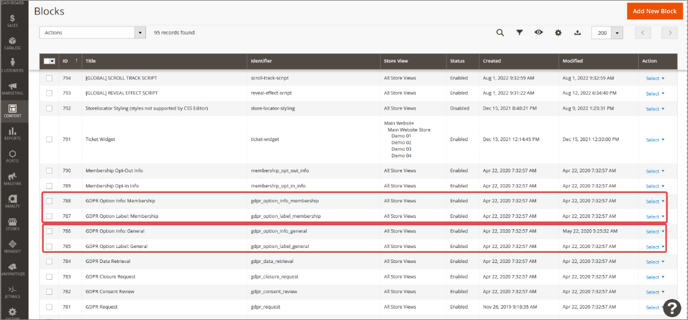

By default there are two consent segments that make up the Privacy Consent box - *general* and *membership*. However, it's possible to add additional consent types that end-users need to agree to, to proceed with registration.

In Magento Webadmin, there's a **Blocks** administrative section (**Content**>**Blocks**) with two CMS blocks that correspond to the default consent solutions:

- **gdpr_option_label_<lowercased-type>** - agreement label for the consent type;
- **gdpr_option_info_<lowercased-type>** - info block displayed above the agreement label.  

   

The text displayed in Privacy Consent window can be customized by choosing the **gdpr_option_info_< >** block, and clicking **Select** > **Edit**.

   

## Additional consent types

In Magento Webadmin, there's an administrative section **NaviPartner** > **GDPR** > **Settings**, that contains the **Consent** panel. Inside, you can set up **Additional Consent Types**. 

When adding a new consent type, you need to provide the **Consent Type Code** first, and then in the **Action** field choose what will happen when a customer accepts/declines the GDPR terms. 

If the **Opt-out of Membership on decline** option is set to **Yes**, the customer's membership will be terminated when they decline the privacy consent terms. 

## Advanced consent settings

The **Consent Advanced** panel is located immediately below the base **Consent** panel. You can switch its **Allow Configuration Overrides** option to **Yes** to be able to add advanced custom options that users will have access to only if they've accepted the GDPR privacy consent terms.

## Notifications for requests

The **Notifications for Requests** panel is used for setting up notifications for active GDPR requests. The following fields and options are available:

| Field Name      | Description |
| ----------- | ----------- |
| **Active for requests from** | Choose whose requests you're going to receive (guests, logged-in users or both). |
| **Sender email** | Add the email address from which the email requests are going to be sent. |
| **Sender name** | Specify the name that is going to be displayed in the **Sender** field of email requests. |
| **Admin recipient name** | Provide the email address of an account that is going to receive all GDPR requests that need to be processed. |
| **Admin recipient name** | Provide the name that is going to be displayed as a recipient in these email request. |

## CRON

The following fields and options are available in the **CRON** panel:

| Field Name      | Description |
| ----------- | ----------- |
| **Set Process Requests via CRON** | All closure requests are processed manually. If a customer wants to process the closure request automatically, CRON should be enabled. |
| **Delete old documents via CRON** | When customers want the sales order to be automatically deleted after some time, this option should be set to **Yes**. |
| **Delete documents older than** | You can define the number of months after which sales orders and the associated documents will be deleted. |
| **CRON schedule** | Specify when the closure request will be processed. | 

#### See also

- [<ins>Configure the GDPR module (e-commerce)<ins>]()
- [<ins>Handling requests for stored personal information<ins>]()