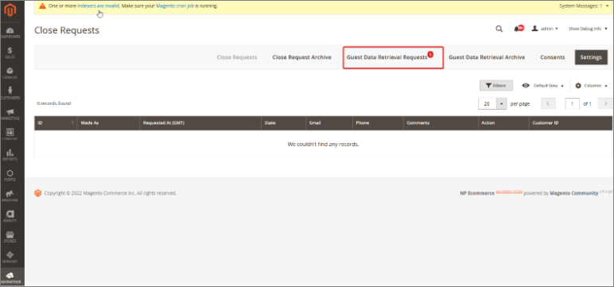
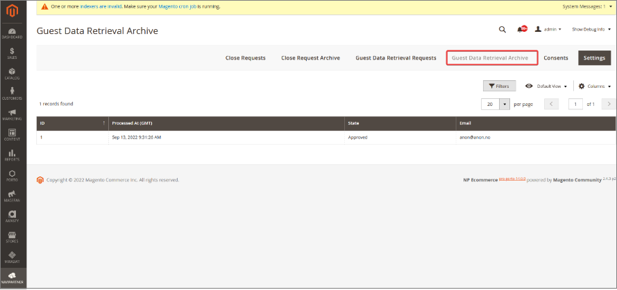
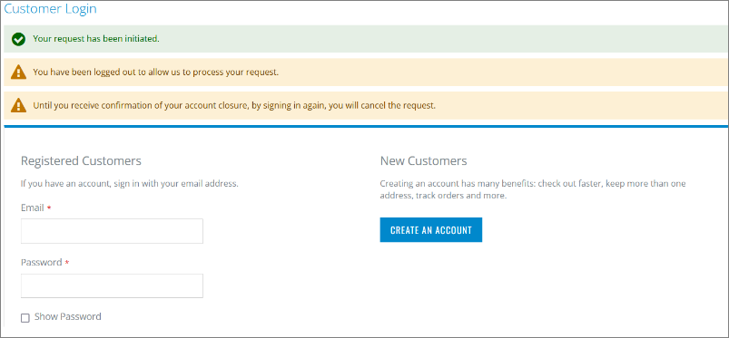
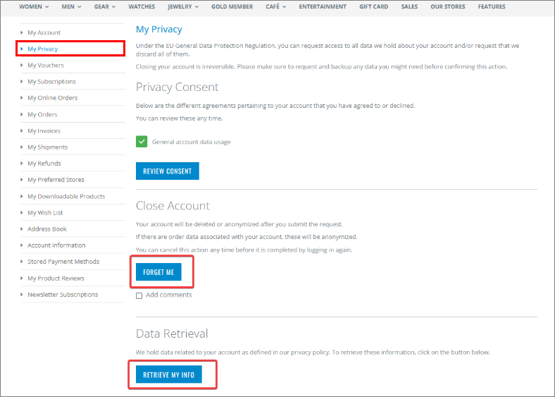
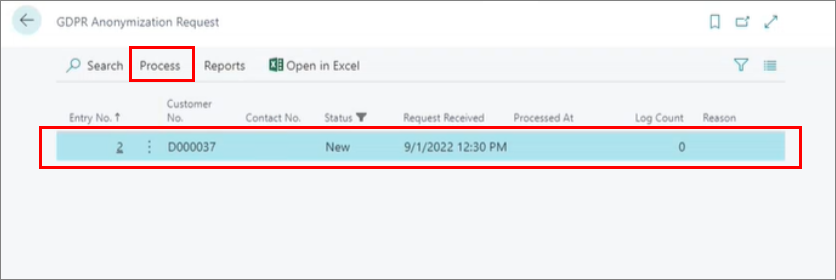
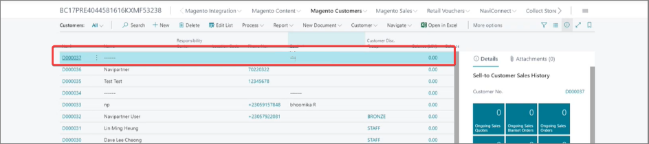

Administrators are notified whenever a request for retrieving or deleting personal information is issued by guest users or registered users. 

## Processing guest requests

Guest users can see the stored information about them by appending <i>/customer/privacy/guest</i> to the store URL.

The page they are redirected to contains privacy-related information, and it allows guest users to enter their email and phone number with an accompanying comment. From there, they can choose whether to delete (**Forget me**) the stored info or **Retrieve** it.

These requests can be found in Magento Webadmin by navigating to **Navipartner** > **GDPR** > **Guest Data Retrieval Requests**.

   

Once the request is received, administrators can take one of the following actions:

- Approve request – a new window will be presented where the administrator can add a comment, and when they click **Proceed**, the user will receive an email with an attached JSON file which contains their data. 
- Cancel the request
- View data - administrators can preview the customer data stored within the JSON file.

When the request is processed, it can be found in the **Guest Data Retrieval Archive**.

   

## Processing registered user requests

Similarly to guest users, registered users can view their information and request retrieval/removal in the **My Privacy** section of their **My Account** page. If they choose the **Forget Me** option, they will be redirected to a new page and logged out of the web store. They can cancel their request by signing in again. 

   

If the registered users wish to close their accounts, administrators will be notified of their choice, and can view those requests in Magento Webadmin, by navigating to **Navipartner** > **GDPR** > **Close Requests**.

   

Processed requests from registered users can be seen in the **Close Requests Archive**. After their closure request is approved by the administrator, the registered user will receive an email about the account closure. 

   

### Deleting registered customers from Business Central

After the request for closing a registered customer account has been processed in Magento Webadmin, you need to follow the provided steps to also delete them in Business Central:

1. Click the  button, enter **Magento Customers**, and choose the related link.       
   The list of registered customers in Magento Webadmin is displayed.
2. Click **Customers** in the ribbon, followed by **Customers GDPR**.     
   A new window **Customer GDPR** is displayed. From there, you can view requests made in Magento Webadmin and extract customer data.
3. Click **Web Requests** in the ribbon.    
   All requests for deleting customer data are displayed.
4. Select the line, click **Process** in the ribbon, followed by **Anonymize**.

   

  When this request is processed, user data will be anonymized in the **Customers** list, as well as that user's sales order data. 

  

#### See also

- [<ins>Configure the GDPR module (e-commerce)<ins>]()
- [<ins>Privacy consent customization<ins>]()