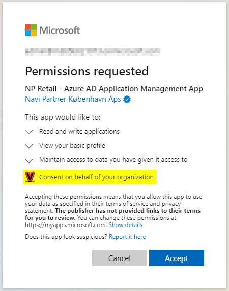
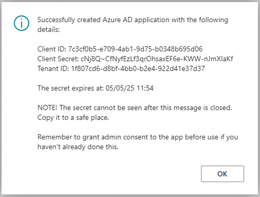

Microsoft Entra ID application[^1] is needed to ensure HeyLoyalty can update data in Business Central (BC).
To create one along with the set of credentials, follow the steps provided below.
[^1]: To interact with the web services (APIs) of Business Central, the external party (HeyLoyalty) needs to use the OAuth 2 protocol to gain an access token. When working with two services interacting with one another, the client needs to use the client credentials flow. The credentials for the client credentials flow are obtained through an Microsoft Entra ID application.

#### Prerequisites

-	Make sure the actions are performed by a user that is both an Microsoft Entra ID administrator and a Business Central administrator. These steps require you to grant the administrator access to certain parts of your Microsoft Entra ID. You should therefore be an administrator in your tenant or get your administrator to perform these steps.
-	This procedure can only be used when your Business Central tenant is registered with Microsoft Entra ID as the login method. If you are using Microsoft’s SaaS this will already be the case.

#### Procedure

1. In Business Central click the  button, search for the **HeyLoyalty Integration Setup** page and open it.
   

Cannot find the page?

HeyLoyalty integration feature is not enabled by default. To enable it, navigate to <b>NaviPartner Feature Management</b> page, and make sure there is a checkmark in field <b>Enabled</b> on the <b>HeyLoyalty Integration</b> line. Do not forget to log into to the system again after enabling the integration.

2. In the page's menu ribbon select **Actions** > **Initial Setup** > **Microsoft Entra ID OAuth**, and click **Create Microsoft Entra ID App**. 
A pop-up window is displayed. 

3. Grant permission to the **NP Retail - Azure AD Application Management App**.        
   This app allows the code to create the Microsoft Entra ID application for the HeyLoyalty integration.

4. Make sure that the consent screen identifies the application as being verified with "Navi Partner København ApS" as Microsoft Partner.

5. On the **Permission Requested** page select **Consent on behalf of your organization**.

6. When asked if you want to create a user, click **Yes**.

7. When asked if you want to grand admin consent, click **Yes**.       
   If there is an issue granting consent (e.g. a pop-up didn’t open), you’ll be able to do it later.       
   As soon as the Microsoft Entra ID application is created, the information will be displayed on the screen.      

8. Make sure to copy the client secret that is shown in the message box to a safe place.      
   It will not be visible after the box is closed.   

  

9. In Business Central click the  button, search for "aad" and open the **Microsoft Entra ID Applications** page.

10. Find the newly created application (it’ll have "HeyLoyalty" in its name), and open the card by clicking **Client ID**.

11.  Make sure the application has the following user permission sets assigned: **D365 BUS FULL ACCESS** and **NPR NP RETAIL**. 
You may also need to assign **PTE GLOBAL**, if NaviPartner standard HeyLoyalty integration functionality has been extended to meet your specific requirements. 

12. Assign the adequate Continia permission sets if you have any of Continia products installed in your Business Central environment.

13.  On the **Microsoft Entra ID Application Card**, click **Grant Consent** to allow the newly created application access to the Business Central API.

## Next step

  - [Set up HeyLoyalty webhook]()