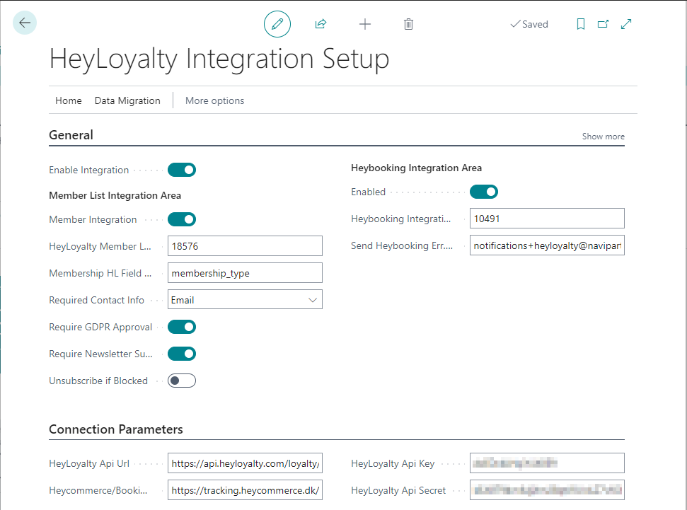
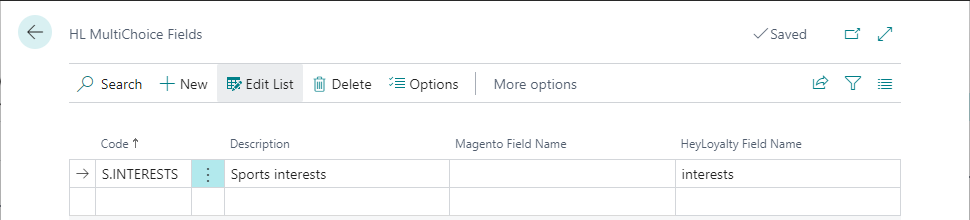
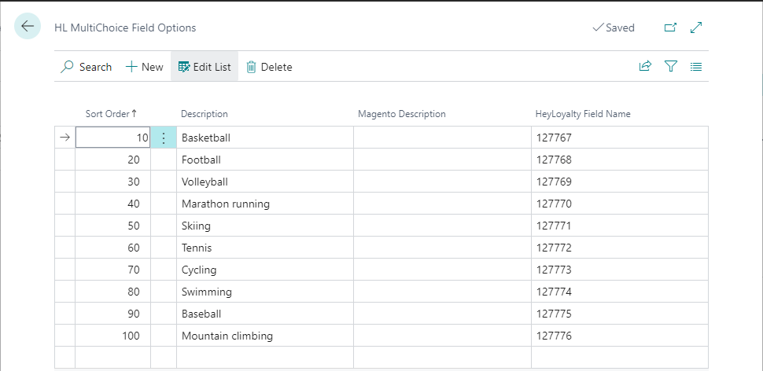
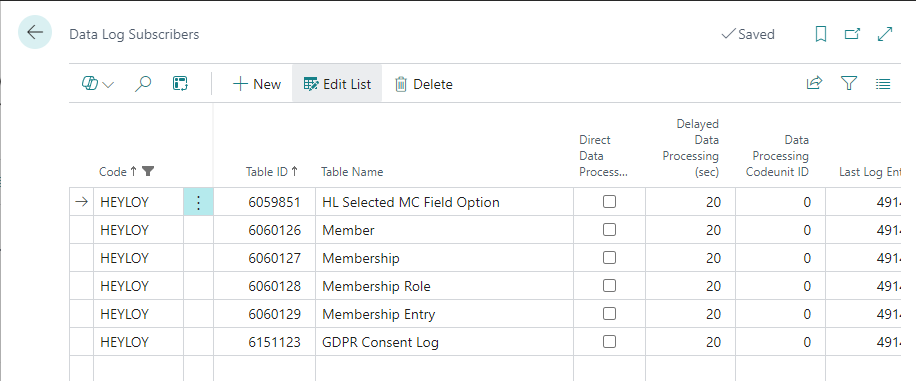

This section gives you an overview of all the setups in Business Central that are required for the HeyLoyalty integration functionality to work properly.

## HeyLoyalty Integration Setup

You can access and configure the main setup components for HeyLoyalty in the **HeyLoyalty Integration Setup** administrative section in Business Central. 

Cannot find the page?

The HeyLoyalty integration feature is not enabled by default. To enable it, navigate to the <b>NaviPartner Feature Management</b> page, and make sure there is a checkmark in the <b>Enabled</b> field on the <b>HeyLoyalty Integration</b> line. Do not forget to log into to the system again after enabling the integration.

 

The following fields and options are available on the page:

| Field name | Comment |
|------------|---------|
| <td>**General** FastTab</td> |
| **Enable Integration** | Specifies whether the integration is enabled. This is the master on/off switch for the whole integration. |
| <td>**Member List Integration Area** subsection</td> |
| **Member Integration** | Specifies whether the **Member List** integration area is enabled. This will enable member information to be sent to HeyLoyalty. |
| **HeyLoyalty Member List ID** | Specifies the HeyLoyalty member list ID that the integration is coupled with. |
| **Membership HL Field ID** | Specifies the HeyLoyalty field ID (the value from column _Merge field_ in the HeyLoyalty field definition page) for storing information about membership code (is not required, if you don't plan to have member membership IDs at HeyLoyalty). |
| **Required Contact Info** | Specifies required contact methods (email and/or phone) that must be specified in the member card before BC will submit the member data to HeyLoyalty. |
| **Require GDPR Approval** | Specifies whether the member needs to agree to GDPR before Business Central submits the member data to HeyLoyalty. It is recommended that you enable this parameter. |
| **Require Newsletter Subscription** | Specifies whether the member needs to subscribe to the e-mail newsletter (the **E-Mail News Letter** field on the **Member Card**) before Business Central submits the member data to HeyLoyalty. We recommend you enable this parameter. |
| **Unsubscribe if Blocked** | Specifies whether the member will be unsubscribed from HeyLoyalty, if the member, or their membership has been blocked in Business Central. It is recommended that you disable this parameter. |
| **Read Member Data from Webhook** | Specifies whether member data is going to be read from the received HeyLoyalty webhook payload. If disabled, an additional GET call to the HeyLoyalty server will be issued automatically in order to retrieve the most recent member data available at HeyLoyalty. The parameter needs to be disabled, as it is not currently fully supported by HeyLoyalty. |
| <td>**Heybooking Integration Area** subsection</td> |
| **Enabled** | Specifies whether the Heybooking Integration area is enabled. This will enable booking and transaction information be sent to HeyLoyalty. |
| **Heybooking Integration ID** | Specifies the Heybooking Integration ID you acquired from your HeyLoyalty partner. |
| **Send Heybooking Err. to E-Mail** | Specifies the email address notifications are sent to in case of errors while importing data to the HeyLoyalty Heycommerce/Booking database. |
| <td>**Connection Parameters** FastTab</td> |
| **HeyLoyalty Api Url** | Specifies the URL for the HeyLoyalty API. The default value is `https://api.heyloyalty.com/loyalty/v1` |
| **Heycommerce/Booking DB Api Url** | Specifies the URL for the HeyLoyalty Heycommerce/Booking database API. The default value is `https://tracking.heycommerce.dk/api` |
| **HeyLoyalty Api Key** | Specifies the HeyLoyalty API Key you acquired from your HeyLoyalty partner. |
| **HeyLoyalty Api Secret** | Specifies the HeyLoyalty API Secret you acquired from your HeyLoyalty partner. |

## HeyLoyalty Multiple Choice Fields

A multiple choice field in HeyLoyalty is a field that allows users to select multiple values from a list of predefined options. 
If you wish to include a HeyLoyalty multiple choice field into the member list integration scope, you'll need to set the field up as an **HL MultiChoice Field** in Business Central.

The **HL MultiChoice Field** page can be reached from the **HeyLoyalty Integration Setup** administrative section by selecting **Home** followed by **MultiChoice Fields** in the ribbon.

     

On the **HL MultiChoice Field** page, you can create a separate entry for each of the multiple choice fields you want to include into synchronization. You'll need to specify the following information for each of the fields:

| Field name | Comment |
|------------|---------|
| **Code** | Specifies a code to identify this HeyLoyalty multiple choice field. |
| **Description** | Specifies an explanation of the HeyLoyalty multiple choice field. |
| **Magento Field Name** | Specifies the ID used for the field in Magento (only required if you wish to sync the field to Magento as well). |
| **HeyLoyalty Field Name** | Specifies the ID used for the field at HeyLoyalty (the value from the _Merge field_ column in the HeyLoyalty field definition page). |

Next, you'll need to specify the list of possible option values for each of the multiple choice fields. Placing your cursor on the line with the field definition in the **HL MultiChoice Field** page, and clicking **Options** in the ribbon opens the **HL MultiChoice Field Options** page.     

      

Here you need to specify the following information for each of the field's possible option values:

| Field name | Comment |
|------------|---------|
| **Sort Order** | Specifies the sort order of the option value. The lower the number, the higher in the list the option value will appear. The order is assigned automatically, but you can change it manually, if necessary. |
| **Description** | Specifies an explanation of the HeyLoyalty multiple choice field option value. |
| **Magento Description** | Specifies the ID used for the field option value at Magento (only required if you wish to sync the field to Magento as well). |
| **HeyLoyalty Field Name** | Specifies the ID used for the field option value in HeyLoyalty. It usually consists of 6 digits. You may need to contact your HeyLoyalty provider to get the option value IDs for the field. |



## Member Attributes

You can map any HeyLoyalty single choice or text field to a member attribute in Business Central.
Refer to [the guide for setting up client attributes]() if you need more information on how to set up member attributes.      



In addition, to map a member attribute and its option values to a HeyLoyalty field, you'll need to take the following actions on the **Client Attribute Card** page:

  - Specify the **HeyLoyalty Field ID** (the value from column _Merge field_ in HeyLoyalty field definition page) for each member attribute.
  - Specify the **Default HeyLoyalty Value**, if you need a default attribute value to be sent to HeyLoyalty in cases, when the attribute has no value assigned for the member in Business Central.
  - Enable the **Auto Create New Values** boolean field, if you wish a new attribute value to be automatically created in Business Central whenever a non-existing attribute value is received from HeyLoyalty.

You also need to take the following action on the **Client Attribute Value Lookup** page:

  - Specify the **HeyLoyalty Name** for each attribute value.

## Stores

Each member can have a preferred store selected on their card in Business Central. This is basically a Collect Store from the NP Retail [Click & Collect]() module.
For each shop you have in HeyLoyalty, you need to create a [Collect Store]() in Business Central and map the entities to each other to be able to synchronize the store code selected on each member card between Business Central and HeyLoyalty.

To associate a Business Central Collect store with a HeyLoyalty store, you need to specify in Business Central the ID used for the store in HeyLoyalty. The ID needs to be provided on the **Collect Store Card** page in the **HeyLoyalty Name** field.

A HeyLoyalty store ID usually consists of 5 digits. You may need to contact your HeyLoyalty provider to obtain the store IDs.

## Data Log Subscribers

Data log subscribers are required for the system to keep track of changes made to the data. These are automatically created when the relevant HeyLoyalty integration area is enabled.
Here is the list of automatically generated data log subscribers.

All data log subscribers should have **Delayed Data Processing (sec)** set to `20`.


