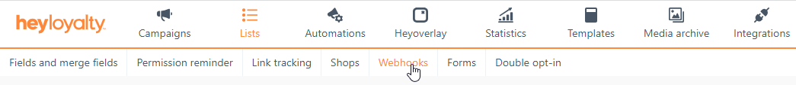

To ensure that changes made to members directly in HeyLoyalty are synchronised back to Business Central (BC), you'll need to set up a webhook in your HeyLoyalty environment.

## Prerequisites
Make sure you have completed the [*setting up member synchronization*]() and [*created AAD application for HeyLoyalty*]() in BC before proceeding with this step.

## Procedure

1. Find the webservice address that was created in BC for HeyLoyalty:
   - In BC click the  button, search for the **Web Services** page and open it.
   - Find the service with **Service Name** = *heyloyalty_services*.
   - Copy the web service link from the field **OData V4 URL**.
<br><br>
2. Adjust the link address, so HeyLoyalty can understand it correctly:<br>
Generally a BC webservice URL for HeyLoyalty has the following structure:
```URL
https://api.businesscentral.dynamics.com/v2.0/<Your BC tenant ID>/<Your BC environment name>/ODataV4/Company('<Your BC company name>')/heyloyalty_services
```
As you can see, there are character pairs `('` and `')` around your BC company name. HeyLoyalty doesn't support this. So you'll need to replace the `('` with its URL encoded representation `%28%27`, and the `')` with `%27%29`. For example:
  - Original URL:
```
https://api.businesscentral.dynamics.com/v2.0/1f807cd6-d8bf-4bb0-b2e4-922d41e37d37/Production/ODataV4/Company('CRONUS%20Danmark%20A%2FS')/heyloyalty_services
```
  - Adjusted URL:
```
https://api.businesscentral.dynamics.com/v2.0/1f807cd6-d8bf-4bb0-b2e4-922d41e37d37/Production/ODataV4/Company%28%27CRONUS%20Danmark%20A%2FS%27%29/heyloyalty_services
```

3. In your HeyLoyalty environment:
   - Select *Lists* from the top menu ribbon, then select *Edit List* for the list you want to set the webhook for.
   - Select *Webhooks* subsection

<br><br>
   - Click *Create a webhook* to create a new webhook. Fill in the following fields for the new webhook:
| Field name | Recommended value |
|------------|---------------------------|
| URL | The adjusted web service URL from BC you have prepared earlier |
| Contact email | Specify an email address to which webhook errors should be sent |
| Send as raw json object | `Yes` |
| Simplified format | `Yes` |
| Authentication type | `OAuth 2.0` |
| Username | The **Application (Client) ID** from the Azure AD application details page that was shown to you at the end of the ["Create Azure Active Directory application for HeyLoyalty"]() process |
| Password | The **Client Secret** value from the Azure AD application details page |
| base URL | `https://login.microsoftonline.com/<Your BC tenant ID>/oauth2/v2.0` |
| scopes (optional) | `https://api.businesscentral.dynamics.com/.default` |
| New subscriber (email, phone) | `Yes` |
| New subscriber (heypush) | `Yes` |
| Update subscriber | `Yes` |
| Unsubscribe subscriber | `Yes` |
| Spam complaint | `Yes` |
| Hard bounces | `Yes` |
