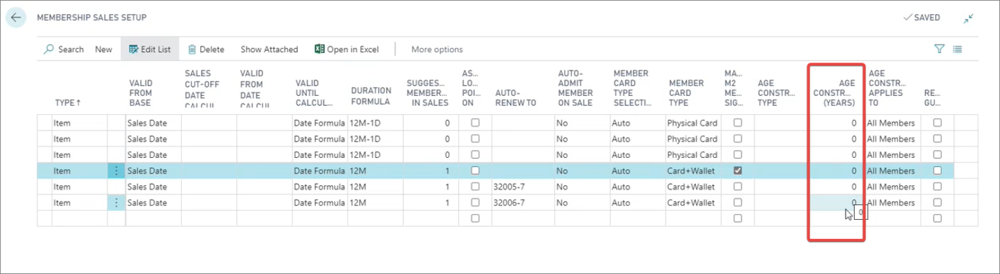

Various aspects of the membership module can be configured in Business Central, and synced to Magento Webadmin. Here are some of the examples:

## Points setup

You can view and edit various options concerning memberships in the **Membership Card** of the desired membership type. For instance, you can view all points that a member has accumulated in the **Points** panel.

   

Additionally, in the **Magento M2 Membership Sign-up** column in the **Membership Sales Setup** administrative section, you can see the level of membership that the customer gets when they first sign up for the loyalty program.

## Membership alteration

It's possible to configure all membership alteration types such as upgrades, renewals, and extensions in the **Membership Alteration** administrative section in Business Central.

All of these alteration types, except for membership cancellation, can be accessed in Magento Webadmin, if you navigate to **Catalog** > **Products**, and open the **Add Products** dropdown. Each alteration type is linked to a distinct item number.

  

### Age-constraint setup

If you wish, you can set up the age constraint for the members in the **Membership Sales Setup**.

   

#### See also

- [<ins>Register as a member on an e-commerce website<ins>]()
- [<ins>Custom pricing for members<ins>]()
- [<ins>Membership options - Magento Webadmin<ins>]()
