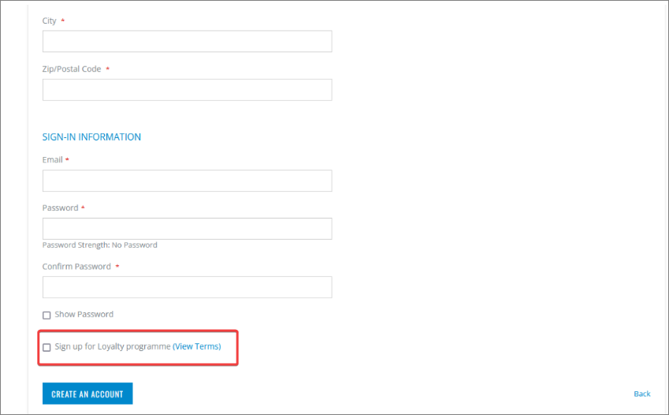
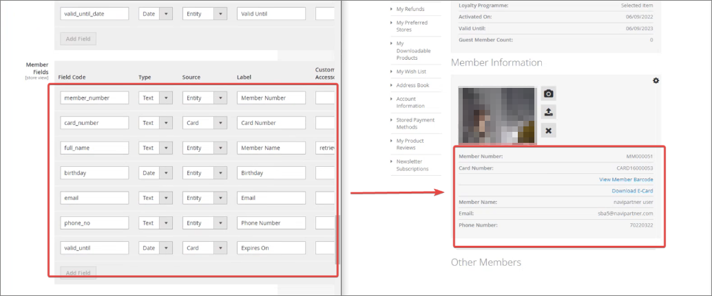

Although Membership setup is largely conducted by NaviPartner consultancy team, there are still several options that you can take a note of.

If you navigate to the **NaviPartner** > **Membership** > **Membership Settings** administrative section of Magento Webadmin, you can see the following options, provided that NaviConnect credentials are in use, and that the Membership module is enabled in the environment: 

| Option Name      | Description |
| ----------- | ----------- | 
| **Enable explicit quick opt-in** | - **Yes** - end-users can opt-in on the loyalty program during the registration, as demonstrated in the [<ins>membership creation<ins>]() article.   - **No** - the membership is automatically quick-created in Business Central. |
| **Opt-in Membership Item No** | Specifies the item number set in Business Central to "purchase" the membership associated with the quick opt-in – e.g when the customer checks loyalty program on store-front, this membership will be the one provided to them. |
| **Opt-in Membership Code** | Specifies the code that declares what kind of membership the end-user is opting in for. |  
| **Show "View Terms" link** | if set to **Yes**, the **View Terms** link will be displayed next to the opt-in option on account creation/checkout. |

     

| Option Name      | Description |
| ----------- | ----------- | 
| **Enable Opt-out** | Allows members to opt out of their membership by clicking **Opt-out** in the **Membership** section of **My Account**. Note that the membership in Business Central will also be closed. |
| **Opt-out Membership Codes** | When opting out, it's possible to choose for which membership codes the opt-out will be allowed (e.g. **SILVER**, **BRONZE**). |

### Membership information setup

Some of the fields that end-users can see in their **My Account** page in the web store can be customized in Magento Webadmin, if you navigate to **NaviPartner** > **Membership** > **Account Dashboard**. 

Additionally, you can configure the available information on the **My Membership**  page in the web store in **NaviPartner** > **Membership** > **My Membership view**.

### Membership template setup

The templates that are applied to the customer memberships (e.g. **BRONZE**, **GOLD**, etc.) can be configured in **Membership Setup**, through the **Customer Config. Template Code** column. You can see the list of all available templates, in the **Configuration Templates** administrative section.

It's also possible to add new custom fields like **Magento Shipping Group**, **Magento Store Code**, and **Magento Display Group**. However, they need to be created in Magento Webadmin first, and then linked to each corresponding template on a member. 
