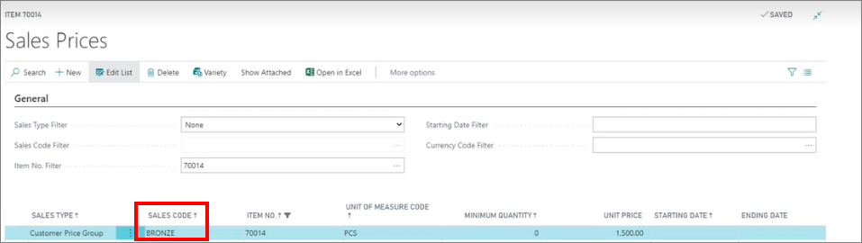
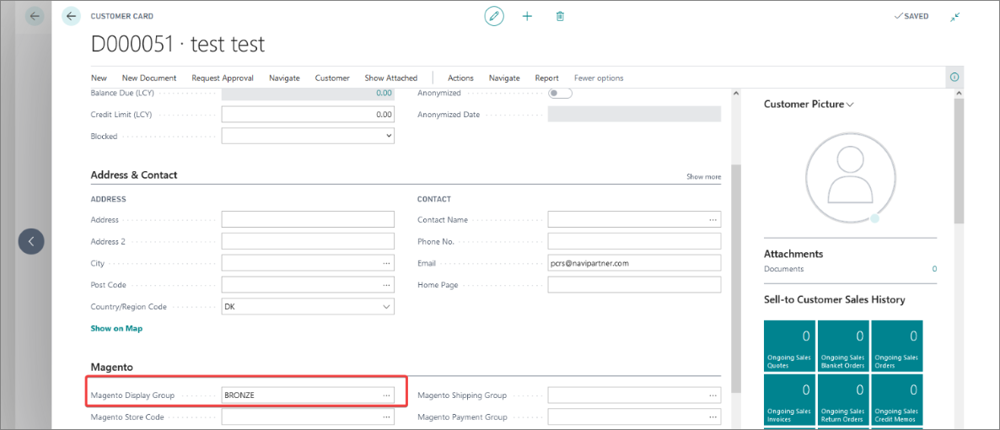

You can offer special prices for members of a specific membership. The naming convention for different membership levels is as follows: **BRONZE**, **SILVER**, **GOLD**, and so on. Depending on the setup in place, each of these different levels can either be earned or purchased, and each one offers different benefits to its members. 

These membership levels are set up in the **NaviPartner** > **User Flag Rules** administrative section in Magento Webadmin. 



It's also important to note that Business Central pricing affects prices on the POS, so if a special price is offered to members for a certain item in Business Central, it will also be displayed on the POS. You can see which membership level will be eligible for a special price of a certain item if you navigate to the **Sales Prices** section on a specific **Item Card**, and view the **Sales Code** column. 

If the unit price is changed in the **Unit Price** column, the new pricing will be applied for the logged-in members in the web shop.

   

Special pricing can also be found in the **Magento** section of **Customer Cards** of some members, depending on the previously performed setup.

  

#### See also

- [<ins>Register as a member on an e-commerce website<ins>]()
- [<ins>Membership options - Magento Webadmin<ins>]()
- [<ins>Membership options - Business Central<ins>]()