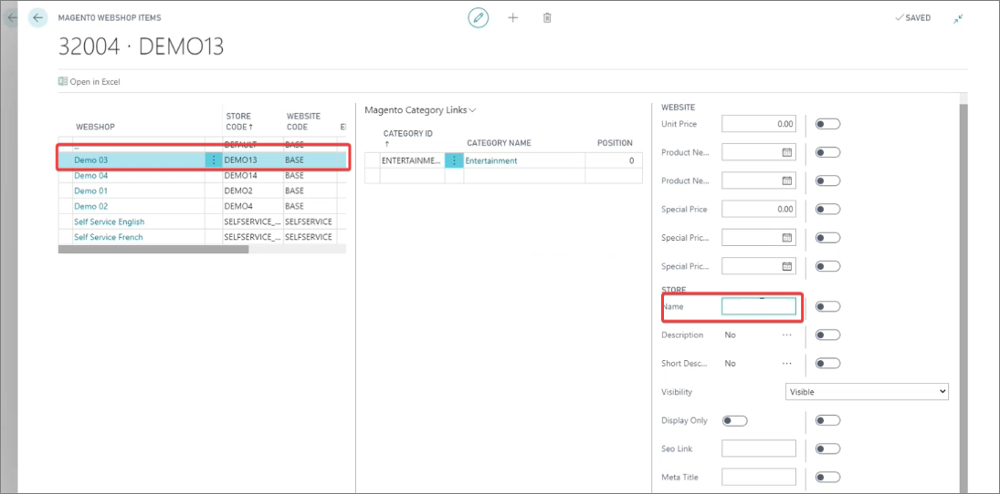
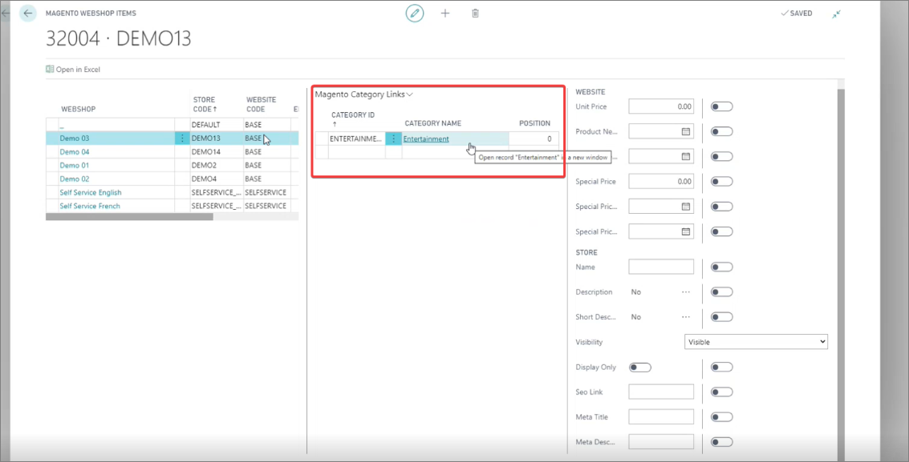
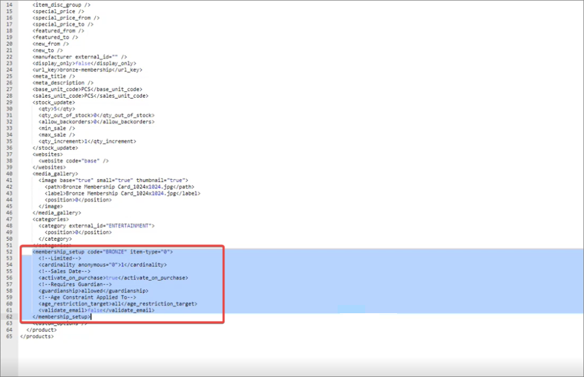
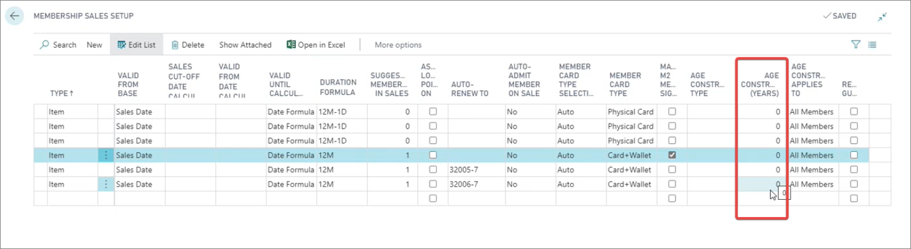

This article describes the basic management of membership items in Business Central.

For instance, if you wish to display an item in the store-front, you can additionally customize it in Business Central. 

1. Click the  button, enter **Item List**, and choose the related link.     
2. Select the item you wish to modify.
3. Add descriptions that will be displayed on the page in the **Magento** tab.       
   You can also add an item image, or even set the item's price to zero, if it's free.    
4. Click **Magento** in the ribbon, followed by **Webshops**.
5. Select a store, and then add the **Name**.
   
    

6. (Optional) You can also assign the item to a category in the **Magento Category Link** section.

   

7. If the synchronized item wasn't converted into a membership item in the Magento Webadmin, it's recommended to check their import log and the membership_setup node.

   

## Additional setup in Business Central

### XML mapping

1. Click the  button, enter **XML Templates**, and choose the related link.       
   The list of available XML templates is displayed.
2. Open the **UPD_ITEM** template, and check mapping by clicking **Process** in the ribbon, followed by **Edit Field Mapping**.
3. Check all membership alterations that can be done (**auto-renew**, **edit**, **upgrade**...)     

      

4. Alter the following elements if needed: 

| Element Name      | Description |
| ----------- | ----------- |
| **allow_subscription** | If subscription is allowed in Business Central, ticking this checkbox turns on the subscription for the membership on that item in the e-commerce platform. | 
| **validate_email** | Currently, only email validation is supported by the e-commerce solution. You can turn it on in the **Member Community** administrative section by selecting **E-Mail** in the **Member Unique Identity** column. | 

### Auto-renewal

Set up the [auto-renewal process]().    
   This can be done in the **Membership Sales Setup** by adding the code of the item to which the membership will be automatically renewed in the **Auto-renew to** column.

### Age-constraint setup

If you wish, you can set up the age constraint for the members in the **Membership Sales Setup**.

   

### Membership template setup

The templates that are applied to the customer memberships (e.g. **BRONZE**, **GOLD**, etc.) can be configured in **Membership Setup**, through the **Customer Config. Template Code** column. You can see the list of all available templates, in the **Configuration Templates** administrative section.

It's also possible to add new custom fields like **Magento Shipping Group**, **Magento Store Code**, and **Magento Display Group**. However, they need to be created in Magento Webadmin first, and then linked to each corresponding template on a member. 