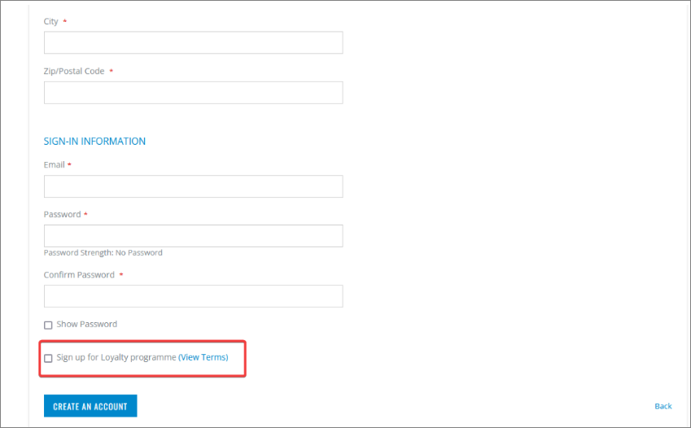

This article guides admins through the process of setting up memberships in e-commerce websites in Magento Webadmin and Business Central.

## Procedure in Magento Webadmin

1. Log into **Magento Webadmin**.
2. Click **NaviPartner** > **Membership**.     
   A page with membership forms is displayed.
3. Open **Membership Settings**.    
4. Set **Use NaviConnect Credentials** to **Yes**.
5. Select **Yes** in **Enable Module**, found in the **General** section.     
   With this selection, the membership itself, and the option for the end-user to sign up for the Loyalty program will be enabled. 
6. Populate the following fields according to your business needs: 

| Option Name      | Description |
| ----------- | ----------- | 
| **Enable explicit quick opt-in** | - **Yes** - end-users can opt-in on the loyalty program during the registration, as demonstrated in the [membership creation]() article.   - **No** - the membership is automatically quick-created in Business Central. |
| **Opt-in Membership Item No** | Specifies the item number set in Business Central to "purchase" the membership associated with the quick opt-in – e.g when the customer checks loyalty program on store-front, this membership will be the one provided to them. |
| **Opt-in Membership Code** | Specifies the code that declares what kind of membership the end-user is opting in for. |  
| **Show "View Terms" link** | if set to **Yes**, the **View Terms** link will be displayed next to the opt-in option on account creation/checkout. |

   

   

| Option Name      | Description |
| ----------- | ----------- | 
| **Enable Opt-out** | Allows members to opt out of their membership by clicking **Opt-out** in the **Membership** section of **My Account**. Note that the membership in Business Central will also be closed. |
| **Opt-out Membership Codes** | When opting out, it's possible to choose for which membership codes the opt-out will be allowed (e.g. **SILVER**, **BRONZE**). |

## Procedure in Business Central

1. Click the  button, enter **Membership Sales Setup**, and choose the related link.
2. In the **Magento M2 Membership Sign-up** column, select the option that represents the level of membership that the customer gets when they first sign up for the loyalty program.       
   If this option isn't checked, signing up for the loyalty program on in the web store will not be possible.
