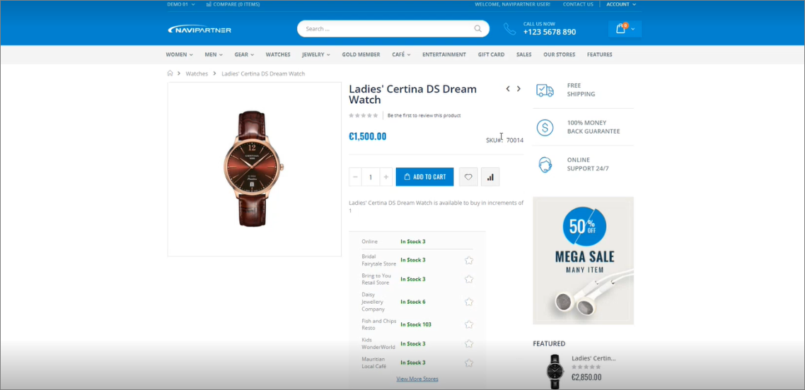
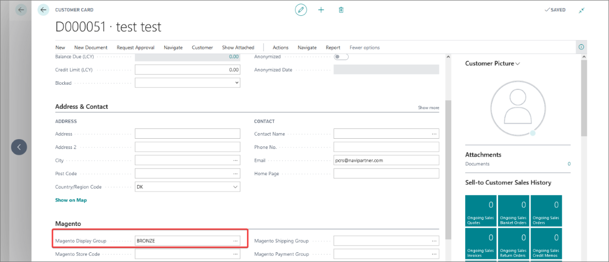

You can offer special prices for members of a specific membership. This article contains instructions on how to do so through the example of a **BRONZE** membership template.

If you wish to create segmentation based on the customer pricing group, you need to perform the following setup in Magento Webadmin and Business Central:

### Procedure in Magento Webadmin

1. Log into **Magento Webadmin**.
2. Click **NaviParnter** > **User Flag Rules**.     
   The **User Flag Rules** page is displayed.
3. Click **Add Rule**.     
4. Provide the **Name**, activate it, and provide **BRONZE** in the **BC Account Membership: Membership Code**.
5. Add flags to this membership in the **Flags** section below.      
   In this example, the flag should be **bc_pricing**, so that Business Central pricing is set for the customers who belong to the membership.
6. Save the rule.
7. Click **Navipartner** > **Pricing**.
8. In the **Logged In** panel, choose **Only accounts with flag set** in the **BC Pricing Active for** field.
9. Save this configuration.     
    All customers with **BRONZE** membership can now see the price set in Business Central.

    

### Procedure in Business Central

1. Click the  button, enter **Item List**, and choose the related link.     
   The list of available items is displayed.
2. Select an item, and open its **Item Card**.    
3. Click **Navigate** in the ribbon, followed by **Sales** > **Prices**.     
   The **Sales Prices** window is displayed.
4. In the **Sales Type** column select **Customer Pricing Group**, and in the **Sales Code** column enter **BRONZE**.
5. Change the unit price in the **Unit Price** column, and add starting and end dates for its validity.     
   The pricing is applied for the logged-in members in the web shop.

   

6. Navigate to the **Membership Setup** administrative section, and set the **Magento Customer Group** in the **Contact Config Template Code**.    
   Consequently, it won't be necessary to set the pricing in Business Central - it can be done through the **Magento Display Group**.     

   

### Alternative special pricing

Alternative to special pricing for different types of membership can also be set up through Magento Webadmin, with the **Magento Discount Rules**. 

The only segment that needs to be performed in Business Central is providing the template code (e.g. **BRONZE**) in the **Magento Display Group** field of the relevant **Customer Card**.

  

Consequently, you don’t need to have the Business Central pricing active, only to set the discount in Magento Webadmin.  
