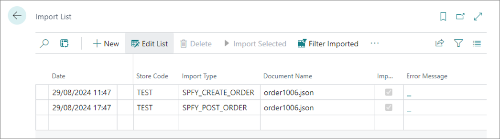
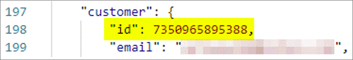
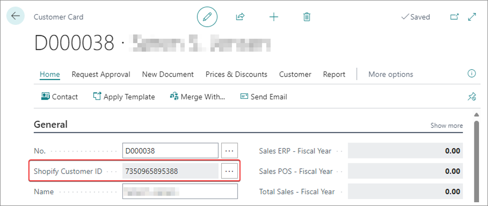

New Shopify orders and order updates are downloaded from Shopify automatically. Two periodic processes are responsible for that ([<ins>refer to **Job Queue Entries**<ins>]() for reference). 

1. The connection with the Shopify servers is established, and query for new, cancelled and closed orders is performed. The results are saved in the **Import List**.



   

2. New entries (retrieved during the first process) in the **Import List** are processed, and consequently sales orders are updated (the new ones are created, the cancelled ones are deleted, and the closed ones are posted).



All created sales orders in the system are assigned a **Shopify Order ID**. 

   

For the purpose of reporting the order progress (shipping items to the customer) back to Shopify, each **Sales Order Line** also gets assigned its own **Shopify Order Line ID**.

## Customer search routine

Customers are selected by using the **Customer search routine**. During the order import, the following customer lookup algorithm is applied:

1. The customer is looked up by their **Shopify ID**.                   
   

   

   

2. If the customer isn't found in the first step, the system attempts to find another customer either by email, phone, or both (depending on the provided value in the **Customer Mapping** field on the **E-commerce Store Card**).    
   If the system finds a matching customer at this stage, the Shopify ID will be assigned to them, so that the next time they can be found during the first stage (Shopify ID lookup).         



3. If the customer still hasn't been found, the system creates a new customer if the **Allow Create Customers** option is enabled in the **E-commerce Store Card**.           
   In this case, the system uses the customer template specifies in the **Customer Config. Template Code** field on the **E-commerce Store Card**. The template is needed to fill-in fields and values which aren't sent to Shopify, but are required in Business Central.      
   If **Allow Create Customers** is disabled, the system uses a predefined customer (assigned to the store through customer mappings, or directly specified in the **Customer No.** field on the **E-commerce Store Card**).        
   For more information, refer to the article on [<ins>E-commerce stores<ins>]().

### Next steps

- [<ins>Send data back to Shopify<ins>]()

