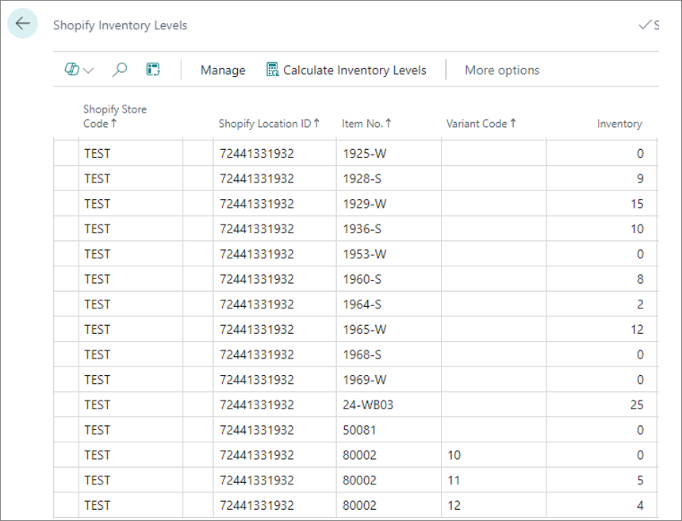

The administrative section **Shopify Inventory Levels** stores the pre-calculated available inventory levels before sending them to Shopify.

  

Shopify inventory levels are updated on each item-related transaction posting (when an item ledger entry is created), and each time a sales order line is created, updated, or deleted.

Additionally, if you set the **Include Transfer Orders** option on the [<ins>**Shopify Store**<ins>]() page to any value other than **No**, Shopify inventory levels will also be updated automatically each time a transfer order line is created, updated or deleted.

## How the Shopify inventory is calculated

The inventory levels are calculated per a Shopify location ID. This means that, if the same Shopify location ID is assigned to multiple Business Central locations, the system aggregates the data from all of those Business Central locations to calculate the inventory level tied to the specific Shopify location ID.

If **Include Transfer Orders** is set to **No**, Shopify inventory level is calculated as:

|                     |                         |                       |
|---------------------|-------------------------|-----------------------|
| Available inventory | Quantity on sales order | Safety stock quantity |

If **Include Transfer Orders** is set to **Outbound**, Shopify inventory level is calculated as:

|                     |                         |                       |                       |
|---------------------|-------------------------|-----------------------|-----------------------|
| Available inventory | Quantity on sales order | Safety stock quantity | Transfer order shipment qty |

If **Include Transfer Orders** is set to **All**, Shopify inventory level is calculated as:

|                     |                         |                       |                       |
|---------------------|-------------------------|-----------------------|-----------------------|
| Available inventory | Quantity on sales order | Safety stock quantity | Transfer order shipment qty + Transfer order receipt qty + Quantity in transit | 

The safety stock quantity can be set in the **Shopify Safety Stock Quantity** field of the **Item Card** of any item. In this case, the same value will be used for all item variants. If you want to set an individual Shopify safety stock quantity level for each item variant, you need to create stockkeeping units in Business Central. 



The inventory level synchronization triggering process is very similar to the process of [<ins>item list synchronization in Business Central<ins>]() - it involves the **Item Ledger Entries** table, the **Sales Line** data log subscribers, as well as processing of the **Task List** entries.
