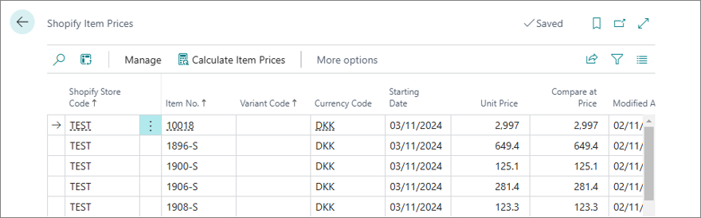

The **Shopify Item Prices** page stores pre-calculated item prices before they are synchronized with Shopify. This structure allows for managing and tracking price updates effectively, and ensures that only the latest, accurate prices are sent. 

  

Records on the page are updated with periodic price calculation routine.

## Setting prices and discounts for Shopify items

The system reuses the standard Business Central price and discount lookup functionality available for sales quotes and orders. Therefore, prices and discounts can be configured for specific customers, customer groups or all customers with the **Special Prices & Discounts** functionality. General sales prices can also be set on **Item Cards**.  The customer for whom the prices are calculated is specified in the **Customer No.** field found on the **Shopify Store Card**.

The prices you set in Business Central are sent to Shopify as the **Compare at Price**, whereas the discounts are used to determine the **Unit Price** sent to Shopify. If there are no applicable discounts set up in Business Central, both the **Compare at Price** and **Unit Price** fields are set to the same value. 



## VAT configuration

When updating product prices through Shopify's API, it's essential to align VAT inclusion with your Shopify store's tax settings. The Shopify admin interface controls whether prices include VAT or not. To ensure your price VAT policies align:

- Verify in the Shopify admin interface whether your store's prices are tax-inclusive (VAT-inclusive).
- Configure Business Central to match, ensuring the **Price includes VAT** setting on the **Item Card** reflects the desired VAT treatment. 

## Triggering item price synchronization

Shopify item sales prices are calculated by running a designated procedure (report 6014551 *Shopify Calculate Item Prices*), which is set to run automatically via the job queue (at 20:00 daily) or manually, if needed. The calculated prices then become visible on the **Shopify Item Prices** page, making it easier to review and track changes before they are sent to Shopify. 

If a price has changed since the last synchronization, a new Naviconnect Task List entry is created and scheduled to be executed on the effective date of the new price. This ensures that only the relevant price updates are synchronized with Shopify on the correct day. 

## Batch price update limits and API request cost

The **No. of Prices per Request** field on the **Shopify Store Card** controls how many item prices can be sent to Shopify in a single batch update. By default, this value is set to 100. Exceeding this limit isn't recommended, as each request has an associated API cost, and keeping requests within this limit minimizes the risk of hitting Shopify's API rate limits, ensuring synchronization remains efficient. If, however, you find that the default value is causing you to exceed Shopify's API request limits in your case, consider reducing the batch size to a lower number. 

