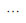
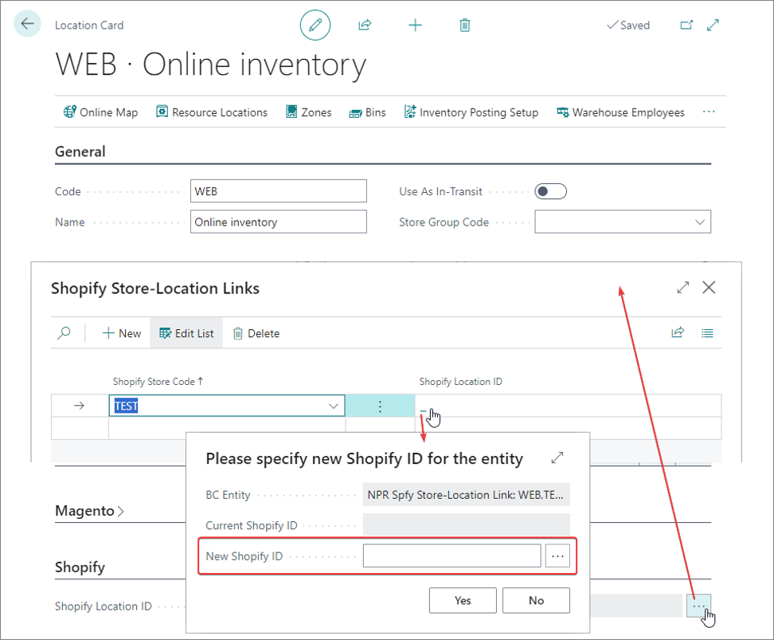
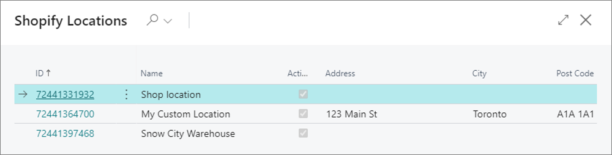

Each Business Central location for which you want to send available inventory to Shopify needs to be associated with a Shopify location.

   

You can link any number of Business Central locations to a single Shopify location, and any number of Shopify locations to a single Business Central location.

- If you link more than one Business Central location to a Shopify location, the available-to-sell inventory sent to the Shopify location will be a sum of the availabilities from all the linked Business Central locations.
- If you link more than one Shopify location to a single Business Central location, Business Central will update the item availability on all linked Shopify locations with the same quantity taken from the Business Central location.

To link a Shopify location to a location in Business Central, follow the provided steps:

1. Click the  button, enter **Locations** and select the related link.      
2. Open the desired **Location Card**.
3. Click  next to **Shopify Location ID**.      
   The **Shopify Store-Location Links** page is opened.
4. Map the Shopify locations to the Business Central location from which you've opened the page.      
   
   

   If you've [<ins>already set up your connection parameters in the **Shopify Store** administrative section<ins>](), the system will be able to connect to the Shopify environment you've set up the connection to, and display a list of available Shopify locations for you to choose from.

   

