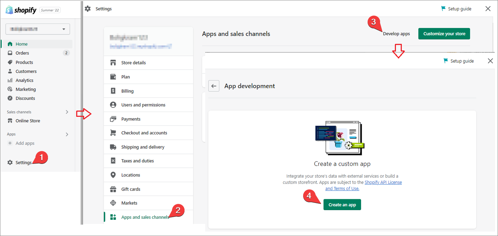
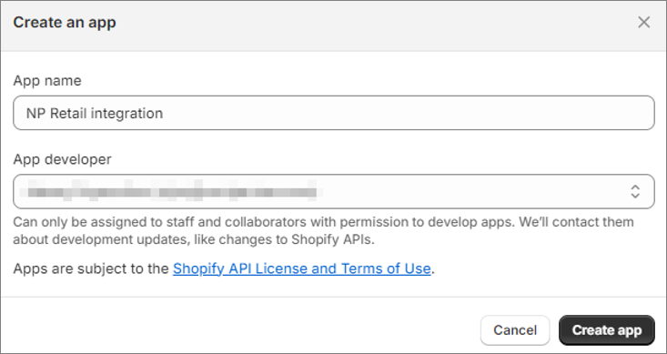
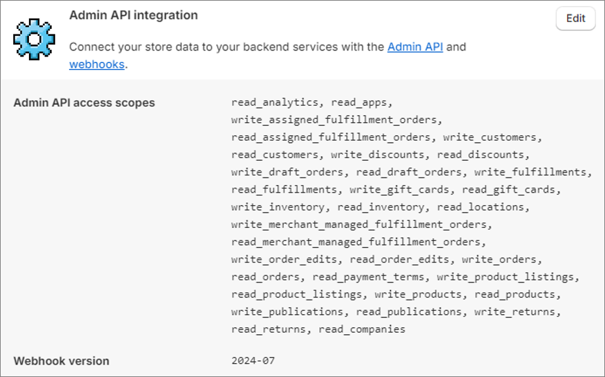
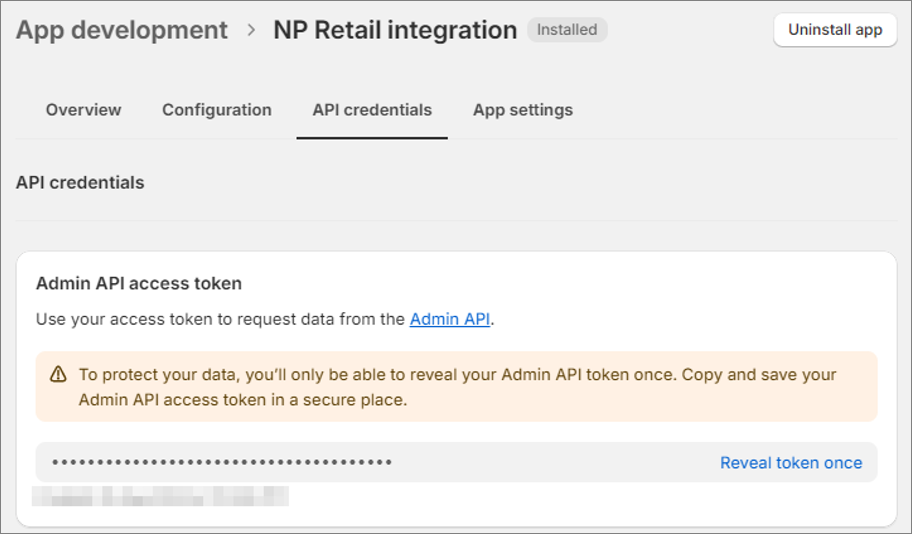

A custom app needs to be created in each Shopify store that Business Central connects to. To create the custom app, follow the provided steps:

1. Navigate to the Shopify store admin page.
2. Navigate to **Settings** > **Apps and sales channels** > **Develop apps**.      
   The **App development** screen is displayed.
3. Click **Create an app**.   
   A window for providing additional app information is displayed.
  
  

4. Use **NP Retail Integration** as the name of the app.
5. Click **Create app**.

  

6. Assign admin API access scopes (permissions) to the app by selecting the app, going to **Configuration** > **Admin API Integration**.
7. Configure the API integration by assigning the following API access scopes: 

  

  {{< alert text="(read_analytics, read_apps, write_assigned_fulfillment_orders, read_assigned_fulfillment_orders, write_customers, read_customers, write_discounts, read_discounts, write_draft_orders, read_draft_orders, write_fulfillments, read_fulfillments, write_gift_cards, read_gift_cards, write_inventory, read_inventory, read_locations, write_merchant_managed_fulfillment_orders, read_merchant_managed_fulfillment_orders, write_order_edits, read_order_edits, write_orders, read_orders, read_payment_terms, write_product_listings, read_product_listings, write_products, read_products, write_publications, read_publications, write_returns, read_returns, read_companies)." />}}

8. Once you've assigned and saved the admin API access scopes, click **Install app**.     
   Shopify installs the new app to your store and generates the **Admin API access token** as a result.

   

   This access token needs to be copied to your **Shopify Store Setup** administrative section in Business Central.