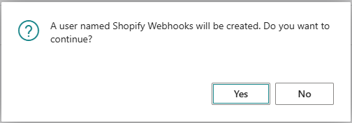
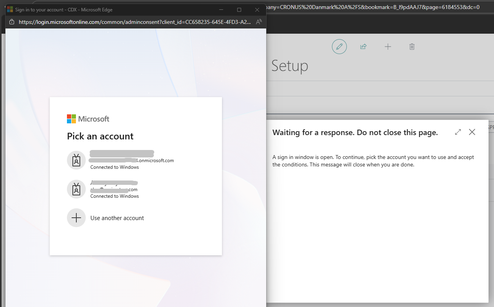
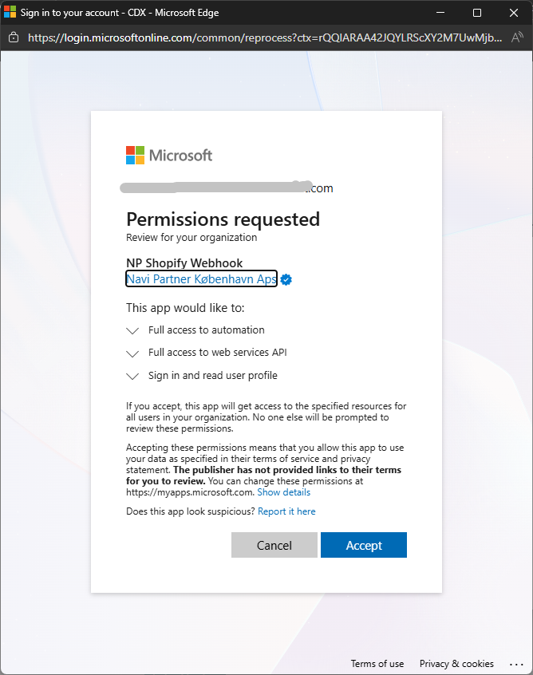
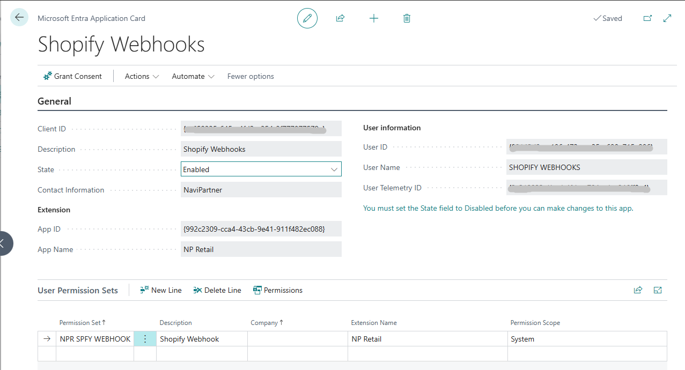

If you want to enable synchronization of modifications made to entities (such as **products** or **customers**) in Shopify back to Business Central, you need to register the **webhook handler application**. This application acts as a proxy between **Shopify** and **Business Central**, translating Shopify requests into a format that Business Central can recognize and accept.

### Prerequisites

 - The solution must be running in a **Business Central SaaS environment**. This functionality is not supported in On-Premises environments.

 - The **latest version** of NP Retail must be installed.

 - The user must have both an Microsoft Entra ID administrator and a Business Central **administrator privileges** in Business Central.

 - **Pop-ups must be enabled** in the browser for the businesscentral.dynamics.com domain.

 

### Procedure

To register the webhook handler app for your BC SaaS environment, follow the provided steps:

1. Click the  button, enter **Shopify Integration Setup** and select the related link.
2. Select **Actions**, followed by **Initial Setup** > **Microsoft Entra ID OAuth** > **Register Webhook Handler App**.        
   Running this action registers the NaviPartner Shopify webhook handler app and prompts for administrator approval/consent. 

   

3. Confirm

    

4. A popup will appear with a sign in window:

5. Accept permission request

After the process has been completed, the following Microsoft Entra App should appear in the list of entra apps in BC.

As soon as this option is enabled, you will start receiving Shopify webhook notifications.        

   Each time you create/update/delete an entity in Shopify, for which you have a webhook subscription, a new entry is created in the **Shopify Webhook Notifications** administrative section in Business Central.

   Once the Shopify Webhook Notification has been processed in Business Central, the changes will be displayed in the **Shopify Integration** section of the relevant entity card (e.g. the **Item** or **Customer** Card).       

### Next steps

- [<ins>Set up inventory-specific integration areas<ins>]()

