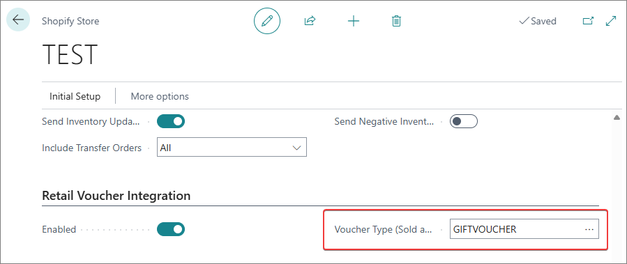
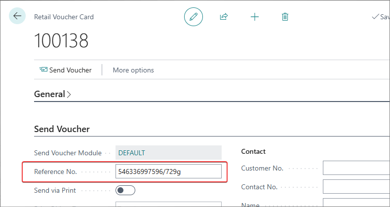

If the adequate setup is performed, retail vouchers purchased in offline shops and in Shopify can be redeemed in Shopify. The integration can be enabled for each individual retail voucher type. 

  

1. Click the  button, enter **Retail Voucher Types** and select the related link.      
2. Select the **Retail Voucher Type Card**, and enable the Shopify integration via the **Integrate with Shopify** toggle switch.
3. Provide the **Shopify Store Code**.       
   The store code should correspond to the Shopify store with which retail vouchers of this type are integrated. 

   

## Handling Shopify gift cards in Business Central

When a Shopify order containing a gift card is imported into Business Central, the system can automatically create a retail voucher instead of a standard inventory item, if the proper setup is performed. The gift card sales line is assigned to a G/L account rather than requiring a specific product mapping. 

To make sure this behavior is applied, follow the provided steps in Business Central:

1. Click the  button, enter **Retail Voucher Types** and select the related link.      
2. Create a new **Voucher Type** that the system will use when creating new retail vouchers in Business Central for gift cards purchased in Shopify.
3. Click the  button, enter **Shopify Stores** and select the related link.
4. Open the **Shopify Store** you wish to modify, and scroll down to its **Retail Voucher Integration** section.     
5. In the **Voucher Type (Sold at Shopify)** dropdown list, select the voucher type you've created for this purpose. 

  

Each retail voucher will have a unique reference number based on:

- Shopify’s internal gift card ID
- The last four characters of the gift card reference number

  

### Limitations

Currently, gift cards sold through Shopify can't be directly redeemed at POS in Business Central. This is due to a limitation in Shopify’s API, which only provides the last four characters of the gift card reference number, rather than the full number needed for standard redemption processes.

#### Workaround for Using Shopify Gift Cards at POS

While direct scanning or manual entry of the full gift card number is not possible, you can still redeem Shopify gift cards at POS using a manual search:

1. Search for the retail voucher in Business Central using the last four characters of the gift card reference number.
2. Identify the correct voucher by cross-referencing the internal Shopify gift card ID (a unique identifier provided by Shopify).
3. Apply the voucher manually to complete the transaction.

## See also

- [<ins>Automatically generated setups<ins>]()

## Next steps

- [<ins>Register Shopify custom app<ins>]()