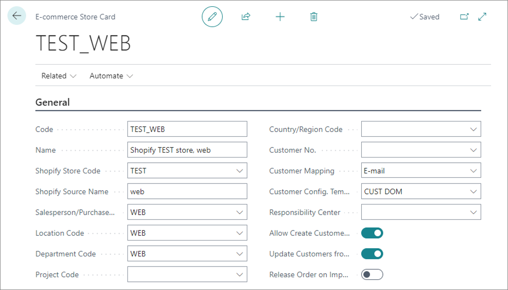
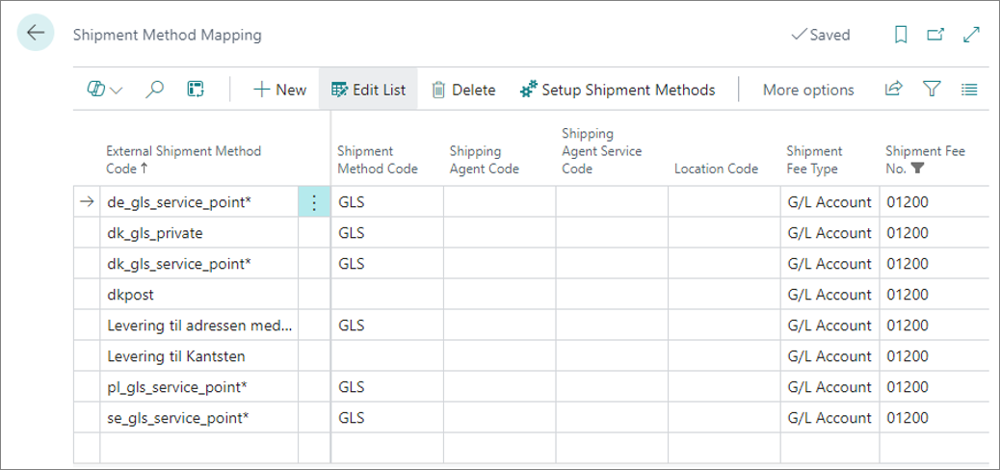
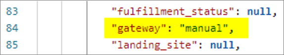
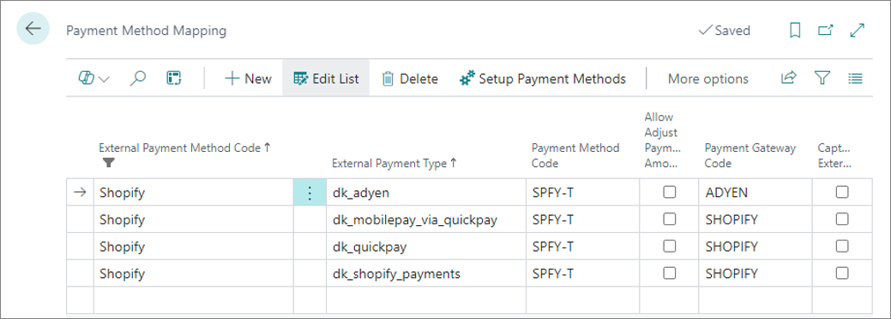
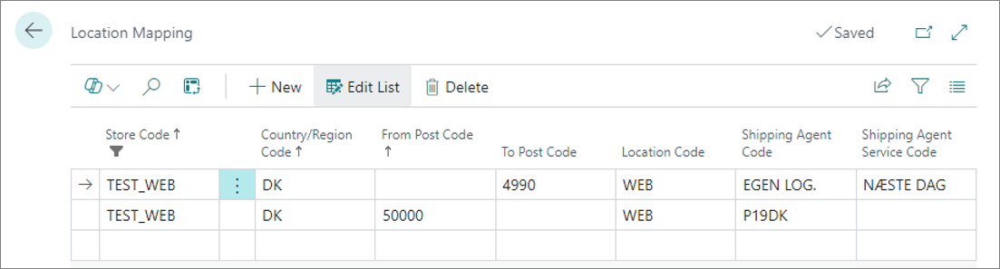

This topic contains instructions for all setups related to the **Sales Order Integration** area.

## Set up E-commerce stores

A distinct e-commerce store needs to be created in Business Central for each value sent from Shopify as a JSON key "Source Name" of the Shopify order JSON file.

   

To define an e-commerce store:

1. Click the  button, enter **E-commerce Stores** and select the related link.      
   The page containing all the existing e-commerce stores in the system is displayed.
2. Click **New** and specify all values that correspond to your business needs in the provided fields.       
   The **Code**, **Shopify Store Code**, **Shopify Source Name** and **Salesperson/Purchaser Code** fields are mandatory.

   

   | Field name      | Description |
   | ----------- | ----------- |
   | **Code** | Specifies the unique internal ID of the record, that will be used by the system to reference this e-commerce store. | 
   | **Name** | Specifies the name of the record. There are no requirements as to what the value of the field should be. You can assign any value to help users distinguish between Shopify source names. | 
   | **Shopify Store Code** | Specifies the Shopify store for which the record is created. | 
   | **Shopify Source Name** | Specifies the source name that Shopify uses in the incoming sales order JSON file to identify this record. |
   | **Salesperson/Purchaser Code** | Specifies the salesperson who will be assigned to all sales orders imported from Shopify with this source name. | 
   | **Location Code** | Specifies a location code from which to ship items for imported sales orders. This field needs to be populated unless shipment method or location mapping has been set up. | 
   | **Country/Region Code**, **Customer No.**, **Customer Mapping**, **Customer Config. Template**, and **Allow Create Customers** | These fields are used by the customer search routine. | 

## Set up Shipment Method Mapping

The shipment method mapping needs to be set up for each value sent from Shopify as the "code" property in the Shopify order JSON file's "shipping_lines" array.

   

To define a shipping method mapping:

1. Click the  button, enter **Shipment Method Mapping** and select the related link.        
   The page containing all the existing shipment method mappings in the system is displayed.  
2. Click **New** and specify all values that correspond to your business needs in the provided fields.       
   The **External Shipment Method Code** and **Shipment Fee No.** fields are mandatory.

   

   | Field name      | Description |
   | ----------- | ----------- |
   | **External Shipment Method** | Specifies a code of the Shopify shipment method (the value of the "code" JSON key in the "shipping_lines" array).   If you want to have a generic setup line that covers multiple Shopify shipping methods simultaneously, you can use wildcard characters (e.g. asterisk - "*") at the end of the value. In this case, the value you specify here acts as a filtering criterion, allowing the system to filter all shipping methods covered by the setup line. | 
   | **Shipment Method Code** | Specifies a shipment method that will be assigned to sales orders. |  
   | **Shipping Agent Code** and **Shipping Service Code** | These fields specify a shipping agent and its service code that will be assigned to sales orders. | 
   | **Location Code** | Specifies a location code from which to ship items for imported sales orders. Alternatively, you can define location mapping. | 
   | **Shipment fee No.** | Specifies a G/L account number to post shipping fees to. | 

## Set up Payment Method Mapping

The payment method mapping needs to be set up in Business Central for each value sent from Shopify as the "gateway" JSON key in the Shopify order JSON file.

   

To define a payment method mapping:

1. Click the  button, enter **Payment Method Mapping** and select the related link.        
   The page containing all the existing payment method mappings in the system is displayed.
2. Click **New** and specify all values that correspond to your business needs in the provided fields.    
   The **External Payment Method Code** and **External Payment Type** fields are mandatory.

   

   | Field name      | Description |
   | ----------- | ----------- |
   | **External Payment Method Code** | Needs tp be equal to a constant value "Shopify". | 
   | **External Payment Type** | Specifies a Shopify payment type (the value of the "gateway" JSON key). | 
   | **Payment Method Code** | Specifies a Business Central payment method to be assigned to sales orders. |
   | **Payment Gateway Code** | Specifies the payment gateway to use for payment capture requests. | 

## Set up Location mapping

Location mapping is used for identifying the code of the Business Central location the items are shipped from, as well as the shipping agent and its service code. During the order import process, the system searches for the location code and/or shipping agent, which depend on the customer's country and postal code.

The location mapping setup is taken into account only if the system can't identify the **Location Code** and/or **Shipping Agent Code** during the evaluation of the **Shipment Method Mapping**.

Location mapping needs to be set up for each store. To set up location mapping:

1. Click the  button, enter **E-commerce Stores** and select the related link.        
   The page containing all e-commerce stores in the system is displayed.
2. Create a new e-commerce store or edit the existing one, then click **Related**, followed by **Location Mapping**.      
   The **Location Mapping** popup window is displayed.
3. Set up the location mapping according to your business requirements.

   

   | Field name      | Description |
   | ----------- | ----------- |
   | **Store Code** | Specifies the Shopify source code (e-commerce store in Business Central). |
   | **Country/Region Code** | Specifies a country/region code to which the current setup line applies. |
   | **From Post Code** and **To Post Code** | These fields specify a range of post codes to which the current setup line applies. |
   | **Location Code** | Specifies a location code from which items are shipped. |
   | **Shipping Agent Code** and **Shipping Agent Service Code** | These fields specify a shipping agent and their service code assigned to sales orders. |

