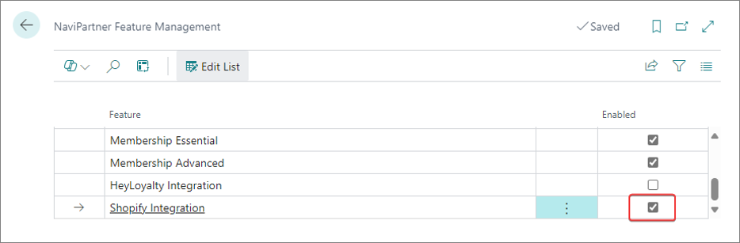

To set up the Shopify integration, make sure the prerequisites are met, and follow the provided steps:

### Prerequisites

1. Install the NP Retail application on the customer tenant database.                   
   The application's version needs to be xxxx.42.0.10000 or newer.   
2. Make sure a custom app is registered with Shopify.       
   
   

### Procedure

1. Click the  button, enter **NaviPartner Feature Management** and select the related link.      
2. Enable the **Shopify Integration** feature. 

   

3. Click the  button, enter **Shopify Integration Setup** and select the related link.      
   The window containing all integration areas that can be set up is displayed. You can choose which integration areas to enable, and specify the **Connection Parameters**.   



2. To enable the integration, select the **Enable Integration** toggle switch, and then enable all the other options you need.   



## Next steps

The following procedures are optional, and whether you want to perform them or not depends solely on your business needs. They don't need to be completed in any specific order.

- [<ins>Set up inventory update sending<ins>]()
- [<ins>Set up the Sales Order Integration area<ins>]()

The following setups are performed automatically, by the system: 

- [<ins>Auto-generated setups<ins>]()

After the integration is set up, you can refer to the following links for more information on how you can use the integration to your advantage:

- [<ins>Synchronize Items List<ins>]()
- [<ins>Send inventory to Shopify<ins>]()
- [<ins>Getting orders from Shopify<ins>]()