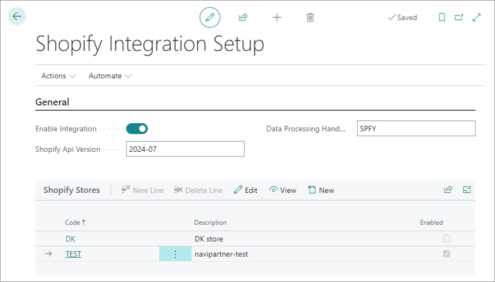

To set up the Shopify integration, make sure the prerequisites are met, and follow the provided steps:

### Prerequisites

1. Install the NP Retail application on the customer tenant database.                   
   The application's version needs to be xxxx.42.0.10000 or newer.   
2. Make sure a custom app is registered with Shopify.       
   
   

### Procedure

1. Click the  button, enter **NaviPartner Feature Management** and select the related link.      
2. Enable the **Shopify Integration** feature. 

   

3. Click the  button, enter **Shopify Integration Setup** and select the related link.      
4. Enable the integration, choose which version of Spotify API you wish to use, and set up the Shopify stores you want to integrate with.     
   Check the provided screenshot and table with the available fields and options.

   

   | Field name      | Description |
   | ----------- | ----------- |
   | **Enable Integration** | Specifies whether the integration is enabled or not. This is the master on/off switch for the integration. |
   | **Shopify API Version** | Specifies the Shopify API version that Business Central will use to communicate with Shopify. The default value is "2024-07". | 
   | **Data Processing Handler ID** | Specifies a code used by the system to identify the import types, task processor, and data log subscribers associated with the Shopify integration. |



## Next steps

- [<ins>Create a Shopify store<ins>]()
