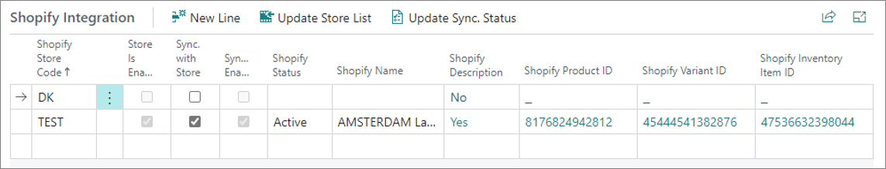
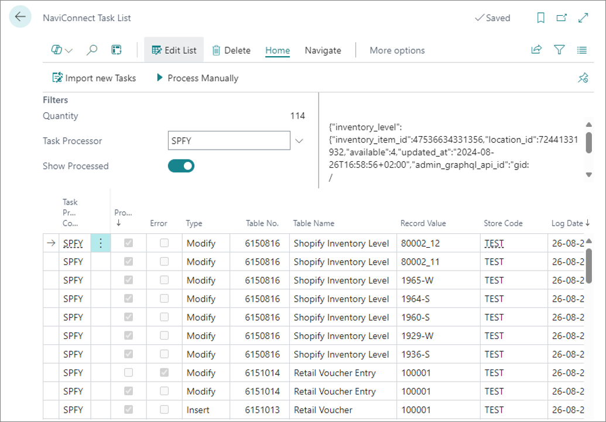

With the proper setup, Business Central can send information about new and updated items and item variants to Shopify. To include an item into the synchronization scope, make sure the prerequisite is met, and follow the provided steps.

### Prerequisite

- Make sure that the **Item List Integration** area on the **Shopify Integration Setup** page is enabled.

### Procedure

1. Click the  button, enter **Items** and select the related link.     
   From the list of items, select the item you wish to send update notifications to Shopify about.
2. In the **Shopify** section of the **Item Card** activate the **Shopify Item** toggle switch.      
   This step should be repeated for all items that you wish to be synchronized between Business Central and Shopify. 

   

   

   After an item is added to the Shopify synchronization scope, each time the item or a related item variant is changed in Business Central, the following information is scheduled to be sent to Shopify:

   | Field name      | Description |
   | ----------- | ----------- |
   | **Title** and **Description** | These values are set for the Shopify store in the **Shopify Integration** FastTab of the **Item Card** as seen in the screenshot presented above. This information is only sent if the **Set Shopify Name/Description** option is enabled for the [<ins>store<ins>](). | 

   If this is a new product for Shopify, Business Central also sends the following values:

   | Field name      | Description |
   | ----------- | ----------- |
   | **product_type** | = “new” |
   | **published** | = false |
   | **published_scope** | = “web” |
   | **status** | = “draft” |

   If this product is known to Shopify, that has been blocked in Business Central, or if the **Sync with Store** option was disabled for the store on the **Item Card** in Business Central, Business Central also sends the following information to Shopify:

   | Field name      | Description |
   | ----------- | ----------- |
   | **status** | = “archived” | 
   | **Shopify Variant** | |
   | **Options** | Item variant variety names and values are explained in more detail in further text. | 
   | **SKU** | Stock Keeping Units are explained in more detail in further text. |
   | **Price** | If the **Do Not Sync Sales Prices** option isn't activated, the item's unit price is sent. | 
   | **inventory_management** | = “shopify” |
   | **Barcode** | ItemReference.”Reference No.” (where “Reference Type”=”Bar Code”, and “Discontinue Bar Code”=false) | 

   After submitting the data and receiving a successful completion response from Shopify, the following fields are updated on the **Item Card** in Business Central (“Shopify Integration” record for the Shopify store):

   | Field name      | Description |
   | ----------- | ----------- |
   | **Synchronization Enabled** | Specifies whether the item has been created as a product in the Shopify store. |
   | **Shopify Status** | Specifies the Shopify product status. | 
   | **Shopify Product ID** | Specifies the unique product ID. | 
   | **Shopify Variant ID** | Specifies the unique Shopify variant ID. This field only has a value if the item has no variants in Business Central. In this case the field will store the Shopify's product default variant ID. | 
   | **Shopify Inventory Item ID** | Specifies the unique Shopify inventory item ID, which is used for managing inventory levels in Shopify. | 
   | **Shopify Name** and **Shopify Description** | Specifies the product title and description from Shopify. | 

   And the following fields are updated on the **Item Variant**:

   | Field name      | Description |
   | ----------- | ----------- |
   | **Shopify Variant ID** | Specifies the unique Shopify variant ID. |
   | **Shopify Inventory Item ID** | Specifies the unique Shopify inventory item ID, which is used for managing inventory quantities in Shopify. | 

 

## Additional information

### Shopify SKU (Stock Keeping Unit)

Whenever an item or an item variant update request is sent to Shopify, the **Shopify Product ID** and the **Shopify Variant ID** are automatically included in the request (or **Shopify Inventory Item ID**, if this is an inventory or unit cost update request).

If there aren't any values for the fields in Business Central, the system will initially attempt to get the IDs from Shopify by providing the Shopify SKU number. For the integration to work properly, the SKU fields in Shopify need to contain the following information:

- Items without variants - the SKU needs to be equal to the Business Central item number.
- Items with variants - each variant SKU needs to be equal to the Business Central item number and Business Central variant code, separated by an underscore (for example: 8000_1)

### Varieties 

Varieties/variants assist users in creating different characteristics associated with an item. Item varieties are copied and shown in Shopify as product variant options. 

#### Variety mapping

There are two things to take into account when mapping varieties to Shopify options:

- Shopify supports only three variant options (as opposed to Business Central, which supports four). If the **Item Card** has all four varieties defined in Business Central, only 1, 2, and 3 are sent to Shopify, while the fourth variety isn't included in the synchronization.
- Shopify has a stricter policy on how variant options can be defined. It's not possible to define an option until all the options preceding it have already been defined. For example, the second option can't be defined before the first one, and the third option can't be defined before the second one. In Business Central, you can define varieties arbitrarily: there's no need to define the first variety for an item before defining the second one, and so on.

The system applies dynamic mapping when identifying which Business Central variety number will be mapped to which variant option number in Shopify: the lowest specified variety on the **Item Card** in Business Central becomes option1 in Shopify, while the following variety number becomes option2, and so on. For example, if the **Item Card** has varieties 2 and 4 in Business Central, the variety 2 becomes option1, and the variety 4 becomes option2 in Shopify.

#### Conditions for synchronization

There are several conditions which determine whether a variety is included in the synchronization:

- The variety value needs to be specified on the item variant record.
- The **Use in Variant Description** toggle switch needs to be active in the **Variety** administrative section.
- If the **Use Description Field** toggle switch is active in the **Variety** administrative section, the **Description** field needs to be specified on the **Variety Value** administrative section, since the variant description will be generated from it.  

When calculating the variety description string, which is sent to Shopify, the **Pre tag in Variant Description** field is used in the **Variety** administrative section.

### Sending item unit cost updates

Item unit cost updates are also sent to Shopify when the **Last Direct Cost** on the **Item Card** changes. All variants of the same products will receive the same unit cost in Shopify.

### Item list synchronization process in Business Central

For this process to work, [<ins>data log subscribers<ins>]() need to be registered in the system. 

A [<ins>job queue<ins>]() creates entries in the **NaviConnect Task List** page based on the data log entries, and then processes them.

   

- Item and item variant information update requests are displayed in the task list as **Item** and **Item Variant** table entries, respectively.

- Item cost update requests are displayed with the table name **Inventory Buffer**.

- The available-to-sell inventory update requests are displayed with the table name **Shopify Inventory Level**.

- Retail-voucher-related requests are displayed with the table names **Retail Voucher** and **Retail Voucher Name**, respectively.

### Next steps

- [<ins>Get orders from Shopify<ins>]()
- [<ins>Send data back to Shopify<ins>]()

