## Shopify app ticket setup

After installing the application, enter the required configuration parameters:

- Tenant ID
- Business Central (BC) environment
- Company

Click **Save Connection Info** and verify that the **BC connection status is marked as "Connected" (green indicator)**:

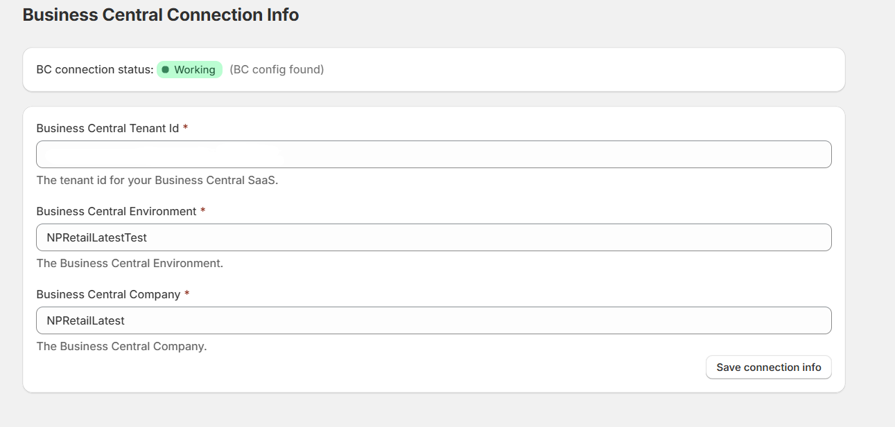



## Adding first ticket product

1. Navigate to **Products** from the main sidebar menu:

   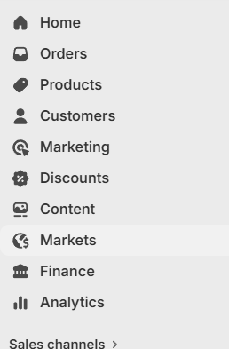

2. Click **Add Product** and fill in the required product details (e.g. name, description, price, etc.).

3. Ensure the following configuration is applied:
   - Inventory tracking: **Disabled (Not tracked)**
   - Product type: **Non-physical product**

   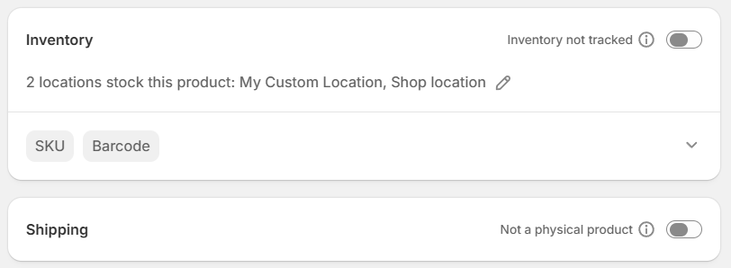

4. In the **SKU field**, enter the Ticket Item Number retrieved from Business Central:

   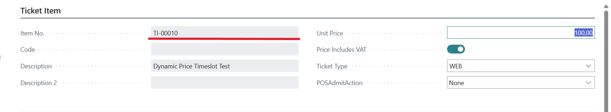

Once completed, the ticket product is ready to be assigned to a ticket collection or used as a standalone product on a product page.

## Dynamic Pricing Setup

1. Navigate to the **Ticket App** from the sidebar and open **Settings**:

   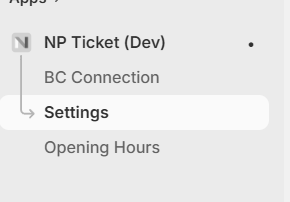

2. Within the **Dynamic Pricing Settings** section:
   - Enable **Dynamic Pricing**
   - Add the ticket product using its SKU
   - After configuration, click **Submit**.

   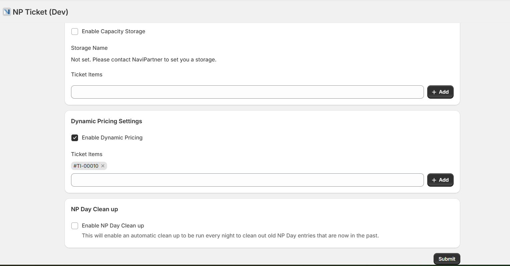

   Alternatively, navigate to **Products → Ticket**, scroll all the way down, and click **"Use Dynamic Pricing"** in the **Blocks** section for the relevant product:

   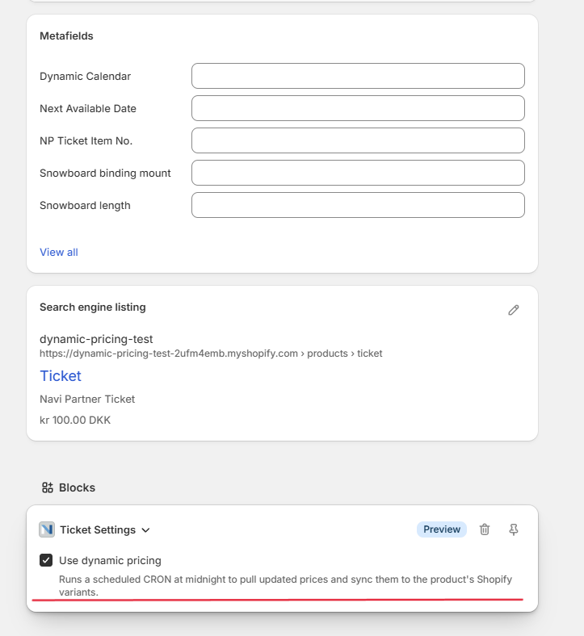

3. After submitting the dynamic ticket configuration, select **Trigger Price Update**:

   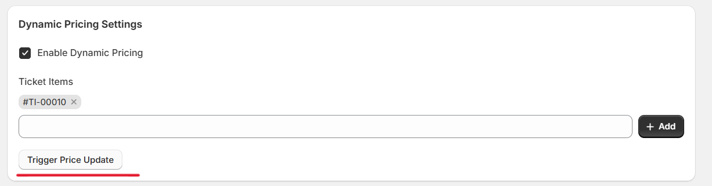

4. Click **Trigger**:

   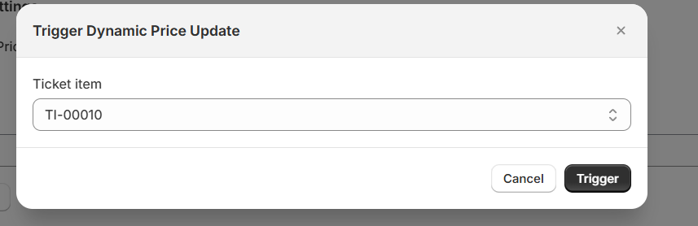



## Verifying Updated Variants

1. Navigate to the **Products** section and open the relevant ticket product.
2. Confirm that newly generated variants are present.
3. Ensure that the variants match the pricing profiles defined in Business Central:

   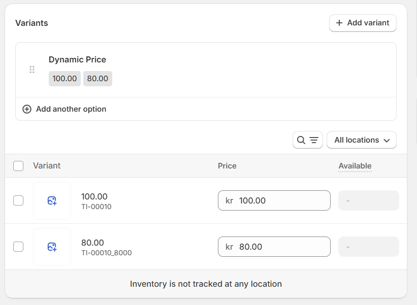

## Pricing Profiles Configuration

1. In Shopify Admin, navigate to **Content → Metaobjects** from the sidebar menu:

   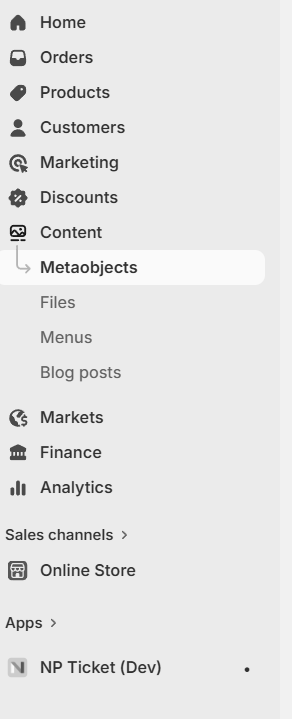

2. Open **Ticket Dynamic Pricing Profile**:

   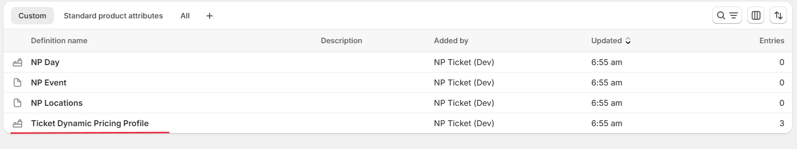

3. Click **Add Entry** and create a custom pricing profile:

   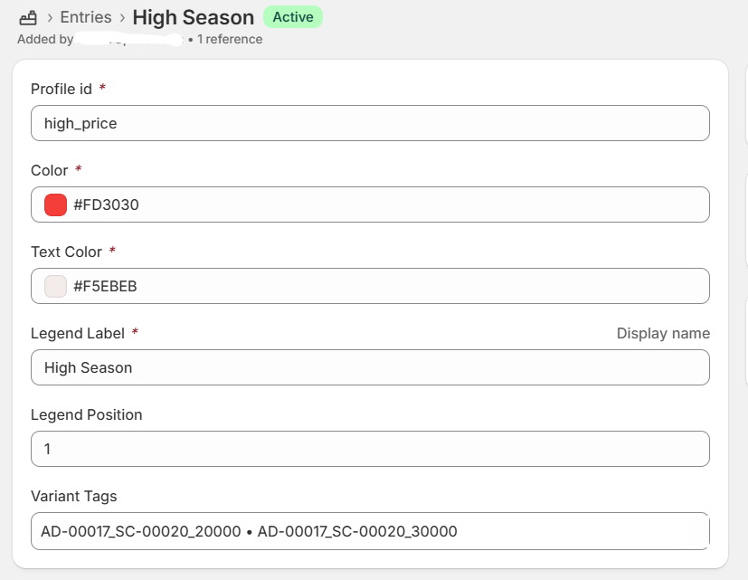

4. For each profile, you can define:
   - Calendar tile color
   - Text color
   - Legend label (display name in calendar UI)

## Mapping Pricing Profiles to Business Central

To link Shopify pricing profiles with Business Central pricing rules, configure **Variant Tags** accordingly:

1. Click the **Variant Tags** field and enter all relevant pricing profiles:

   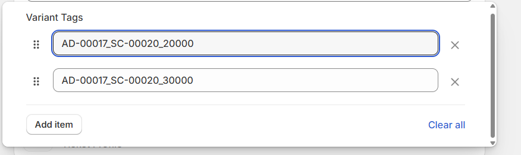

2. For the **Base Price**, use the **Admission Code**.

3. For additional pricing rules, use the following format:

   ```
   AdmissionCode_ScheduleCode_RuleLineNo
   ```

   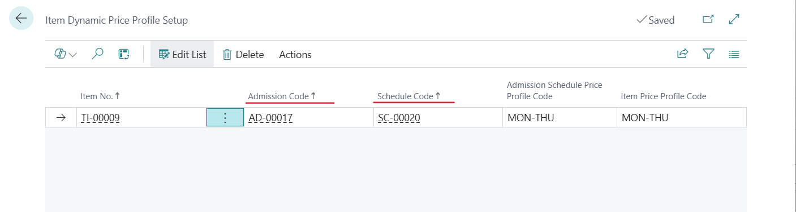
   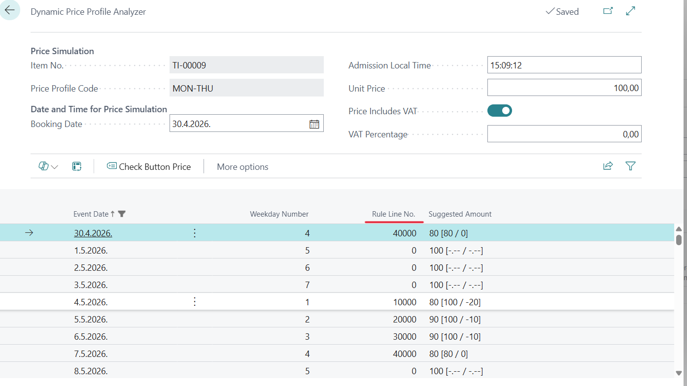

4. Required values can be found in Business Central under: **Ticket Item → Ticket → Pricing Profiles**.
