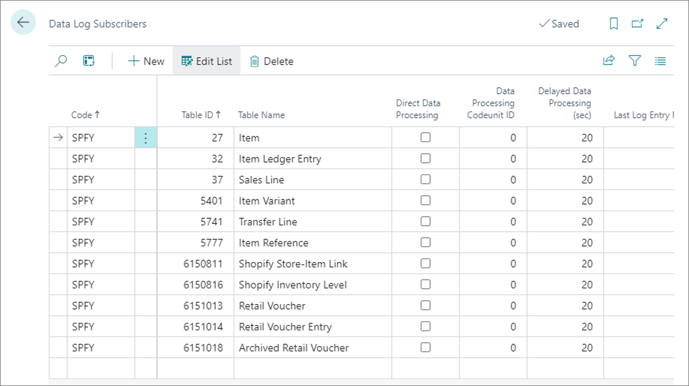
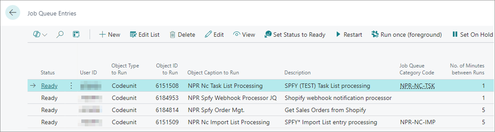
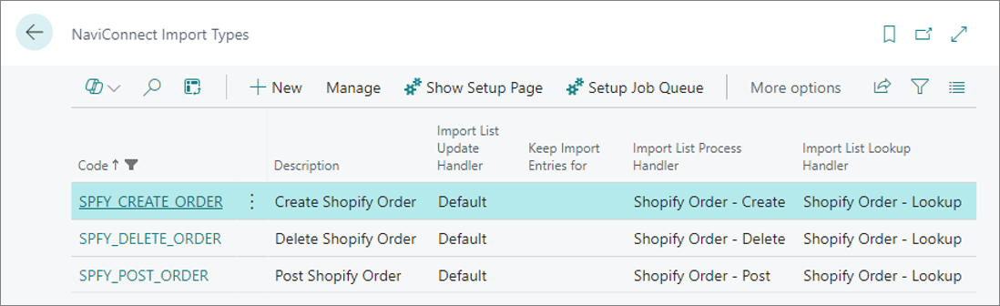

The following setups are generated automatically when necessary. They don't require any action on your part.

## Data log subscribers

Data log subscribers are required if the system needs to keep track of changes done to the data. They are automatically generated if the relevant Shopify integration area is enabled. 

The list of automatically generated data log subscribers is contained in the **Data Log Subscribers** administrative section.

  

All data log subscribers should have **Delayed Data Processing (sec)** set to **20**. 



## Job Queue Entries

The job queue entries are required for automating the regular data exchange between Business Central and Shopify. They are in control of:

 - Processing both NC task list and NC import list entries. 
 - Running specific Shopify-related tasks, like retrieving Shopify orders and handling Shopify webhook notifications. 

The job queue entries are created automatically once the relevant integration areas are enabled.

  

By default, the following job queue entries are created automatically:

|          Event                                                                                                |            Job Queue Entry Created               |
|---------------------------------------------------------------------------------------------------------------|--------------------------------------------------|
| Enable Integration for a Shopify store                                                                              |  Object Type to Run = Codeunit   Object ID to Run = 6151508 [NPR Nc Task List Processing]   Description = \<Task Processor Code> (\<Store Code>) Task List processing   Parameter String = processor=\<Task Processor Code>,store=\<Store Code>,update_task_list,process_task_list,max_retry=3   No. of Minutes between Runs = 1 |
| Enable Sales Order Integration for any Shopify store                                 |     Object Type to Run = Codeunit   Object ID to Run = 6184814 [NPR Spfy Order Mgt.]   Description = Get Sales Orders from Shopify   No. of Minutes between Runs = 5 |
| Enable Sales Order Integration for any Shopify store | Object Type to Run = Codeunit   Object ID to Run = 6151509 [NPR Nc Import List Processing]   Description = SPFY* Import List entry processing   Parameter String = import_type=SPFY*,process_import_list   No. of Minutes between Runs = 5 |
| Enable "Auto Sync Item Changes from Shopify" for any Shopify store | Object Type to Run = Codeunit   Object ID to Run = 6184953 [NPR Spfy Webhook Processor JQ]   Description = Shopify webhook notification processor   No. of Minutes between Runs = 1 | 

## Import types

Import types are needed to process data received from external sources, like Shopify.

  

The following import types are needed for the integration (all of them are related to the [<ins>**Sales Order Integration**<ins>]() area)

| Code                   | Description             | Import List Update Handler      | Import List Process Handler     |  Import List Lookup Handler      |
| :----:                 |    :----:               |                          :----: |                 :----: |                    :----: |
| SHOPIFY_CREATE_ORDER   | Create Shopify Order    | Default                         | Shopify Order - Create               | Shopify Order – Lookup                  |
| SHOPIFY_DELETE_ORDER   | Delete Shopify Order    | Default                         | Shopify Order - Delete               | Shopify Order – Lookup                  |
| SHOPIFY_POST_ORDER     | Post Shopify Order      | Default                         | Shopify Order - Post               | Shopify Order – Lookup                  |



