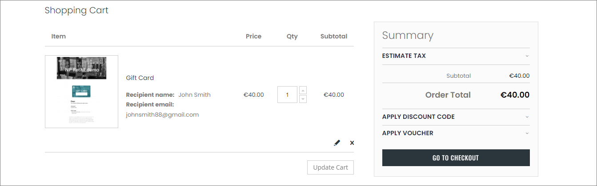

Once you've created a brand-new voucher, you can purchase it in the web store. To do so, follow the provided steps:

#### Prerequisites

- [<ins>Create a new voucher<ins>](), and place it in the main menu of the web store.

#### Procedure in the web store

1. Find the voucher you've created and  in the main menu of the web store.       
   A page with all relevant voucher-related information is displayed.
2. Populate the required fields (**Recipient name** and **Recipient email**), then click **Add to Cart**.     
   The voucher is now ready for checkout.
3. Go to checkout by clicking the cart button in the upper right corner.      
   You can also select the voucher quantity if you wish.       

   

4. Check whether everything is in order, and click **Go to Checkout**.
5. Provide billing information, and select the payment method.      
   If you're paying with card, you also need to provide credit card details before purchasing the voucher.
6. Scroll down, and click **Place Order**.    
   It may take some time for the payment to be processed and completed.
7. Once the order has been placed, note your order number, and copy it.       
   A confirmation email is also sent to the email address you've provided in the previous steps.

## Next steps

### Find your order details in Magento Webadmin

1. Log into **Magento Webadmin**.
2. Click **Sales** > **Orders**.     
   The list of all placed orders is displayed. Among them, you can see the details on the order you've just placed.      

   

3. Click the **Order Number** you've received from the web store.        

   

4. Click **Select** in the **NaviConnect** tab, and then **View XML**.       
   You are presented with an XML document that represents the voucher. You can see the external order number in the *<sales_order_lines>* element

### Apply the voucher on your web order

Once you've received a voucher, you can [<ins>apply the discount it provides<ins>]() on your next purchase from the web store, or even get an item for free if it costs less than the amount the voucher provides.

#### See also

- [<ins>Create vouchers in Magento and Business Central<ins>]()