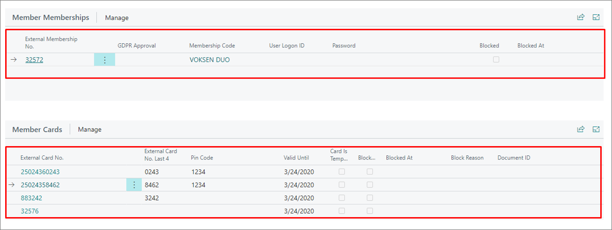
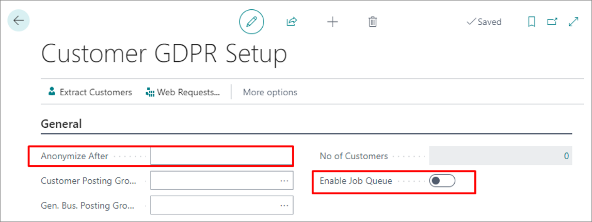

The **Member Card** administrative section is used for storing information for identifying individual members. It also contains options useful for configuring the member entity in Business Central. 

You can open a **Member Card** of a specific member by clicking the customer's **External Member No.** from the **Members** administrative section. The following sections are available: 

## General

You can get an overview of basic information about members, such as their ID, full name, phone number, and address. It's also possible to edit this information, if it has been edited since the last update. There's also an option to **Block** members in this section.

## Member Memberships

This section contains information such as **External Membership No.** and **Membership Code**, which define the type of the membership in use. 

## Member Cards

All membership cards that ever existed for that particular member are listed in this section. Member cards contain information about the subscriptions the members are currently using, or have used in the past.

## Member card actions

The following actions can be taken in the **Member Card** administrative section:

### Issuing new Member cards

If a customer looses their member card, a new one can be issued from the system. This can be done by clicking **Process** in the ribbon, followed by the **Generate New Card** action.

### Anonymizing members

You can wipe out the member's personal information when their membership expires, while still keeping the transactional data stored in the system. When anonymization is complete, the member will be automatically blocked. 

The **External Card No.** is still stored in the system even after the anonymization, so a person can come back with the number and have it reactivated.

You can anonymize customers manually by clicking **Actions**, followed by **Member Anonymization**. 

There's also an administrative section **Customer GDPR Setup** that contains the **Anonymize After** field in which you can specify for how many years after memberships have expired the customer data will be stored in the system. After the specified number of years expires, the customer data is anonymized. Additionally, it's necessary to activate the **Enable Job Queue** toggle switch for the automatic anonymization to become effective.

