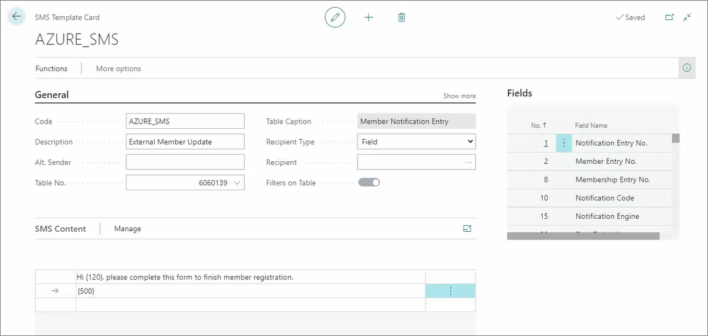

This feature enables users to register as members and acquire a membership card more efficiently than when registering at the counter. As soon as a customer provides their name and phone number to the teller, an SMS is sent their way, and through it, they can access and submit a membership registration form. The membership is also dispatched to the customers via SMS. 

To make this flow possible, it's necessary to perform the following setup steps in Business Central first:

1. Click the  button, enter **Azure Member Registration**, and choose the related link.    
2. Click **New**.       
   The **Azure Member Registration Setup** page is displayed.
3. Provide the **Code** which will be used to identify the membership (e.g. *AZURE_GOLD*), and then provide a more descriptive name for it in **Description** (e.g. *Member Registration GOLD*).
4. Provide the **Azure Storage Account Name** in the designated field.     
   The storage name is contained in the endpoint which is targeted by the API to complete the membership creation request.
5. Provided the Azure storage queue in the **Queue Name**.     
   The queue name is also contained in the full endpoint.
6. Click **Process Azure Queue** in the ribbon, followed by **Actions** > **Setup** > **Create Azure Queue**.     
   A confirmation message is displayed, stating that the queue has been created in the specified Azure storage account.
7. Enable the **Azure Member Registration** via the toggle switch in the **General** panel.
8. Provide the full endpoint URL in the **Membership Registration Url** field.    
   The customer's device will be redirected to that URL when registering their membership.
9. Provide the URL to the terms of service for the membership registration in the **Terms of Service Url** field.
10. Select the **SMS Template** that the customer will receive or create a new one.    
    If you're creating a new template, make sure that the **Document Sending Profile** table with the ID **6060135** is selected in the **Table No.** field. This table contains the best-suited values for the SMS template used in this scenario.

    

11. Make sure that **Enable Dequeing** toggle switch is activated (in the **Queue Processing** panel).
12. Click the  button, enter **Membership Sales Setup**, and choose the related link.    
    Here, you can select which items will be available to the specified memberships. 
13. Click **Create Membership**, and provide the customer's **First Name** and their **Phone No.**; then click **OK**.
14. Assign the new Azure setup profile to the membership sales setup.        
15. Open the **Membership Notification** from the **Membership Card**, and send the SMS to the provided customer's phone number.     
    The customer should then open the SMS, and click the link inside to complete their membership registration.