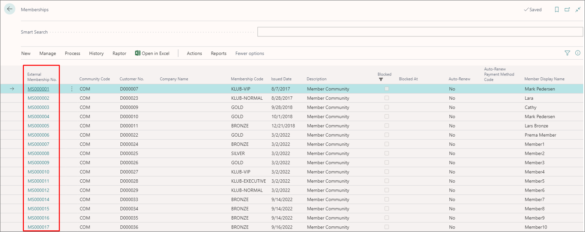

The **Memberships** administrative section contains the list of membership cards. It also offers information about the community code, customer number, membership code, issue date, and the member display name. 

From the **Memberships** list, you can take the following actions:

- Create a new membership (**New**).
- Delete an existing membership (**Manage**).
- View ledger entries (**History**).
- Set up notifications, add entries to the alteration journal, and set up coupons (**Process**).
- Update customer information (**Action**).

From the **Membership List** you can easily navigate to the relevant [<ins>**Membership Card**<ins>]() by clicking the value under the **External Membership No.** column.

  