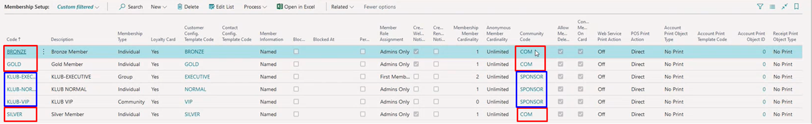

Membership setup defines in more detail what the memberships offer to members. There are six types of memberships, divided into two communities:

- **COM** - Bronze; Silver; Gold
- **SPONSOR** - KLUB-EXECUTIVE; KLUB-NORMAL; KLUB-VIP

  

Once you click on one of the codes in the **Code** column, you will land on the **Membership Setup Card**.

The following fields and options are available in the **General** FastTab:

| Field Name     | Description |
| ----------- | ----------- |
| **Community Code** | Specifies the code used to differentiate between multiple community types. This value needs to be provided when creating a new membership. |
| **Code** | Specifies the code of the membership setup. This value needs to be provided when creating a new membership. |

The following fields and options are available in the **Setup** FastTab:

| Field Name     | Description |
| ----------- | ----------- |
| **Membership Type** | Specifies how many people can be a part of the membership.   <ul> <li>**Individual** - per one member (person). </li> <li>**Community** - all members in the system are assigned to one membership. </li> <li>**Group** - multiple people can be a part of one membership. </li> </ul> | 
| **Membership Member Cardinality** | Specifies the maximum number of members per one membership. |
| **Member Information** | Specifies whether a member is anonymous or registered by name. |
| **Anonymous Member Cardinality** | Specifies whether there is a limit to the number of anonymous members or not. | 
| **Member Role Assignment** | Specifies which types of members can exist in the membership.   <ul> <li>Admin Only</li> <li>The first member is admin</li><li>Members only</li> </ul> |
| **Enable Age Verification** | Specifies whether a certain age is required to be accepted into a membership (e.g. student cards) |

The **Print** FastTab is used for defining how the printing will take place for membership-related objects such as:

- Accounts
- Receipts
- Member cards
- On Member Card Swipe

Each of these sections defines object types used for printing (no print, codeunit, report template). If a template is declared as the print object type, then the **Print Template Code** needs to be defined. If a **Report** is selected, then the **Print Object ID** needs to be selected. 

