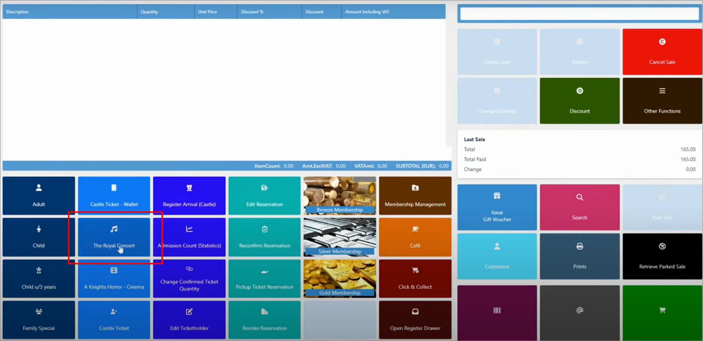
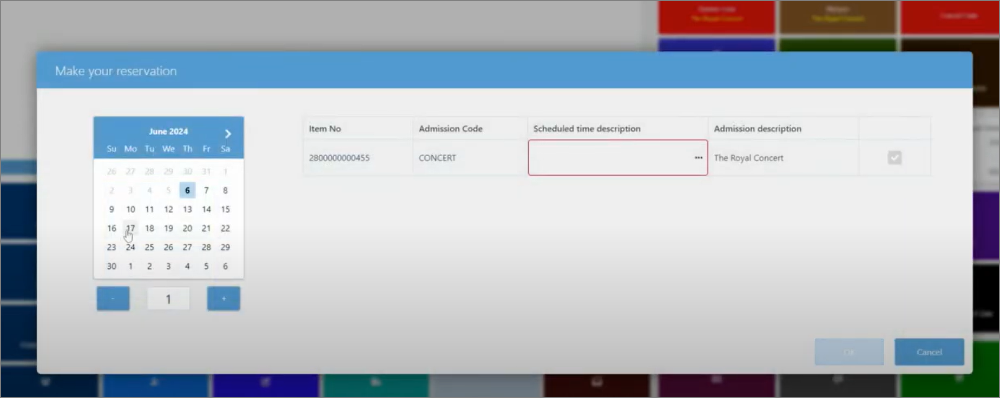
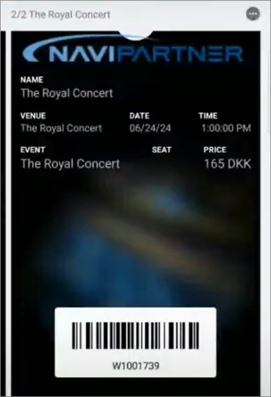

The process of issuing a ticket from the POS follows the same flow as when standard items are sold on the POS. 

1. Open the POS and log in.
2. Select the event/object the customer wishes to gain an entry to.

   

   A pop-up window is displayed.
3. Select a date on which the customer wishes to attend the event or enter the object of interest, as well as the number of tickets they are purchasing.

   

4. Check the available time slots by pressing **Scheduled time description**, and then press **Apply** if there are sufficient tickets left for the customer's preferred time slot.
5. Check whether everything else is in order, and press **OK**.     
   The **Ticket Holder** pop-up window is displayed.
6. Provide the guest's name, email and phone number in the designated fields.      
   If the phone number has been provided, the customer will receive an SMS containing the purchased ticket.
7. Proceed to **Payment**.     
   If the ticket has been set up for **Printing**, the ticket will be printed after the sale is finalized.

## SMS ticket

If a customer's phone number has been provided in the previous steps, they will receive an SMS containing the URL which directs them to the download link for their purchased ticket. 

   

Once they download and open the file, they will see the barcode that needs to be scanned to provide them entry to the requested event/object.

<iframe width="560" height="315" src="https://www.youtube.com/embed/sTXZINekEj0?si=js30xVab3D6cNtJy" title="YouTube video player" frameborder="0" allow="accelerometer; autoplay; clipboard-write; encrypted-media; gyroscope; picture-in-picture; web-share" referrerpolicy="strict-origin-when-cross-origin" allowfullscreen></iframe>

#### See also

- [<ins>NP Designer<ins>]()
- [<ins>Set up DIY printed tickets<ins>]()
- [<ins>Set up tickets using the Ticket Setup Wizard<ins>]()
- [<ins>Admit an issued ticket<ins>]()
- [<ins>Create prepaid tickets<ins>]()
- [<ins>Create postpaid tickets<ins>]()
