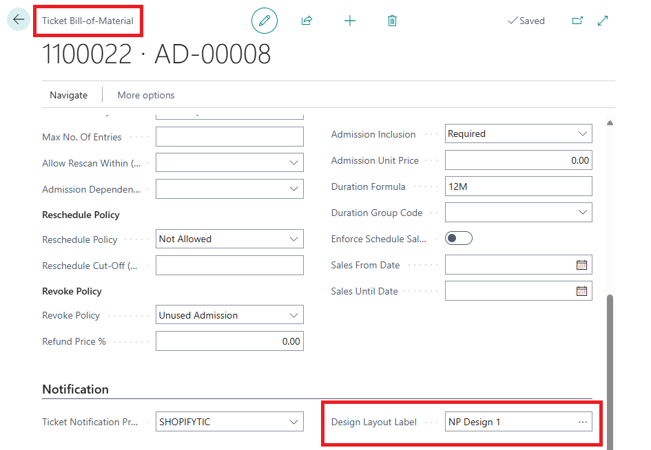

This article provides an overview of the NP Designer application, including guidance on ticket design and configuration.

NP Designer is a dedicated application for creating and customizing ticket layouts within Microsoft Dynamics 365 Business Central. It enables users to design visually consistent tickets using configurable elements, manage multiple templates for various use cases, and ensure alignment with both operational needs and branding standards.

### Sign up

To access the Ticket Designer application, only the user's email address is required for login. These steps should be followed:

* Step 1: Enter your email address and click Next.

* Step 2: Check your inbox for a one-time code, enter it, and click Login.
 

### Designs

The Designs page is the main workspace in Ticket Designer, where users create and manage ticket layouts. New tickets can be started from a blank design or by duplicating an existing one. All designs are shown as cards with a preview, name, creation date, and language. Users can add new designs via the Add new design button, or organize them into folders using Add new folder.

Each design card also includes an options menu where users can delete, duplicate, and see the history of changes or rename designs.

### Ticket creation

The Designs page provides a canvas for creating and customizing ticket layouts, supported by intuitive tools for flexible design. At the top, users can name the design and set the language, while changes can be saved anytime using the Save button.

On the left side of the editor, a toolbar gives access to design elements such as text, images, shapes, and QR or barcodes. Elements are added by dragging them onto the layout, where they can be positioned and resized.

#### Toolbar

| Icon                                   | Desription                           |
| -----------                            | -----------                          |
|       | Add plain text to the design canvas. Useful for displaying static content such as event names, dates, or ticket numbers. |
|         | Upload and insert custom images like logos, banners, or backgrounds into the ticket layout. |
|   | Insert simple graphical elements (rectangles, lines) for visual structure or decoration. |
|           | Embed QR codes or barcodes containing ticket data, links, or other scannable content. |
|       | Small grid displays a grid of small squares across the ticket design area for more accurate element alignment, while Quarter grid inserts horizontal and vertical lines that divide the layout into four equal sections. |
| | Opens a sidebar displaying all elements currently added to the ticket layout. Each item is listed with its exact position and dimensions, allowing for precise selection, inspection, and editing. |

The editor is designed to give full creative control while maintaining clarity and structure, making it easy to build visually consistent and print-ready ticket designs tailored to specific events or venues.

<video width="500" height="300" controls>
  <source src="/videos/NP_Designer.mp4" type="video/mp4">
  </video>

### Users

The Users page lists all registered users with their details and permissions. Administrators can add, edit, or remove users via the Add new user button or the action menu, and quickly find entries using the search bar.

### Connection

The Connection page is set up by a NaviPartner employee, while the description is provided solely to familiarize the customer with the process, explaining the tenant ID, environment, company, and the auto-generated API key that must be inserted into the NPDesigner Setup in Business Central.

### Medias

The Medias page serves as a central library for all image assets used in ticket designs, such as logos and backgrounds. Media files can be added or removed as needed and are available for direct use within the design interface.

## Business Central

After a successful connection, the integration between NP Designer and the Business Central environment is established, and the user can access the Business Central side for ticket usage.

### NPDesigner Setup Card

The NPDesigner Setup page serves as the place for configuring the integration between NP Designer and Business Central. On this page, the URL of the NP Designer application is entered, along with the API key generated by the application. The fields Public Ticket URL and Public Order URL are prepopulated and do not require manual input.

### Ticket Bill-of Material (BOM)

On the Ticket Bill-of-Material page, the Design layout label field is defined. This is where the user specifies which NP Designer layout will be applied, ensuring that the correct label format is used whenever tickets are generated.

### Ticket List

The Ticket List page is designed to display all available tickets within the system. In addition to providing an overview of ticket information, it allows users to preview any selected ticket in its digital format through the View Online Ticket action.

#### See also

- [<ins>Set up DIY printed tickets<ins>]()
- [<ins>Set up tickets using the Ticket Setup Wizard<ins>]()
- [<ins>Admit an issued ticket<ins>]()
- [<ins>Create prepaid tickets<ins>]()
- [<ins>Create postpaid tickets<ins>]()