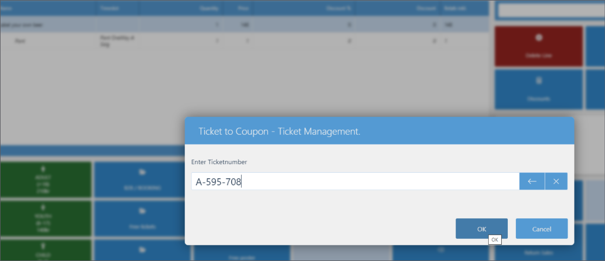

The Ticket to Coupon functionality allows customers to purchase tickets that can be redeemed for specific items or services at designated attractions. 

When customers present their ticket at the counter, cashiers can utilize the **Ticket to Coupon** POS action to scan the ticket. The system then applies the corresponding discount to the physical product or service linked to the ticket’s associated coupons. 

The coupon is both created and archived on the spot automatically in the background. When this happens, the coupon is exported to Business Central and posted.     

   

The administrative section **Ticket Coupon Profile** is used to configure and maintain ticket-to-coupon setups. This includes associating tickets with one or more coupons.

1. Click the  button, enter **Ticket Coupon Profiles** and choose the related link.
   You will need to create or modify coupons per a profile.
2. Define the **Coupon Type** to be used, and ensure that a meaningful **Required Admission Code** is included.     
   The coupon type will be linked to the specific coupons later in the process. 

   

3. Edit the selected coupon type, and click **Setup**, followed by **Setup Apply Discount** in its ribbon.      

           

   The **Coupon List Items** window is displayed.

4. Add the product or products the discount should be applied to in the **Coupon List Items** table.

5. To ensure parity with the Ticket to Membership feature, designate a coupon alias within the profile group as **Default** (even if only one alias exists).      
   This ensures that the alias name is automatically provided when the coupon is requested online.       

   

6. Tick the **Enabled** checkbox next to the relevant profiles.
7. In **Valid From Date** select one of the following options:    
   - **Purchase** - The coupon will be valid from the purchase date until the end date defined by the **Valid For Date Formula**.
   - **First Admission** - The coupon will be valid starting from the first admission date, with the validity ending according to the **Valid For Date Formula**. 
   - **Selected Admission** - The coupon will be valid from the date of the **Required Admission**.
   - Blank - The coupon will be valid for the same date range as the ticket. 

   

8. Navigate to the **Ticket Types** administrative section, and create a new ticket type. 
9.  Add the profile code of the previously created ticket coupon profile to the **Coupon Profile Code** column. 
10. Create a new button on the POS, and assign the **TM_TICKETMGMT_3** action to it. 
11. Configure the action's variables:     
   - Set the **CouponAliasCode** to the alias assigned to the ticket coupon profile you're using.
   - Set **Function (Enum)** to **Ticket to Coupon**. 
   - Add a caption for the button that will appear on the POS interface.
   - Optionally, add a secondary caption for additional clarity.

12. Open the POS interface to perform a sale. 
13. Select the item to be purchased, which may include new memberships or membership renewals.
14. Press the newly created button to apply the discount.      
15. Scan the ticket or enter its number in the pop-up.      

    

    A 100% discount is automatically applied to the selected item. 
16. Complete the POS transaction.     
    The coupon is created and archived automatically. You can view the coupon using the **View Ticket Coupons** action in the **Ticket List** or find it under **Archived Coupons**.
