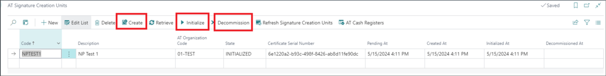
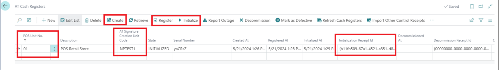
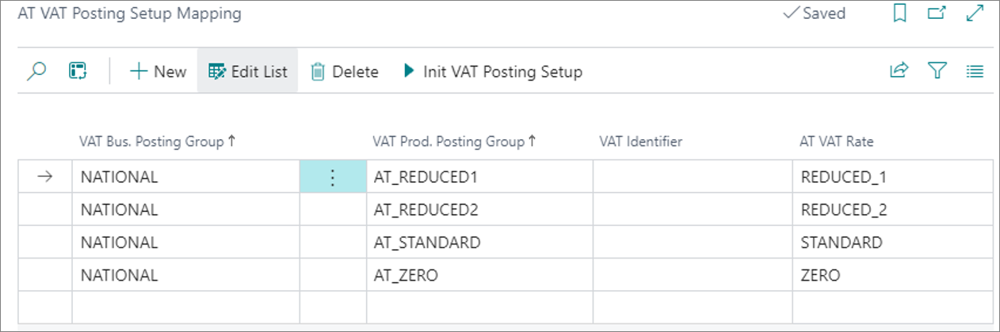

NP Retail is integrated with the Fiskaly API solution that makes the usage of NaviPartner's POS solution compliant with Austrian fiscal laws. 



To configure NP Retail for compliance with Austrian fiscal laws, follow the provided steps:

1. Navigate to the **AT Fiscalization Setup** administrative section.
2. Enable the **AT Fiscalization Enabled** toggle switch.      
   The **Fiskaly API URL** field is automatically populated as a result. 
3. Expand the **FinanzOnline Credentials** section, and populate the available fields.      
   The FinanzOnline credentials are unique for each company/legal entity. They are provided by FON when a client registers as a FinanzOnline Cash Register web service user. More information can be found in the [<ins>FinanzOnline handbook<ins>](https://finanzonline.bmf.gv.at/eLearning/BMF_Handbuch_Registrierkassen.pdf) (pages 60-63).
4. Create a POS audit profile that will be used for all POS units that are going to be used. Make sure the following configurations are applied: 
   - Select **AT_FISKALY** as the **Audit Handler**.
   - Make sure the **Audit Log Enabled** toggle switch is active. 
   - Make sure the **Allow Sales and Return in the Same Transaction** toggle switch is disabled. 
5. Open the **AT Organizations** page from the **AT Fiscalization Setup** ribbon.       
   The AT organization can be created for a company or on a POS store level.
6. Create a new AT organization.
7. Provide the **API Key** and the **API Secret** in the **AT Organization Card**.      
   Both pieces of information are obtained from the Fiskaly Dashboard as soon as the Fiskaly organization is created. 
   
   

8. To authenticate the organization, use the **Authenticate FON** action in the ribbon.
9. Create a Signature Creation Unit (SCU) following the organizations' successful authentication.      
   The SCU is created on the entire organization level. It is used for signing transactions made on the POS. Each transaction is signed.
10. Provide the **Code**, **Description**, and select the authenticated organization in the **AT Organization Code** field.
11. When all date is input, click **Create** to create the SCU for this organization, and then click **Initialize**.

    

    

12. Navigate to the **AT Cash Registers** administrative section.     
    After the SCU has been created and initialized, it's necessary to connect the POS units with it, so that a transaction is signed every time it is made from the POS unit.
13. Select a POS unit from the **POS Unit No.** dropdown list, then select the previously created SCU code from the **AT Signature Creation Unit Code** dropdown list. 
14. Execute the **Create**, **Register**, and **Initialize** actions (in that order) to activate the cash register.        
    A transaction will be created and recorded in the **AT POS Audit Log** after it's been initialized.

    

15. Navigate to the **AT VAT Posting Setup Mapping** administrative section, and set the combination of **VAT Business** and **VAT Product** posting groups.      
    The combination needs to be compliant with the permitted VAT rates in Austria, and they need to match the existing combinations set on the standard **VAT Posting Setup** table. 

    

    It's possible to insert all combinations from the **VAT Posting Setup** by executing the **Init VAT Posting Setup** action.

16. Navigate to the **AT POS Payment Method Mapping** administrative section, and choose the POS payment methods you wish to use, then connect them to the related **AT Payment Types**.

    

17. Click **Init Payment Methods** to insert all payment methods.       
    Cash transactions are all payment made in cash, but they also include credit/debit card payments, gift cards/vouchers, and any other cash substitutes, while bank transfer is a non-cash transaction.

<iframe width="560" height="315" src="https://www.youtube.com/embed/3AWFsa9u_Qg?si=tti_NF2Mlh29yFkn" title="YouTube video player" frameborder="0" allow="accelerometer; autoplay; clipboard-write; encrypted-media; gyroscope; picture-in-picture; web-share" allowfullscreen></iframe>

#### See also 

- [<ins>Transactions (Austrian fiscalization)<ins>]()
- [<ins>AT POS Audit Log (Austrian fiscalization)<ins>]()