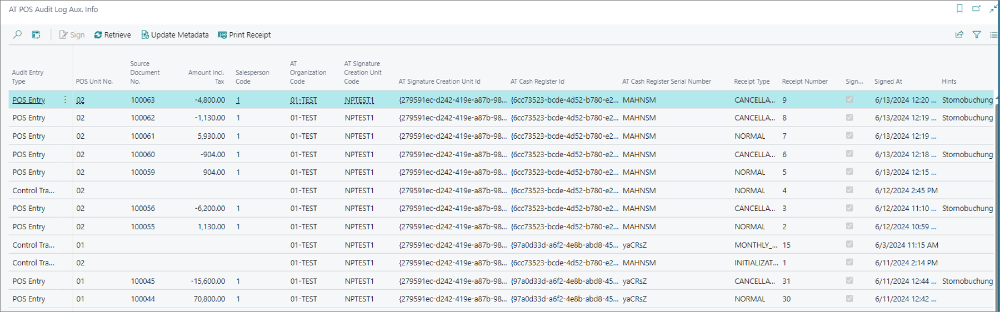

All transaction data tied to POS compliant with the Austrian fiscalization laws is recorded in the **AT POS Audit Log Aux. Info** administrative section.

The following information can be learned from this table: 

| Field Name      | Description |
| ----------- | ----------- |
| **Audit Entry Type** | Specifies whether the transaction is related to the POS entry or the cash register. Cash register transactions are connected to the initialization or decommission of the POS unit. | 
| **AT Organization Code** | Specifies the code pertaining to the cash register registered with Fiskaly. |
| **AT SCU Code** | Specifies the information pertaining to the SCU created for the given POS unit from Fiskaly. | 
| **AT SCU ID** and **AT Cash Register ID** | Provides identification for the POS clients created with Fiskaly. | 
| **AT Cash Register Serial Number** | Specifies the unique serial number related to the registered Fiskaly client. | 
| **Receipt Type** | Specifies the status of the receipt (transaction), e.g. normal, cancelation, training, initialization, decommission, yearly_close, monthly_close, signature_creation_unit_fault_clearence. | 
| **Hints** | Specifies the receipt type information that Fiskaly provides, and that is printed on the receipt. |
| **FON Receipt Validation Status** | Specifies whether the transaction validation from FON was successful or not. |
| **Receipt Number** | Specifies the receipt number generated per each POS unit (AT cash register). | 

<iframe width="560" height="315" src="https://www.youtube.com/embed/3AWFsa9u_Qg?si=tti_NF2Mlh29yFkn" title="YouTube video player" frameborder="0" allow="accelerometer; autoplay; clipboard-write; encrypted-media; gyroscope; picture-in-picture; web-share" allowfullscreen></iframe>