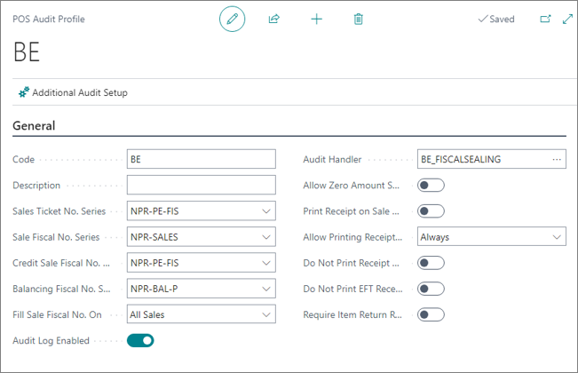
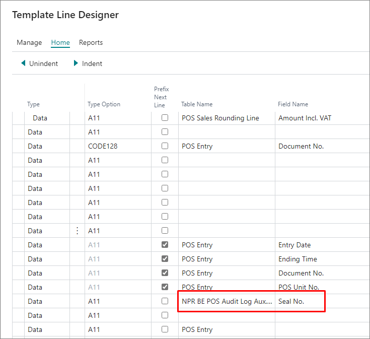
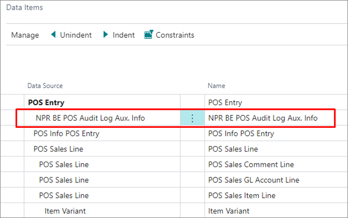

To configure NP Retail for compliance with Belgian fiscal laws, follow the provided steps:

1. Navigate to **POS Audit Profiles**, and create a new profile.
2. Populate the **Code** and other mandatory fields.      
   
   
  
3. Enable the audit log, and set the **Audit Handler** to **BG_DISCALSEALING**.
4. Make sure this audit profile is set for all POS units from the **POS Unit List** that need to be compliant with Belgian fiscalization laws.

## Next steps - Set Seal No. On Receipt

The receipt template that is used for the Belgian compliance is **EPSON_RECEIPT_2**. The seal number can be printed on receipt by editing the layout of that template, and adding the table from where the number should be taken, as well as the field. 

Before editing the layout, make sure that the table from which the seal number needs to be retrieved is in the table **Data Items** for the given template. 

When this is set, the seal number will be stated on the ticket each time it is printed. 

#### See also 

- [<ins>BE POS Audit Log<ins>]()