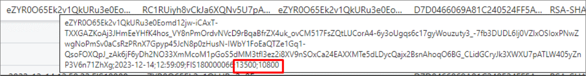
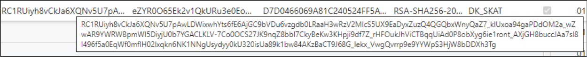

All transactions performed on the POS are recorded in the **DK POS Audit Log Aux.** administrative section. You can also see on which POS unit and in which store the given transaction has been performed, as well as the date of the transaction, and the numbers of associated documents and entries.

The **POS Audit Log** page contains information on all cash register activities that have been carried out. All cash register activities linked to POS transactions have the same number as the transactions they are linked to - **Acted on POS Entry No.** and **Acted on POS Entry Fiscal No.**. In addition  to this, the sales and return transactions have the accompanying signature displayed in the **Signature Base Value**, **Signature**, and the **Previous Signature** columns.

## Digital signatures

- **Signature Base Value** - This value is used as the base of the encryption, and it contains the time, date, and the number of the transaction request, as well as the amount including and excluding the VAT. These values are subsequently encrypted to form the actual signature.

   

The last two digits of both values in the provided screenshot are decimals, so the amount including VAT is 135,00, and the number excluding VAT is 108,00.

- **Signature** - This value is the encrypted combination of the time, date, number of the transaction request, as well as the amount including and excluding the VAT, as seen in the **Signature Base Value**.

   

- **Previous Signature** - This value is the signature of the previously recorded transaction.

## Subsequent signing transactions

Subsequent signing is required for transactions that aren't signed. This process requires the **NPR DK Re-gen. Audit Signature** codeunit to be run from the **Object List**. When executed, all transactions for signing from the **POS Entry List** will be transferred (or recreated if they were already available in the Audit Log), and signed in the **POS Audit Log**. 

If some of the POS entries were previously signed, they will be recreated and resigned as well, and the previous signatures will be deleted. 
