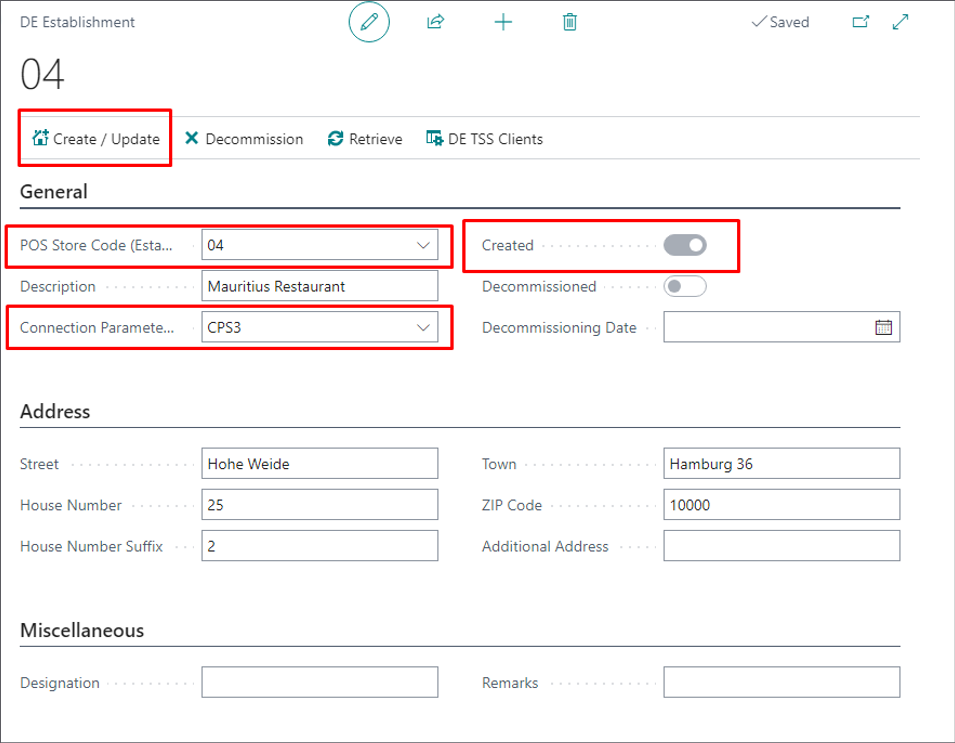
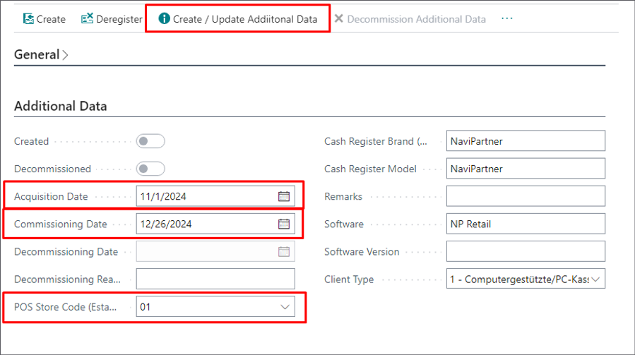
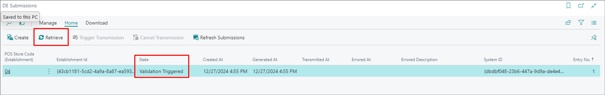
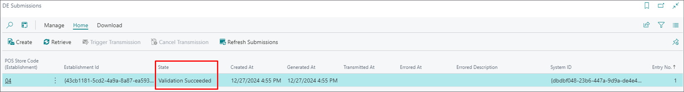
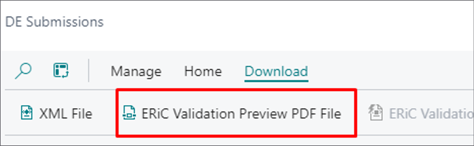
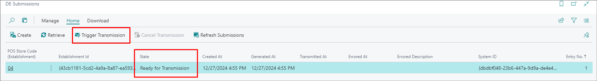

The Fiskaly SIGN DE x Submission API enables the management of taxpayer, establishment, client, and submission data necessary for submitting a declaration on the use of Electronic Record-Keeping Systems/ERS (Elektronische Aufzeichnungssysteme/EAS in German) as required by fiscal authorities.

Key features of the integration include:

- Input and validation of all relevant data
- Generation of the submission in the required XML format
- Transmission of the submission to the fiscal authorities

To perform the preliminary setup for its use, follow the provided steps:

## Configure Taxpayer Information

1. Navigate to the **DE Connection Parameter Set** page.
2. In the **Taxpayer** section, provide the following company details: **Type**, **Registration No.**, **Tax Office Number**, **VAT Registration No.**, **Company Name**, **Legal Form**, and **Address Information**.
3. Once all fields are filled, click **Create/Update Taxpayer Records**.        
   A toggle switch labeled **Created** is enabled to to confirm the records have been created.

## Add Establishment Details

1. Navigate to the **DE Establishment** page, and provide the following information: **POS Store Code**, **Connection Parameter Set Code**, and **Address Information**. 
2. Click **Create/Update** to create the establishment in Business Central. 

  

  

## Set Up TSS Clients

1. Open the **DE Fiskaly TSS Clients** page and access the **TSS Client Card**.
2. Fill out the **Additional Data** section for each client connected to the given establishment:   
   - **Acquisition Date** - the date the client was first reported to Fiskaly.
   - **Commissioning Date** - the date the additional data was first reported.
   - **POS Store Code** - the store code related to the establishment.      

  

3. Click **Create/Update Additional Data** to submit the additional information on the establishment to the Fiskaly.

  

## Submit Establishment Data

1. Navigate to the **DE Submissions** page and click **Create**.
2.  Select the relevant establishment from the list.
3.  Click **Retrieve** to check the submission status from Fiskaly.    
    
    
    

4.  Download the **ERiC Validation Document** from the **Download** section to confirm validation success.       
    
           
  
    When validation is successful, the submission status changes to **Ready for Transmission**, enabling the **Transmission Triggering** action.      

    

5.  Trigger the transmission to submit the data to Fiskaly.      
    Upon success, the status updates to **Transmission Succeeded**.      
    In case of errors, the **Errored At** and **Errored Description** fields will display the details.

## Download Submission Files

It is possible to download the following files for submission: 

- **XML File** - contains the submitted data in XML format, as required for its transmission to the tax authorities.
- **ERiC Validation Preview PDF** - a preview of the submission after successful validation, generated by ERiC in the PDF format.
- **ERiC Transmission PDF** - contains submission data upon successful transmission, generated by ERiC in the PDF format.
- **ERiC Validation XML File** - if the validation is unsuccessful, this file will contain a set of errors in the XML format.
- **ERiC/ELSTER Transmission XML File** - if the transmission fails, this file will contain a set of errors in the XML format.