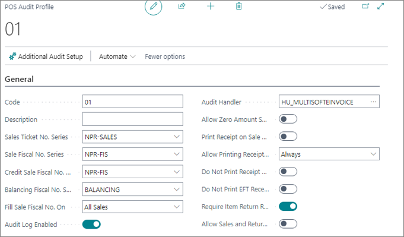
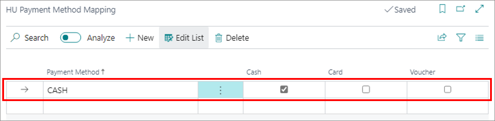

E-invoices, provided by [<ins>Multisoft<ins>](https://www.multisoft.hu/en/homepage/), facilitate real-time communication with the relevant tax authorities. A sales order can be created from a POS, and issued to a customer in a form of an invoice. 

To enable e-invoices, follow the provided steps:

1. Navigate to the **HU MultiSoft E-Invoicing Setup** administrative section in Business Central.     
   A new page is displayed.
2. Enable the HU **E-Invoicing**.
3. Navigate to the **POS Audit Profile** administrative section.     
   The list of audit profiles is displayed.
4. Create a new audit profile, and select **HU_MULTISOFTEINVOICE** as the **Audit Handler**.
5. Enable the **Audit Log**.

   

6. Make sure this audit profile is selected on all POS units in the **Profiles** section of each **POS Unit Card**.
7. Navigate to **HU Payment Method Mapping**. 
8. Select payment method codes will be available while processing invoices, and relate them to one of the three available payment methods.

   

   When sales are finished, only the mapped payment methods will be applied to the sales orders. 