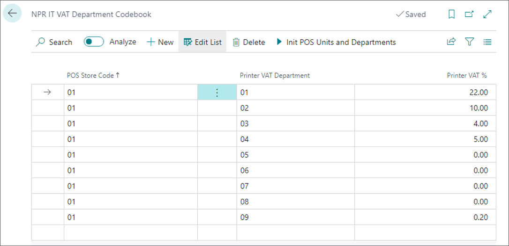
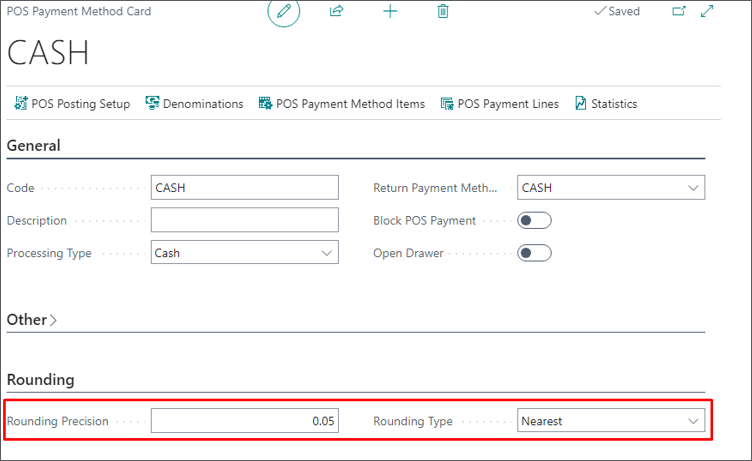
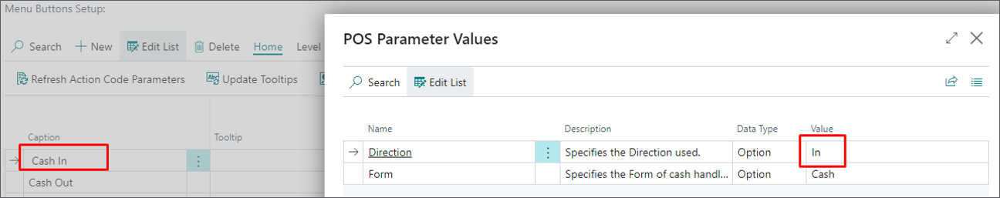
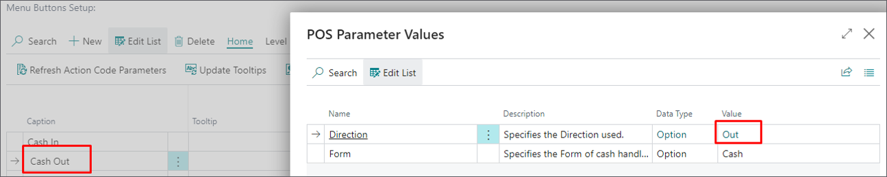
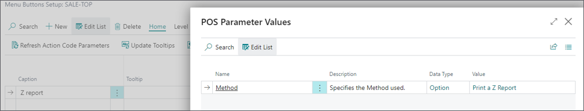
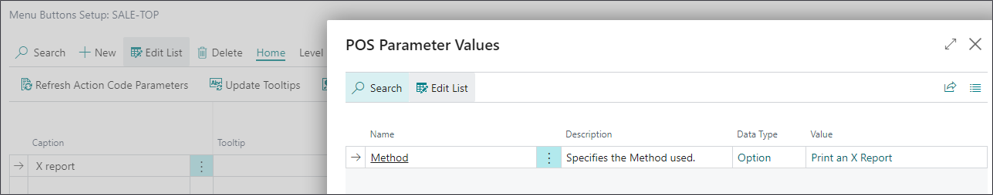
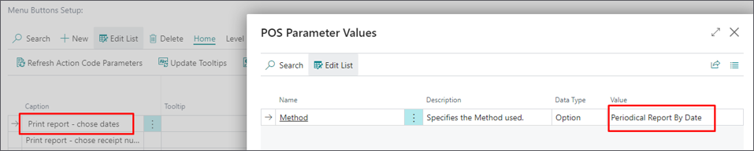
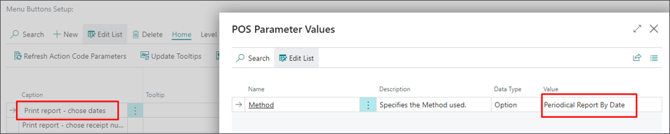
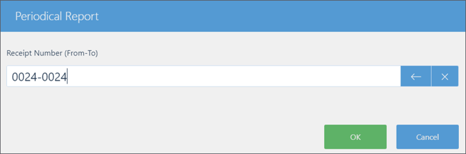

The Italian fiscalization is based on the POS system integration with the fiscal printer (RT device) that communicates with the tax authority (TA) and generates printouts for various processes such as:

-	Sales
-	Voucher handling 
-	Discounts
-	Return
-	Cancellation
-	Invoice
-	Cash-in/Cash-out
-	Reports (X report, Z report and EJ report)
-	Receipt copy
-	Lottery handling

To ensure compliance with Italian fiscal laws, follow the provided steps:

1. Navigate to the **IT Tax Fiscalization Setup** page, and enable the fiscalization via the toggle switch.
2. Open the **POS Audit Profiles** administrative section, enable the audit log, and set the **Audit Handler** to **IT_ENTRATE**.
3. Make sure this audit profile is set for all POS units from the **POS Unit List** that need to be compliant with Italian fiscalization laws.
4. Move on to the **IT POS Unit Mapping** page, and enter the **Fiscal Printer IP** address for the POS unit connected to the printer, and set the **Fiscal Printer Rounding Type** to **Standard Rounding**.       
5. To obtain the **Fiscal Printer RT Type** and **Fiscal Printer Serial No.**, create a POS button using the **IT_PRINT_MGT** action, and set the parameters to **Get Fiscal Printer Model**.     
   The **Fiscal Printer RT Type** and **Fiscal Printer Serial No.** fields are populated after the **RT Printer Type** and **RT Serial No.** are executed from the POS.
6. To be able to log into the printer, create a POS button using the **IT_PRINT_MGT** action, and set the parameters to **Log in Fiscal Printer**.      
7. Ensure that the printer’s password, stored in **IT POS Unit Mapping** under **Fiscal Printer Password**, is correctly configured.     
   When triggered, the **IT_PRINT_MGT** action takes the printer's password from **IT POS Unit Mapping** and logs into the fiscal printer with it. 
8. Set up the action to get the fiscal printer VAT codes. The action is **IT_PRINT_MGT** while its parameter should be set to **Setup Printer**.          
   The action should be run from **Function Menu** on **POS Login** page. 

   VAT department codes are listed in the **NPR IT VAT Department Codebook** table.    

   

   The **VAT %** column contains all possible VAT rates for Italian compliance. According to the VAT % set in the **VAT Posting Setup** table, when a sale is made from the POS, the printer gets the VAT department number, and uses it for printing the correct VAT rate on the receipt. 

9.  From the **IT POS Payment Method Mapping** table, choose the POS payment method corresponding to the Italian fiscalization payment methods from the **IT Payment Method** field. 
10. Assign a unique **IT Payment Method Index** to each payment method.      
   The index value determines how payments are grouped in X and Z reports.         

   The following range (possible variants of payment methods) of index values is available for printer payment types:

   - 0Cash – 0-5
   - 1Check – N/A
   - 2Credit card – 0-10
   - 3Ticket – 1-10
   - 4Multiple tickets – 1-99
   - 5Not Paid – 0-Mixed (goods and services);1-goods; 2-services; 3-Invoice to follow; 4-RT invoice;5-national health
   - 6Payment discounts – 0-generic; 1-multi-use voucher. 

11. Set rounding for cash payments.      
    Refer to the following rules:

    - 1 and 2 cents -> rounding the account down to a round figure (e.g. € 9.31 -> € 9.30)
    - 3 and 4 cents -> rounding off the account to 5 cents upwards (e.g. € 9.33 -> € 9.35)
    - 6 and 7 cents -> rounding off the account to 5 cents down (e.g. € 9.37 -> € 9.35)
    - 8 and 9 cents -> rounding of the account to a round figure upwards (e.g. € 9.38 -> € 9.40)

12. On the **POS Payment Method Card** for cash payments, set the **Rounding Precision** to **0,05** and the **Rounding Type** to **Nearest**.     

    

13. Create the buttons for **Cash In** and **Cash Out** using the **IT_CASH_MGT** action.     
    For cash-in, set the parameter value to **In**, and for cash-out, set the parameter value to **Out**.     

    

    

    

## Additional setup

### Issue lottery code

1. Create a POS button for the action **IT_LOTT_CODE**. 
2. Before choosing the payment method to finish the sale, enter a lottery code.
3. Complete the sale with a desired payment method.     
   The lottery code will become visible on the receipt below the receipt number. 

### Print fiscal reports

It is possible to print the end-of-day report (Z report), X report, electronic journal report, and periodical report.

#### Z report

1. Create a POS button for the action **IT_PRINT_MGT**.
2. Set the parameter value to **Print a Z report**.     

        

3. Execute the action on the POS to print the end-of-day report.

#### X report

1. Create a POS button for the action **IT_PRINT_MGT**.
2. Set the parameter value to **Print an X report**.     

   

3. Execute the action on the POS to print the X report.    
   It shows the current balancing stated on the printer. 

#### Periodical report

Periodical reports can be printed by two methods – by choosing dates and by choosing receipt numbers. 

1. Create POS buttons for both options by using the action **IT_EJ_REPORT**. 
2. Choose the option for printing by setting the necessary parameters.     
   
   

   

#### Receipt duplicate

1. Create a POS button for the action **IT_PRINT_MGT**.
2. Set the parameter value to **Print Last Receipt**.     
3. Execute the action on the POS to print the duplicate of the last printer receipt.    

#### Receipt copy

1. Create a POS button for the action **IT_EJ_REPORT**. 
2. Set the parameter to **Periodical Report By Receipt Number**.      
   The receipt numbers (from-to) should be the same, as displayed in the following screenshot:

   