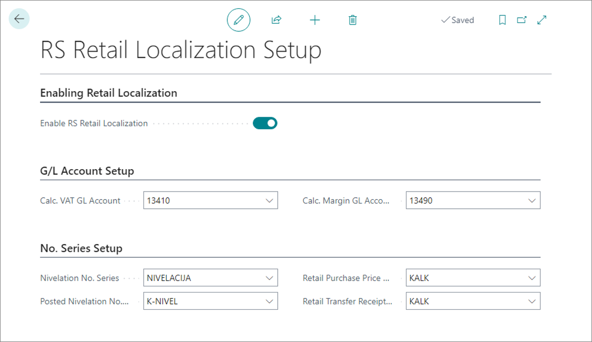
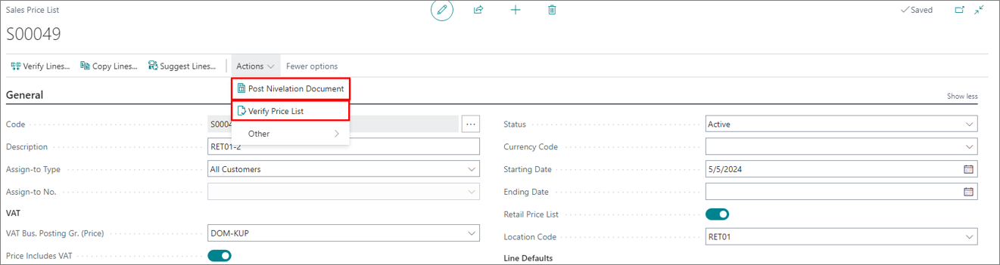

To set up retail localization compliant with Serbian fiscal laws, follow the provided steps:

1. Go to the **RS Retail Localization Setup** page, and enable retail localization via the **Enable RS Retail Localization** toggle switch.
2. Provide the accounts for posting the **Calculated VAT** and **Calculated Margin**.
3. Set the **No. Series** for posting documents.

   

  

4. Open the adequate **Location Card** and enable the **Retail Location** toggle switch.      
   The toggle switch should be enabled on all retail locations affected by the localization.

5. Create the **Sales Price List** that will be used.      
   It's possible to  modify it until it's verified. 
6. Execute the **Verify Price List** action.      
   The starting date set in the sales price list specifies when the sales price list becomes effective, and the verified data cannot be changed. 
   
   

7. (Optional) You can add new items and prices to an active price list. It's necessary to verify the new price list for it to become valid, however.      
   The verification is performed via the **Verify Lines** action.
8. Mark the sales price list in use as the **Retail Price List**.

## Document nivelation (price leveling)

The nivelation document is created when the following actions are taken:

- when discounts are recorded
- when the sales price is changed

When the discount is used in the sales invoice or a POS transaction, the nivelation document will be posted.

When the item price is changed, the new price list should be created. The nivelation document is posted by choosing the **Post Nivelation Document** action.

   

All posted nivelation records can be found in the **Posted Nivelation Documents** list.
