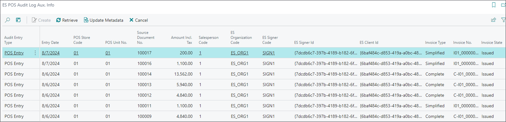

This guide explains how to configure NP Retail to comply with Spanish fiscal laws. Follow these steps:

1. Open the **ES Fiscalization Setup** page, and enable **ES Fiscalization**.
2. In the **Endpoints** section, enter the following links:       
   
   - Test environment: *https://test.es.sign.fiskaly.com/api/v1/*
   - Live environment: *https://live.es.sign.fiskaly.com/api/v1/*

3. If using the live environment, ensure the **Live** toggle switch is enabled so that transactions are sent to the correct API.
4. In the **Invoicing** tab, set the maximum amount for issuing simplified invoices in the **Simplified Invoice Limit** field.        
   If this amount is exceeded, a complete invoice is generated.

5. Enter the invoice description in the **Invoice Description** field.

   

6. Go to the **POS Audit Profiles** page and create a new audit profile for all POS units.
7. Set its **Audit Handler** to **ES_FISKALY**.
8. Select **Successful Sales** in the **Fill Sale Fiscal No.** field.
9. Enable the **Require Item Return Reason** toggle switch.      
  As a result, when processing a return, a **Return Reason Code** will be required.

  

10. Navigate to the **ES Organizations** administrative section, and provide all the necessary information in the **ES Organization Card**.     
    The **API Key** and **Secret** are obtained from Fiskaly upon API creation. These credentials are displayed only once, so ensure they are copied and entered immediately.

   

11. In the **Taxpayer** section, select the applicable business territory.      
    The system will configure compliance settings based on the selected territory (TicketBAI or Verifactu).

12. Click **Create Taxpayer**, to register the organization in Business Central.     
    The Fiskaly dashboard is updated accordingly.        

    Company details (**Company Name**, **Tax Number**) and software-related information (**Software Name**, **License**, **Version**) are automatically populated.

13. (Optional) If the server is unavailable during taxpayer creation, use:     
    - **Retrieve Taxpayer** to refresh the taxpayer details.
    - **Retrieve Software** to refresh the software details.
14. (Optional) To deactivate an organization, use the **Disable** action.      
    Once disabled, the same organization can't be reactivated.       
    Each organization represents a single POS store.      

     

15. After the organization is created, navigate to the **ES Signers** table, enter the required information, and select the previously created organization from the **ES Organization Code** field. 
16. Click **Create** in the ribbon to activate the signer.      
    The certificate-related details are automatically populated, and the signer state is updated to **Enabled**. 

    

    The **Disable** action is used to put the signer out of work, and when executed, the signer's **State** is updated to **Disabled**.     
    If the signer’s **State** is **Defective**, it may be due to an expired certificate or updated taxpayer details.      
    If the server is unavailable during signer creation, use the **Retrieve** action to update certificate details from Fiskaly.     
    Only one signer is needed per organization.     

17. From the **ES Clients** table, select the POS units, and link them to the previously created organization in the **ES Organization Code** field. 
18. Click **Create** in the ribbon to connect the POS unit with the organization.       
    The signer is assigned to the related POS unit in the **ES Signer Code** field.       
    The client's **State** is updated, and the **Signer ID** is populated automatically.     

    

    Each organization (store) has a single signer, used by all associated POS units.    

    You can use the **Disable** action if you need to deactivate a POS unit. The **Client State** will be updated to **Disabled** as a result.     

    If the server is unavailable during client creation, you can use the **Retrieve** action to refresh the **Signer ID** from Fiskaly. 

19. In the **ES Clients** table, define the **No. Series** for:     
    - Simplified Invoices – **Invoice No. Series**
    - Complete Invoices – **Complete Invoice No. Series**
    - Corrective Invoice – **Correction Invoice No. Series**

   Although there isn't a strict law regulation on invoice numbering, there are certain [<ins>known recommendations<ins>](https://sede.agenciatributaria.gob.es/Sede/en_gb/iva/facturacion-registro/facturacion-iva.html):   

   - Use uppercase letters (A-Z) and digits (0-9). Avoid lowercase letters.
   - Blank space: if you use a blank space, only one character will be used, and never any more.
   - Usage of special characters: Dash '-', underscore '_', forward slash '/' and full stop '.'
   - If using a series prefix, it should precede the invoice number with a space separator.
   - The invoice number must not start with blanks (therefore text adjusted to the left).

20. Define the possible return reasons in the **Return Reason** table.
21. Navigate to the **Return Reason Mapping** table, and assign fiscalization correction options from the drop-down list.

          

    All POS transactions are recorded in the **ES POS Audit Log Aux. Info** table.     

    

### ES POS Audit Log Aux. Info reference

   The following fields and options are found in the **ES POS Audit Log Aux. Info** table:

   | Field Name      | Description |
   | ----------- | ----------- |
   | **ES Organization Code** | Identifies the organization that processed the transaction. | 
   | **ES Signer Code** | Specifies the signer used for fiscalization. | 
   | **Invoice Type** | Specifies whether the issued invoice is **Simplified**, **Complete**, **Correcting**, **Enrichment**, **Remedy** or **External**. | 
   | **Invoice No.** | Specifies the invoice number given from the number series previously set on the **ES Clients Setup** page. | 
   | **Invoice State** | Specifies whether the invoice was **Issued**, **Cancelled** or **Imported**. | 
   | **Invoice Registration/Cancelation State** |Reflects the invoice status on Fiskaly: **Pending**, **Registered**, **Requires Correction**, **Requires Inspection**, **Stored** or **Invalid**. | 

The following actions are available in the **ES POS Audit Log Aux. Info** ribbon:

- **Create** - If the invoice creation at the end of sale fails, you can use this action to create it after first selecting the failed transaction in the table.      

   
  
  When the action is executed, a window with the invoice recipient information is opened, and you can provide all the necessary information regarding the customer to create a **Complete Invoice**. 

   

- **Retrieve** - This action updates the data in the table according to the invoice status on the Fiskaly end. This action only updates the data for the selected transaction. 