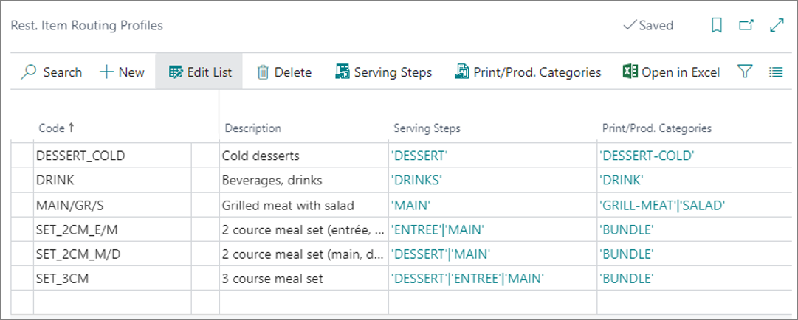
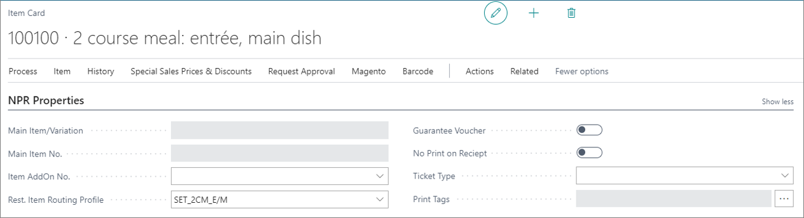
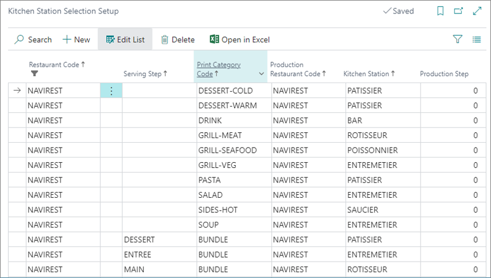
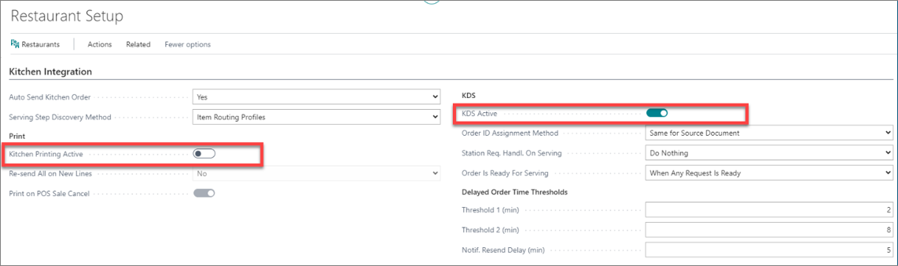

Rest. item routing profiles indicate under which serving step the dishes are going to be served, and which print/production category they refer to. Both of these parameters are indicated in the following screenshot, in their respective columns.

  

## Serving steps

Serving steps are used for defining a code associated with a specific meal or an item, and the different serving steps it is used in. For example, if there's a meal item named *2 course meal*, and you configure the **Rest. Item Routing Profile** as **SET_2CM_E/M**, the meal will be broken into two serving steps, and consist of *Entrée* and *Main* components. When a customer orders this meal, they will first be served with the *Entrée*, and then with the *Main* course.

  

The relationship between the *2 course meal* item card and the restaurant item routing profile is established in the **NPR Properties** section by providing the route code.

## Print/Prod. Categories

In addition to setting up the serving route, you also need to set the production route. The kitchen can be notified of the production route either via a print ticket or a [<ins>KDS<ins>]().

To establish a relationship between the **Rest. Item Routing Profile** and the **Print/Production Categories**, you need to perform the necessary setup in the **Kitchen Station Setup**. 

  

In the **Kitchen Station Selection** administrative section, you need to define the print category which will determine the kitchen station that is going to be in charge of preparing the full meal or a meal component. You can extract the following information from the table presented in the previous screenshot:

- **DESERT-WARM** is prepared in the **PATISSIER** kitchen station.
- **DRINK** is prepared in the **BAR** kitchen station
- Each serving step of a set meal  (BUNDLE) is sent to its respective kitchen station for preparation:
  - The **DESSERT** serving step is sent to the **PATISSIER** kitchen station.
  - The **ENTRÉE** serving step is sent to the **ENTREMETIER** kitchen station.
  - The **MAIN** serving step is sent to the **ROTISSEUR** kitchen station.

Each order is sent to the kitchen in the form of a waiter request for meal preparation. This request can be expressed either in a KDS format or in a printed paper format. You need to determine the format that will be used in the **Kitchen Integration** section of the relevant **Restaurant Setup** card.

  

In the **Print Template Output Setup** you can set the printer on which the templates are printed. The output printers also need to be physically configured in each kitchen station.