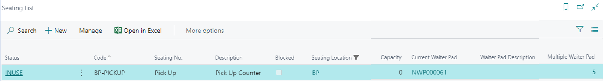
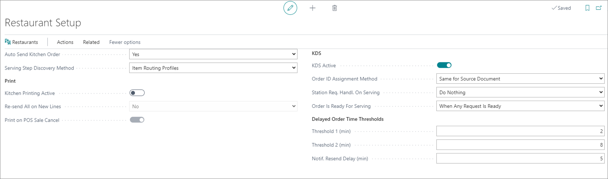

This article goes through all necessary components for setting up a fast-food restaurant environment in NP Restaurant. Certain steps need to be taken when setting up all fast-food restaurants, while others depend on the restaurant's unique features. 

## Restaurant Setup

The [<ins>**Restaurant Setup**<ins>]() administrative section is where you can configure the general framework for your restaurant. It covers basic elements such as the **No. Series**, **Seating Statuses**, **POS Actions** that are used in different processes, as well as the options related to the integration with the [<ins>KDS<ins>]() or kitchen printers. Populate the necessary fields that dictate how the restaurant will be run, and move on to the other sections.

## Restaurant Card

You can create a new **Restaurant** entity in the **Restaurants** list in Business Central. Once you do, you can set up its **Restaurant Card** according to your business needs. 

You need to configure the general information and behavior of the restaurant. Use the following screenshot and the provided [<ins>Restaurant card reference guide<ins>]() if needed.

  

## Rest. Service Flow Profile Card

Set up the [<ins>service flow<ins>]() to establish how the restaurant operations will be performed. 

Note that the **NEW_WAITER_PAD** POS action that is used for configuring the autosave function on the waiter pad needs to have the following parameters defined in a fast-food setting:

  

## Restaurant Kitchen Stations

There can be at least two [<ins>kitchen stations<ins>]() per a fast-food restaurant defined in the system. By default, all food is prepared in one kitchen station, while the drinks are added during the packing stage. In certain cases, fryers can be defined as stations in their own right.

  

## Seating location

By default, a single seating location is created in the system, without the seats capacity.

  

## Seating list

By default, a single seating is created in the system. 

  

## Kitchen Station Selection Setup

Define the sequence in which a meal is transferred from one station to another. Dish components can be prepared in parallel or one after the other, depending on their preparation time and other factors. 

For example, during the preparation of a Burger bundle meal, you can prepare the burger and the fries in parallel, but the full order will still be transferred to the packing station only when both productions are completed. 

  

## Flow statuses (to be skipped)

The flow statuses for serving don't apply to fast-food environments. You don't serve meal components separately, unlike in restaurants that serve dishes in a flow such as *Entrée > Main Course > Dessert*.

## Rest. Item Routing Profile (to be skipped)

The [<ins>**Rest. Item Routing Profile**<ins>]() indicates under which serving step the dishes are going to be served, and which print/production category they refer to. In fast-food restaurants, there's only one serving step and one station. You need to configure this profile only if there are multiple stations in the fast-food environment. 

  

### Serving steps

In a fast-food restaurant setting, the serving steps consist only of **MAIN**, as there's just one serving step: *Production > Packing*.

  

### Print/Prod. Categories

Since you're only using the production station in the fast-food scenario, the **Print/Prod Category** is used to determine which dish type is being produced. It doesn't have much effect on the routing for preparation and kitchen printers output. 

## POS unit setup

In the **POS Unit Card**, you don't use a specific profile for the restaurant, as there's no **Restaurant Floor Plan**. The POS layout will resemble any other retail POS, except that you can add POS actions for splitting bills, and so on.

  

## Restaurant notifications

### SMS functionality

When taking an order, you can notify the customer via SMS that their order is ready. This feature is useful for fast-food restaurants located in malls or parks. Customers can order their food and focus on their other activities instead of waiting in line for the food. Once the food is ready for pick-up, the customer will receive an SMS to come back to the counter and collect it. 

You can add the necessary configurations in the [<ins>**SMS Setup**]() administrative section.   

  

In the backend, a job queue checks if there's an SMS to be sent, then sends it to the recipient automatically. The content structure of the SMS is defined in the relevant SMS template. 

### Restaurant notification setup

Refer to the [<ins>**Restaurant Notification Setup** reference guide<ins>]() for more information on the available fields and options.

### SMS template for restaurant notifications

You can define the template which will be used when sending restaurant notifications in the form of an SMS. The content of the said template may vary depending on the reason it's sent for, e.g. delayed order, order ready for pick-up etc. 

  

For example, when sending an SMS to notify customers that their order is ready, the message content can be as simple as *"Your order #-- is ready."*

  

If you want to notify a supervisor or a group of supervisors that the order preparation is being delayed, you can also use a notification. It's just necessary to make sure the **Recipient Type** in the **SMS Template Card** is set to **Group**, and that the group includes all relevant supervisors. 

### Delayed order time threshold

The delayed threshold is defined in the **Restaurant Setup**, and when you set a notification for a threshold in the **Restaurant Notification Setup**, with its accompanying SMS template, the recipient will receive a notification when the threshold has been reached. 

  

## Item add-on setup

You can opt for several different approaches when setting up item addons. For more information, refer to the [<ins>article on custom configurations for item add-ons<ins>]().

Pay special attention to the instructions on [<ins>Item add-ons as a list of selections of ingredients and substitutes in a Burger menu<ins>]() as they are relevant for the fast-food environments.

## Fast-food transaction flow

For more information, refer to the article on the [<ins>Restaurant transactions flow<ins>]()

### Ordering and payment

Orders are taken from the POS Sale view, after which the customer/salesperson can proceed to the Payment View.

  

The payment can be taken in any payment form accepted by the fast-food restaurant. 

### Phone detail for SMS notification to customers

Once the payment is done, a pop-up is displayed, requesting the user's phone number. When it is provided, the Sale view is displayed again, and the POS is ready for the next sale. If a phone number isn't provided, the customer will not receive an SMS.

### Requesting preparation

When completing the payment, the request for preparation is done automatically, without any need to request preparation manually. The order is either printed or, in the case of KDS, displayed on the KDS of the station for meal preparation.

  

### Requesting packing

Once the meal preparation is completed, the user can double-press the order from its **Burger** section, and the order will be moved to the **Packing** station KDS.

  

### Ready for delivery

Once the packing is completed, the user can double-press the order from its **Packing** station, and the order will be moved to the **Ready** station KDS. Simultaneously, an SMS is sent to the customer, to notify them that the meal is ready for pick-up.

  

Once delivered, the user can double-clicked on the order, and it will be removed from the system.

### Customer display

There's a customer display on which customers can track their orders, and see in which stage they currently are. Each time a task is completed, the order will be moved from one status to another until it's delivered. Once that is complete, the order will disappear from the customer display.

  