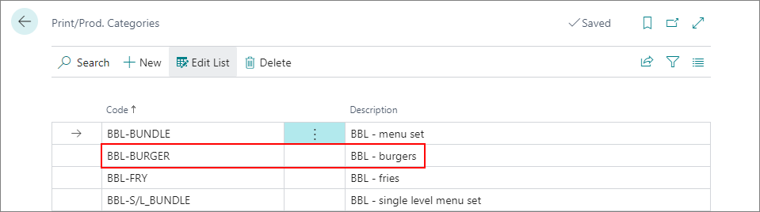
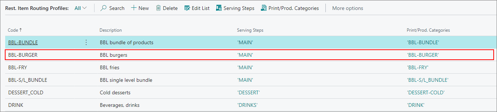

There are several administrative sections that need to be configured in Business Central before you can effectively use KDS (Kitchen Display System). 

To set up prerequisites and the KDS, follow the provided steps:

#### Prerequisites

- Create and fully configure **Item Cards** which correspond to dishes that are going to be prepared in the restaurant.
- Add at least one restaurant to the environment, and create a seating plan.
- Create a **Restaurant Profile**, and assign it to POS units.

#### Procedure 

1. Click the  button, enter **Restaurant Setup**, and choose the related link. 
2. Make sure **KDS** is activated. 
3. Move on to the **Kitchen Integration** panel, and select **Item Routing Profiles** as the **Serving Step Discovery Method**.
4. Navigate to the **Print/Prod. Categories** administrative section. 
5. Create a **Print/Prod. Category** or categories that are going to be linked to the **Item Cards** of the prepared dishes.       
   Print/production categories determine to which kitchen station the order is to be sent (e.g. grill station, pizza station).

   

6. Navigate to the **Rest. Routing Profiles** administrative section. 
7. Create **Rest. Routing Profile** or profiles, and use them to specify under which serving step the dishes are going to be served, and which print/production category they refer to.      

   

   

   
   
8. Open an **Item Card** corresponding to one of the dishes prepared by the restaurant, e.g. cheeseburger.
9. Navigate to the item's **NPR Properties** panel, and assign this item to the item group defined by the routing profile.    
   In this way, you're notifying the system that the item needs to be sent to a specific kitchen station, and served to customers as a part of a specific serving step. 

   

10. Navigate to the **Kitchen Station Selection Setup** administrative section.       
    Here, you can specify which category will be assigned to which kitchen station, for every restaurant available in the environment. This administrative section is more suitable for fine-dining restaurants, which have a more complex food preparation and serving system. For example, the **Drinks** category is best suited for the **Bar** kitchen station.
11. Select the restaurant this kitchen station selection setup line is used at or leave the **Restaurant Code** field blank if you wish the setup line to be used for all restaurants in the system.       
    The same logic should be applied to **Seating Location**, **Serving Step**, and **Print Category Code**.
12. Provide the print category code and the kitchen station the dish is prepared in. 

<iframe width="560" height="315" src="https://www.youtube.com/embed/FwkgHZAFeAU?si=7fTN_L-GRigdHNlL" title="YouTube video player" frameborder="0" allow="accelerometer; autoplay; clipboard-write; encrypted-media; gyroscope; picture-in-picture; web-share" allowfullscreen></iframe>

#### See also

- [<ins>Kitchen Display System<ins>]()