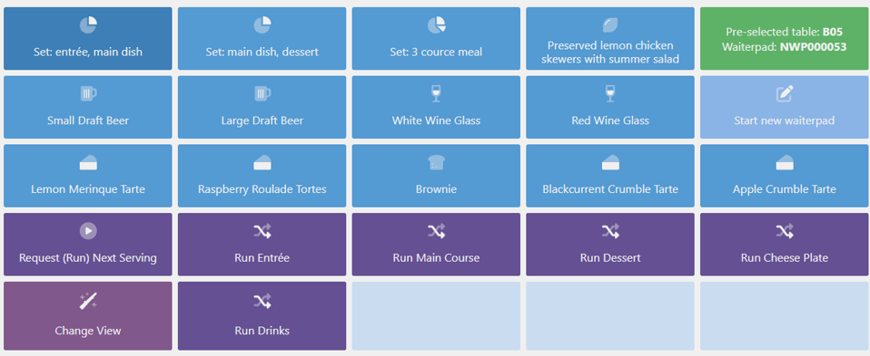
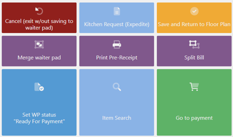

The following values represent the typical configuration of **POS for Restaurant**:

| POS Menu Button              |       POS Action Type / Action Code |          Parameters                                     |
|    --------      | ----------------------------- | -------------------------------------------------------                     |          
| **Set Menus**  | Item/Item No | Not Applicable  | 
| **Waiter Pad**  | SHOW_WAITER_PAD | Seating Selection Method = List   Show Only Active Waiterpad = false It will display status of current waiter pad.   {{< alert icon="📝" text="Note on syntax for button, using BUILTIN_SALE: (Pre-selected table: <b>{{NPRE.TableNo}}</b> Waiterpad: <b>{{NPRE.WaiterPadNo}}</b>)."/>}} |
| **Start New Waiter Pad** |NEW_WAITER_PAD | Ask for Number of Guest = true   Seating Selection Method = List   Open Waiter Pad = false   Use seating from context = false |
| **Request (Run) Next Serving** | RUN_W/PAD_ACTION | Lines to Send to Kitchen = New/Updated   Move Sale to W/Pad on Finish = true   Return to Default View on Finish = true   Serving Step to Request = BLANK   Waiter Pad Action = Request Next Serving |
| **Run Drinks** | RUN_W/PAD_ACTION |Lines to Send to Kitchen = New/Updated Move Sale to W/Pad on Finish = true   Return to Default View on Finish = true   Serving Step to Request = DRINKS   Waiter Pad Action = Request Specific Serving |
| **Run ENTREE** | RUN_W/PAD_ACTION |Lines to Send to Kitchen = New/Updated Move Sale to W/Pad on Finish = true   Return to Default View on Finish = true   Serving Step to Request = ENTRÉE Waiter Pad Action = Request Specific Serving |
| **Run Main Course** | RUN_W/PAD_ACTION | Lines to Send to Kitchen = New/Updated   Move Sale to W/Pad on Finish = true   Return to Default View on Finish = true   Serving Step to Request = MAIN   Waiter Pad Action = Request Specific Serving |
| **Run Dessert** | RUN_W/PAD_ACTION |Lines to Send to Kitchen = New/Updated Move Sale to W/Pad on Finish = true   Return to Default View on Finish = true   Serving Step to Request = DESSERT   Waiter Pad Action = Request Specific Serving |
| **Run Cheese Plate** | RUN_W/PAD_ACTION | Lines to Send to Kitchen = New/Updated   Move Sale to W/Pad on Finish = true   Return to Default View on Finish = true   Serving Step to Request = CHEESE   Waiter Pad Action = Request Specific Serving |
| **Cancel (exit w/out saving to waiter pad)** | RUN_W/PAD_ACTION | Lines to Send to Kitchen = New/Updated   Move Sale to W/Pad on Finish = true   Return to Default View on Finish = true   Serving Step to Request = BLANK   Waiter Pad Action = Close w/out Saving |
| **Merge waiter pad** | RUN_W/PAD_ACTION |Lines to Send to Kitchen = New/Updated   Move Sale to W/Pad on Finish = true   Return to Default View on Finish = true   Serving Step to Request = BLANK   Waiter Pad Action = Merge Waiter Pad |
| **Kitchen Request (Expedite)** | RV_K/REQUESTS | Filter by = Waiterpad |
| **Print Pre-Receipt** | RUN_W/PAD_ACTION | Lines to Send to Kitchen = New/Updated   Move Sale to W/Pad on Finish = true   Return to Default View on Finish = true   Serving Step to Request = BLANK   Waiter Pad Action = Print Pre-Receipt |
| **Save and Return to Floor Plan** | RV_SET_R-VIEW | Use Default End Of Sale View = true |
| **Split Bill** | SPLIT_BILL |All Waiter Pads = Yes   Seating Selection Method = stringPad   Return to Default View on Finish = false |
| **Set WP status "Ready For Payment"** | RV_SET_W/PAD_STATUS | Status Code = PMT   Waiter Pad Code = BLANK |

#### See also

- [<ins>Restaurant transactions flow<ins>]()
- [<ins>Restaurant seating plan (POS)<ins>]()
- [<ins>Restaurant POS View/POS menus<ins>]()