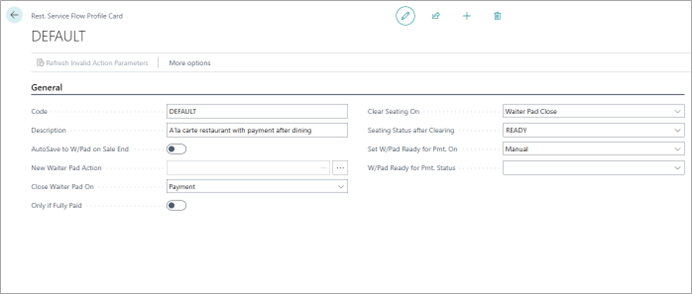

The following fields and options are available on the **Rest. Service Flow Profile Card**:

| Field Name      | Description |
| ----------- | ----------- |
| **Code** | DEFAULT – The code is a general configuration that is going to be used in the Restaurant Setup. | 
| **Description** | What Kind of process we want to adopt? For example: A'la carte restaurant with payment after dining | 
| **AutoSave to W/Pad on Sale End** | Specifies whether the items placed in the POS sale and other accompanying selected functions are automatically saved to a waiter pad at the end of the sale. The configuration is done with the **NEW_WAITER_PAD** POS action. |
| **New Waiter Pad Action** | Specifies the code for the POS action that is used when a new waiter pad is created at the end of a sale. Recommended value is "NEW_WAITER_PAD" |
| **Close Waiter Pad On** | At what stage of the process do we want to close the waiter pad automatically? For example: Payment |
| **Only if Fully Paid** | We activate this condition if we want to be strict on the payment.    | 
| **Clear Seating On** | At what stage do we want to clear the seating on a table and reset to empty? For example: Waiter Pad Close | 
| **Seating Status after Clearing** | What kind of Status do we want to attribute to the table when we finish clearing the seating? Here we are setting it to READY, as we are assuming that it is the waiter that cleans the table himself after the guest paid & leaved. For example: READY    |
| **Set W/Pad Ready for Pmt. On** | Specifies whether and when system should automatically change waiter pad status to "ready for payment" (the status specified in field "W/Pad Ready for Pmt. Status"). For example, we can set it to : Pre-Receipt if Served. The system will check if the last order has been served and the pre-receipt printed. |
| **W/Pad Ready for Pmt. Status** | Specifies the "ready for payment" status code on the waiter pad. We have two options here, depends on the business flow, we can specify to ask from payment after ordered or based on the above defined logic for field: “Set W/Pad Ready for Pmt. On” |

#### See also

- [<ins>Seating<ins>]()
- [<ins>Restaurant transactions flow<ins>]()
- [<ins>Restaurant seating plan (POS)<ins>]()
- [<ins>Restaurant POS View/POS menus<ins>]()