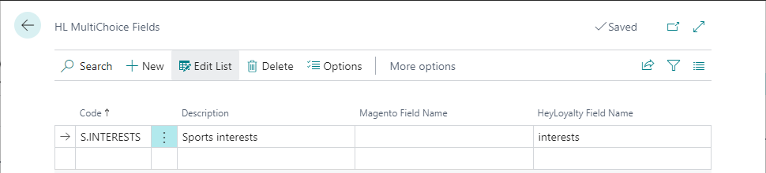

This section gives you an overview of all the setups in BC that are required for the HeyLoyalty integration functionality to work properly.

## HeyLoyalty Integration Setup
This is the main setup page.
To open the page click the  button and search for the **HeyLoyalty Integration Setup**.

Cannot find the page?

HeyLoyalty integration feature is not enabled by default. To enable it, navigate to <b>NaviPartner Feature Management</b> page, and make sure there is a checkmark in field <b>Enabled</b> on the <b>HeyLoyalty Integration</b> line. Do not forget to log into to the system again after enabling the integration.

 

There are the following fields on the page:
| Field name | Comment |
|------------|---------|
| <td>**General** FastTab</td> |
| Enable Integration | Specifies whether the integration is enabled. This is the master on/off switch for the whole integration. |
| <td>**Member List Integration Area** subsection</td> |
| Member Integration | Specifies whether the Member List integration area is enabled. This will enable member information to be sent to HeyLoyalty. |
| HeyLoyalty Member List ID | Specifies the HeyLoyalty member list ID integration is coupled with. |
| Membership HL Field ID | Specifies the HeyLoyalty field ID (the value from column _Flettefelt_ in HeyLoyalty field definition page) for storing information about membership code (is not required, if you don't plan to have member membership IDs at HeyLoyalty). |
| Required Contact Info | Specifies required contact methods (email and/or phone) that must be specified in the member card before BC will submit the member data to HeyLoyalty. |
| Require GDPR Approval | Specifies whether the member must agree to GDPR before BC will submit the member data to HeyLoyalty. We recommend you enable this parameter. |
| Require Newsletter Subscription | Specifies whether the member must subscribe to the e-mail newsletter (**E-Mail News Letter** field on the member card) before BC will submit the member data to HeyLoyalty. We recommend you enable this parameter. |
| Unsubscribe if Blocked | Specifies whether the member will be unsubscribed from HeyLoyalty, if the member, or their membership has been blocked in BC. We recommend you disable this parameter. |
| Read Member Data from Webhook | Specifies whether member data is going to be read from received HeyLoyalty webhook payload. If disabled, for each incoming webhook request system will issue an additional GET call to HeyLoyalty server in order to retrieve the most recent member data available at HeyLoyalty. The parameter must be disabled as it is not currently fully supported by HeyLoyalty. |
| <td>**Heybooking Integration Area** subsection</td> |
| Enabled | Specifies whether the Heybooking Integration area is enabled. This will enable booking and transaction information be sent to HeyLoyalty. |
| Heybooking Integration ID | Specifies the Heybooking Integration ID you acquired from your HeyLoyalty partner. |
| Send Heybooking Err. to E-Mail | Specifies the email address notifications are sent to in case of errors while importing data to HeyLoyalty Heycommerce/Booking database. |
| <td>**Connection Parameters** FastTab</td> |
| HeyLoyalty Api Url | Specifies the URL for HeyLoyalty Api. Default value is `https://api.heyloyalty.com/loyalty/v1` |
| Heycommerce/Booking DB Api Url | Specifies the URL for HeyLoyalty Heycommerce/Booking database Api. Default value is `https://tracking.heycommerce.dk/api` |
| HeyLoyalty Api Key | Specifies the HeyLoyalty Api Key you acquired from your HeyLoyalty partner. |
| HeyLoyalty Api Secret | Specifies the HeyLoyalty Api Secret you acquired from your HeyLoyalty partner. |

## HeyLoyalty Multiple Choice Fields
A multiple choice field in HeyLoyalty is a field that allows users to select multiple values from a list of predefined options. 
If you wish to include a HeyLoyalty multiple choice field into the member list integration scope, you'll need to set the field up as an **HL MultiChoice Field** in BC.
To open the **HL MultiChoice Field** page, navigate to **HeyLoyalty Integration Setup** page, and in the page's menu ribbon select **Home** > **MultiChoice Fields**.

  
On the **HL MultiChoice Field** page create a separate entry for each of the multiple choice fields you want to include into synchronization. You'll need to specify the following infromation for each of the fields:
| Field name | Comment |
|------------|---------|
| Code | Specifies a code to identify this HeyLoyalty multiple choice field. |
| Description | Specifies an explanation of the HeyLoyalty multiple choice field. |
| Magento Field Name | Specifies the id used for the field at Magento (only required if you wish to sync the field to Magento as well). |
| HeyLoyalty Field Name | Specifies the id used for the field at HeyLoyalty (the value from column _Flettefelt_ in HeyLoyalty field definition page). |

Next you'll need to specify the list of possible option values for each of the multiple choice fields. To do that, put your cursor on the line with the field definition in the **HL MultiChoice Field** page, and in page's menu ribbon click **Options**.

On the **HL MultiChoice Field Options** page you'll need to specify the following infromation for each of the field's possible option values:
| Field name | Comment |
|------------|---------|
| Sort Order | Specifies the sort order of the option value. The lower the number, the higher in the list the option value will appear. Is assigned automatically, but you can change it if necessary. |
| Description | Specifies an explanation of the HeyLoyalty multiple choice field option value. |
| Magento Description | Specifies the id used for the field option value at Magento (only required if you wish to sync the field to Magento as well). |
| HeyLoyalty Field Name | Specifies the id used for the field option value at HeyLoyalty. Usually consists of 6 digits. You may have to contact your HeyLoyalty provider to get the option value ids for the field. |



## Member Attributes
You can map any HeyLoyalty single choice or text field to a member attribute in BC.
Please refer to [_this documenation section_](), if you need more information on how to setup member attributes.


Additionally, to map a member attribute and its option values with a HeyLoyalty field, you'll need to do the following:
- Specify **HeyLoyalty Field ID** (the value from column _Flettefelt_ in HeyLoyalty field definition page) for each member attribute on the **Client Attribute Card** page. The field **Default HeyLoyalty Value** on the **Client Attribute Card** page specifies the default attribute value to be sent to HeyLoyalty in cases, when the attribute has no value assigned for the member in BC.
- Specify **HeyLoyalty Name** for each attribute value on the **Client Attribute Value Lookup** page.

## Stores

## Data Log Subscribers

