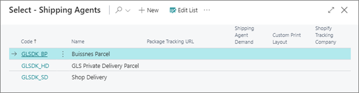
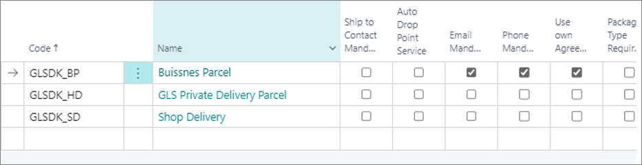
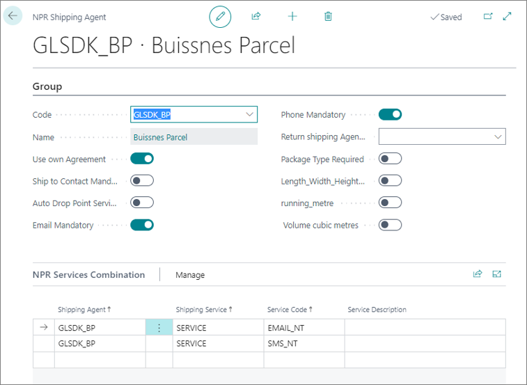

To set up integration with Shipmondo, follow the provided steps on the Shipmondo website and Business Central in the indicated order:

## Procedure on Shipmondo website

1. Navigate to the [<ins>Shipmondo website<ins>](https://shipmondo.com/), and create a new account.     
2. Once the account is created and you're logged in, click on your company username in the top right corner of the page.     
   A dropdown list is displayed with all available account options.
3. Click **Add Funds**, and provide the amount you wish to add in the pop-up window that is displayed.
4. Follow the on-screen instructions to complete the payment.
5. Open the **Settings** dropdown in the ribbon, and select **Own agreements**. If you have any agreements, add them here.      
   This section should contain the necessary agreements for the integration to be established successfully.
6. Open the **Settings** dropdown again, and select **Print**, followed by **Printers**.
7. Add the printers you're going to use as default label printers.
8. Open the **Settings** dropdown once more, and then select **API**, followed by **Freight and service overview**.     
   The **API product and service overview** page is displayed.
9. Add **Denmark** as the **Sender country**, and the **Receiver country**.    
10. Select the services you wish to use inside the GLS carrier.

          

   The following services are used by default in the Shipmondo integration:

   - Shop Delivery - Code: GLSDK_SD
   - Private Delivery Parcel - Code: GLSDK_HD
   - Business Parcel - Code: GLSDK_BP

## Procedure in Business Central

1. Click the  button, enter **Shipping Provider Setup**, and choose the related link.       
   The page for setting up information about API in use is displayed. 
2. Click **Actions** in the ribbon, followed by **Shipping Agents**.       
   The **Package Shipping Agents** page is displayed.
3. Create a new entry, and when inputting the **Code**, open the dropdown to **Select from full list**.     
   All fields are populated according to the service used for establishing the integration.
4. Add the **GLSDK_BP**, **GLSDK_HD**, and **GLSDK_SD** shipping agent codes.

   

5. Click  in the ribbon, and select **Shipping Agent** from the dropdown list, followed by **Shipping Agent Services**.    
   The **Shipping Agent Services** page is displayed.
6. Add a new entry with the **SERVICE** value in the **Code** field.       
   It is possible to rename the **Code** to something more descriptive to the users.
7. Make sure the **Email Mandatory**, **Phone Mandatory**, and the **Use own Agreement** checkboxes are ticked for the **Business Parcel** entry in the **Package Shipping Agents** page.       

   

8. Hover over the **Business Parcel** entry, and click **Edit**.
9.  Add the necessary **NPR Services Combination** entries.       

   

## Next steps - Test connection

If you need assistance in testing the connection between Shipmondo and your Business Central environment, refer to the guide for [<ins>Testing connection with Shipmondo<ins>]().