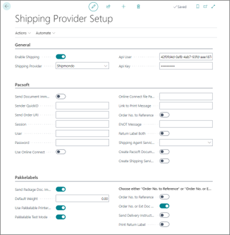
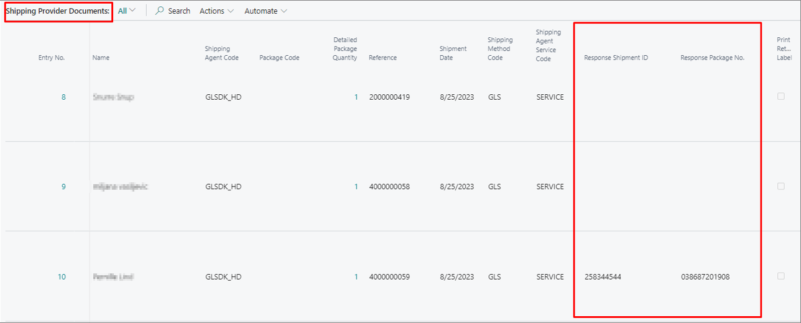
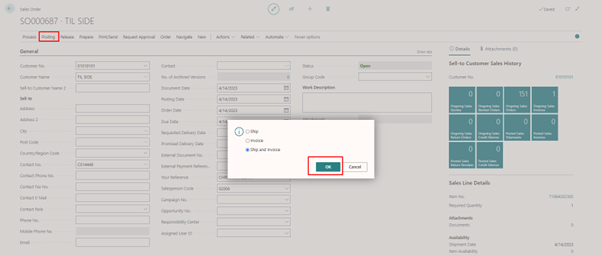
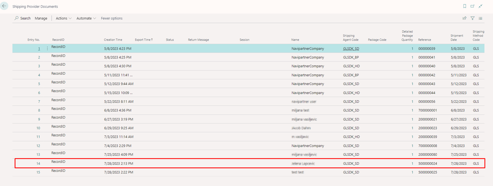

Once you've completed the necessary setup for the [integration with Shipmondo](), it's recommended to test it, to make sure everything works properly.

#### Prerequisite

- Find information about your **User** and **Key** from the Shipmondo website to be able to use the Shipmondo API.
     1. Click **Settings** in the ribbon on the Shipmondo website.
     2. Select **API**, followed by **Access**.     
        The **API access** information is displayed. You can use the **User** and **Key** values provided here.

#### Procedure

1. Open the [Shipmondo API specification page](https://app.shipmondo.com/api/public/v3/specification#/).    
   Use the **User** and **Key** you've retrieved from the Shipmondo website to get full access to this page and its contents.
2. Select **Account** > **Retrieve balance** from the list of **ENDPOINTS** in the left sidebar.     
   The information about the requested endpoint is displayed.
3. Provide your API **User** and **Key** in the **Auth** box on the right side of the screen.
4. Click **Send API Request**.
5. Navigate to the **Shipping Provider Setup** page, and select **Shipmondo** as the **Shipping Provider**.
6. Provide the **API User** and **API Key** you've copied from the Shipmondo website in the indicated fields.
7. Open the [Shipmondo API specification page](https://app.shipmondo.com/api/public/v3/specification#/) again, and select **Shipments** > **Create a shipment** endpoint from the left sidebar.
8. Provide your API **User** and **Key** in the **Auth** box, and change the **product_code** parameter in the **Body** section to **"GLSDK_BP"**
9. Click **Send API Request** to test the setup.       

    

10. Navigate to the **Shipping Provider Setup** in Business Central, and **Enable Shipping**.
11. (Optional) Although printers are set up on the customers' end, you can retrieve a list of printers from the **NPR Package Printers** page by selecting **Actions** followed by **Get printers**.      
    You can reach this page from the **Shipping Provider Setup** by selecting **Actions** > **Printer**.
    
    After configuring the **Shipping Provider Setup** page, it should appear as presented in the following screenshot:     

    

### Additional testing information

Every item has its net weight, and the average net weight per box/item (e.g. per a pair of shoes) should be displayed in the **Inventory** section of the **Shipping Provider Setup** page.

You can check whether a shipment has been sent to Shipmondo if the **Response Shipment ID** and **Response Package No.** fields in the **Shipping Provider Documents** page are populated. 

   

When you purchase an item from the web store, you can navigate to the **Import List** in Business Central, find your order, and then click **Import Selected** in the ribbon. Afterwards, you can find your imported order in the **Sales Orders** list to **Post** it. 

   

You can find the order in the **Shipping Provider Documents** if the posting has been completed successfully.

   

The order/shipment also lands on the Shipmondo website, and you can access them by clicking **Go to Shipments**.