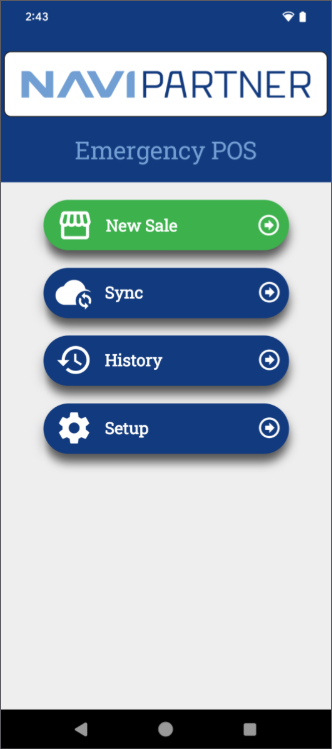
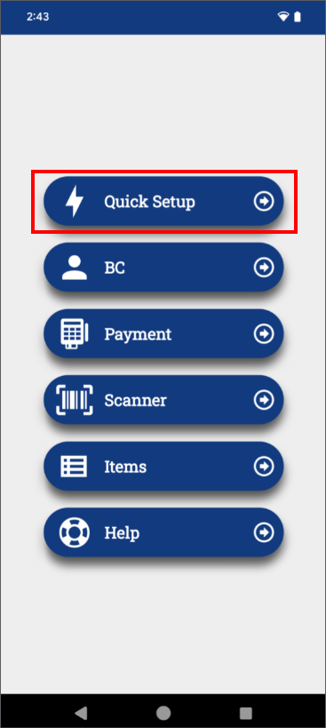
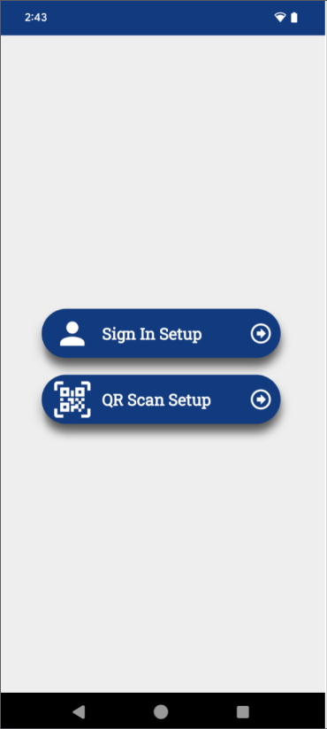
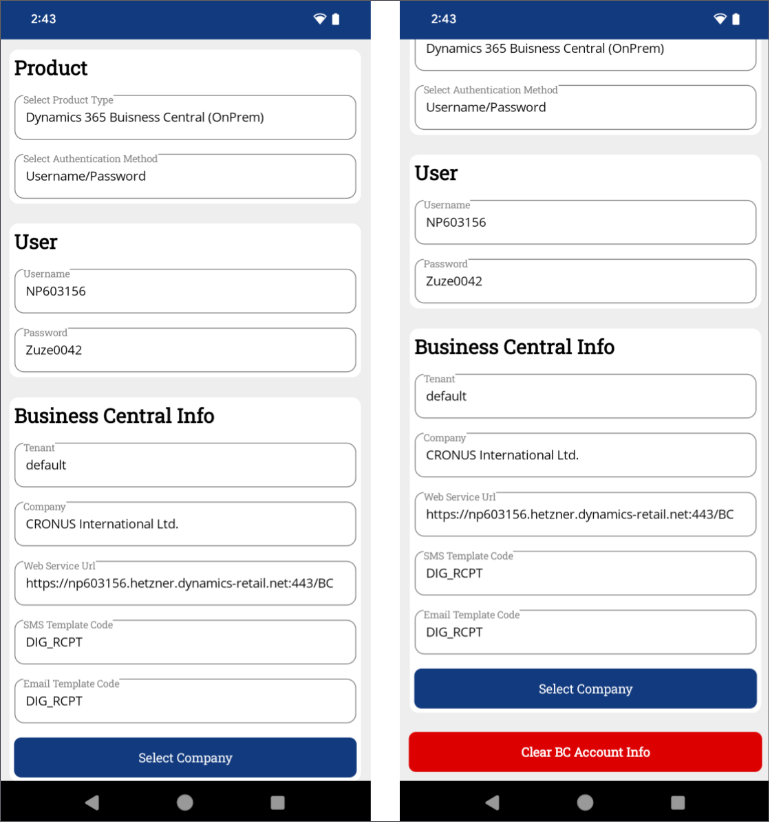
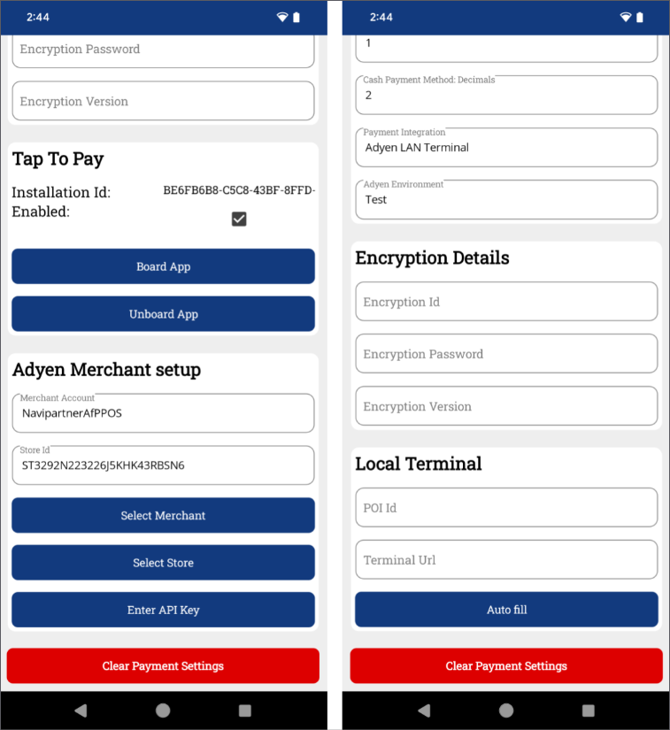
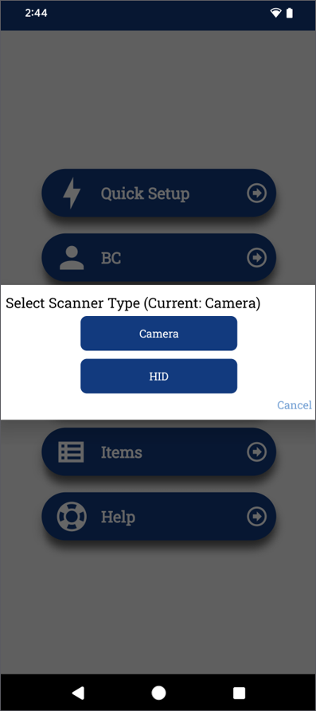

NP Retail Emergency mPOS is an application designed to help customers process payments when Business Central (BC) or the internet is unavailable. This article walks you through the process of setting it and using its features.

## Configure Business Central

1. Click the  button, enter **Emergency mPOS Setup**, and choose the related link.           
2. Provide the basic information needed for the emergency POS to work correctly, such as supported payment methods and SMS/email templates.
3. Contact the NaviPartner consultancy team to assist with **NP Pay POS Payment Setup** for automatic configuration.

## Prepare your device

### Prerequisites

- Request software installation for NP Pay from the NaviPartner consultancy team.
- Install the **Adyen Payments** app if you're also using the [<ins>Tap to pay<ins>]() feature.      
  There is both a live and a test version of this app in the Google Play store. 

### Set up the Emergency mPOS app

1. Open the **NP Retail Emergency mPOS** app on your device.      
   The home screen is displayed.

    

2. Tap **Setup**. 

     

    The setup menu is displayed.

2. Tap **Quick Setup**.       

   

3. Sign in or scan a QR code to configure the device.     

   

   

## Additional setup

The other setup pages and the options they contain are briefly outlined in this section. For more details on each individual page, switch to the [<ins>reference guide<ins>]()

### BC setup

- Connect the app to Business Central for synchronization.
- Configure SMS/email receipt templates.

   

### Payment setup

The payment setup page specifies all configurations related to sales and payments. 

- Define payment methods (EFT, cash, Tap to Pay, LAN Terminal).
- Configure encryption details for secure transactions.
- Enable Boarding for Adyen Payments app integration.

  

### Scanner setup

- Use **Binary Eye** for camera-based barcode scanning.
- Opt for HID mode for built-in hardware scanners.

  

### See also

- [<ins>NP Retail Emergency mPOS overview<ins>]()   
- [<ins>Make a sale on NP Retail Emergency mPOS<ins>]()
- [<ins>NP Retail Emergency mPOS (reference guide)<ins>]()